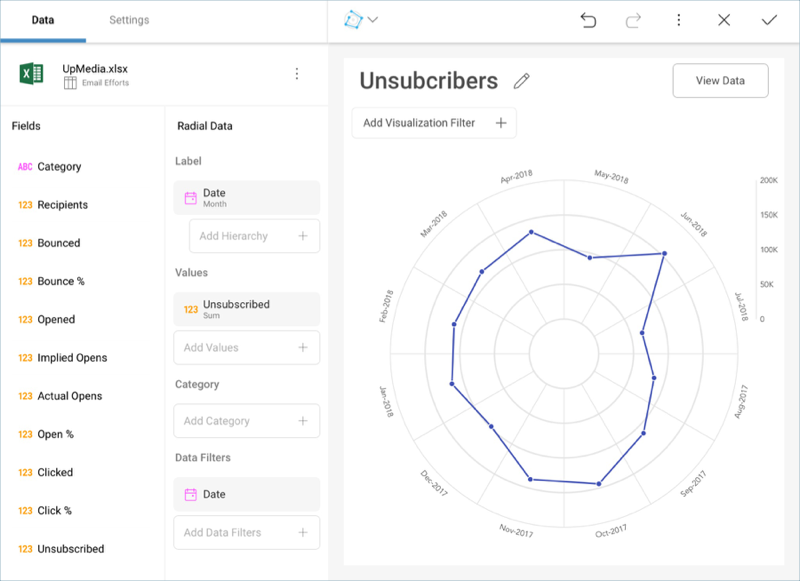
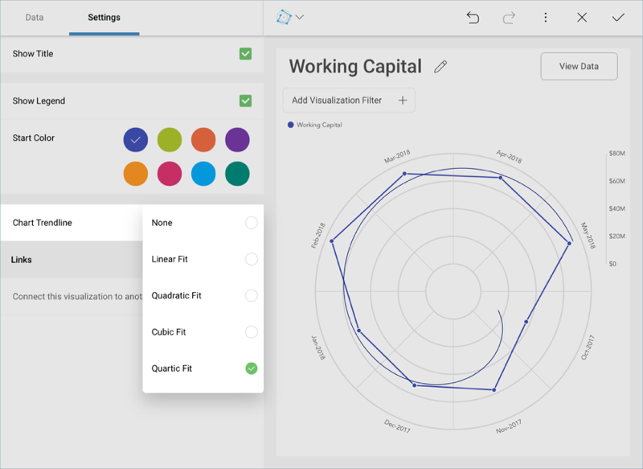

## Radial Charts

Like category charts, Radial charts are simply representations of
information in a coordinate system.

### Chart Trendlines for Radial Charts

Chart settings enable the display of trend lines, which are lines that
are painted across a chart, based on an algorithm. Trendlines are a very
simple, yet powerful tool to help you determine trends in datasets, and
define thresholds for taking action. The supported algorithms are Linear
Fit, Quadratic Fit, Cubic Fit, Quartic Fit, Logarithmic Fit, Exponential
Fit, Power Law Fit, Simple Average, Exponential Average, Modified
Average, Cumulative Average, Weighted Average.

