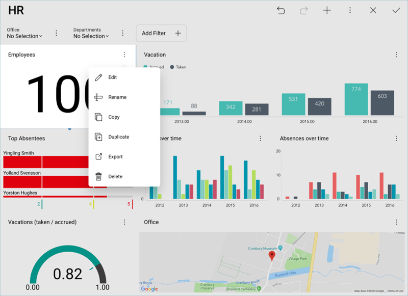
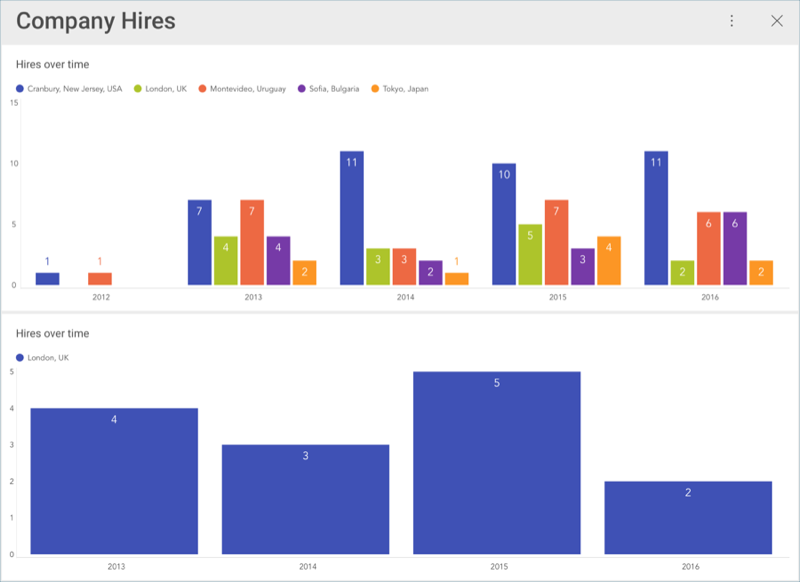

## Reusing Visualizations

Speed up the creation of dashboards by reusing visualizations; you just
need to **copy & paste** any visualization you want.

### Duplicating Visualizations

Create an exact copy of the original visualization within one dashboard.
Sometimes, you need to duplicate an already customized visualization and
then tweak the duplicate's data set. For example, the charts below show
Hires Over Time for all offices and a specific one separately.

### Copying and Pasting a Visualization

You can copy & paste any visualization within a dashboard or even across
dashboards. Note that you can create new dashboards by mashing up
visualizations from other dashboards.

### What to Consider

Your new visualization will have **the same title** as the original
visualization.

You can select *Rename* from the overflow menu of a visualization in [Dashboard Edit mode](~/en/dashboards/index.html#view-edit-mode). You can also change the title in the [Visualizations Editor](~/en/data-visualizations/visualizations-editor.md) using the
*pencil icon*.

Also, if your original visualization had any **data in the Data Editor**,
the new visualization will also have it. You will need to remove the
fields from the Data Editor if necessary.
