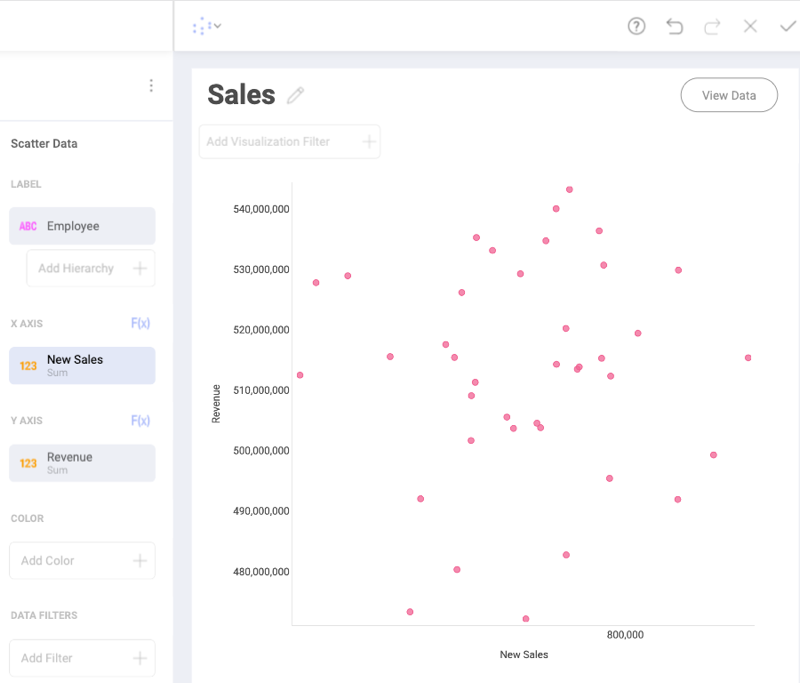
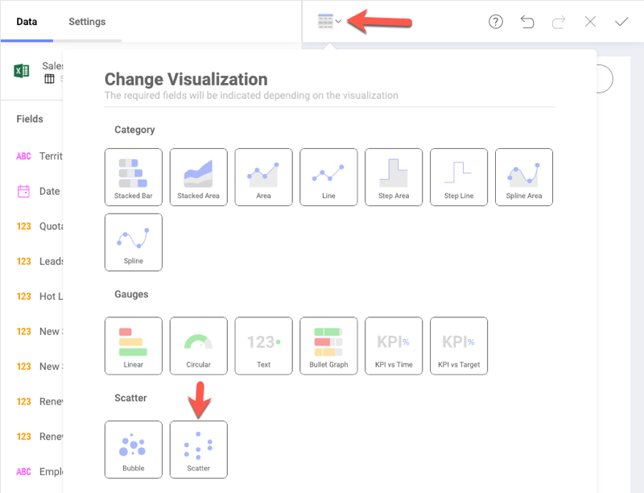
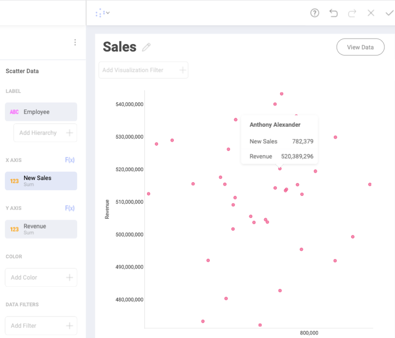
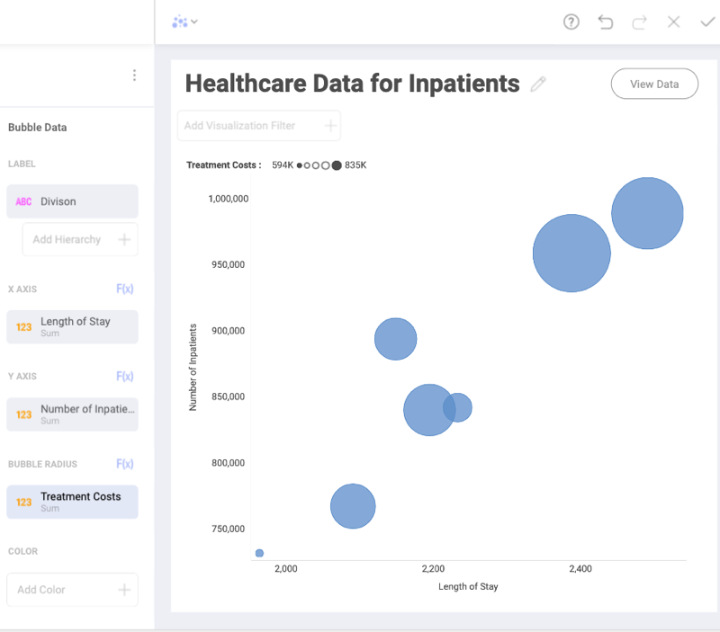
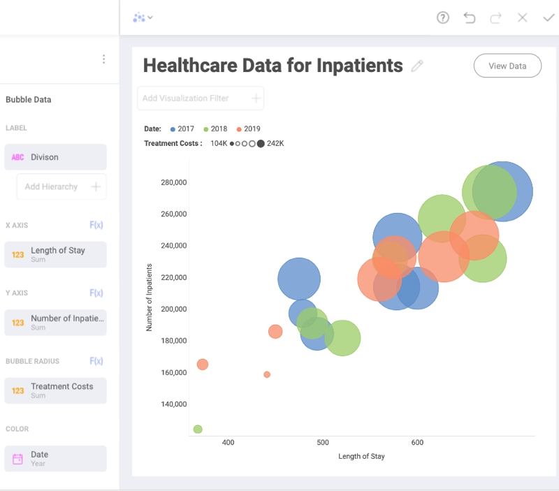
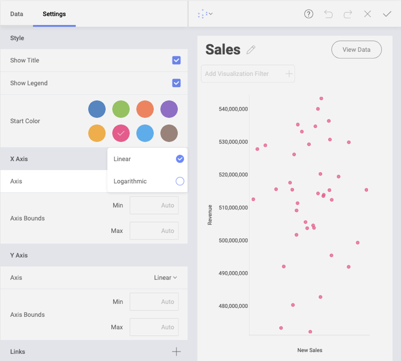

## Scatter and Bubble Charts

### What are Scatter Charts Used for?

Scatter charts are used to represent the relationship between two quantitative measures by plotting data points along the X (horizontal) and Y (vertical) axes. They are particularly useful for demonstrating patterns in large datasests.

### What are Bubble Charts Used for?

A bubble chart is a variation of a scatter chart in which the data points are replaced with bubbles. Like scatter charts, bubble charts represent the relationship between two quantitative measures as well as a third quantitative measure represented by the size of the bubble. 

### Creating a Scatter Chart

In the example above, the scatter chart visualization shows the
relationship between the quantity of *New Sales* and the *Revenue* made
by each particular *Employee*.

To create a scatter chart:

1.  Select the *Scatter* visualization in the *Change Visualization*
    menu:

    

2.  Choose numerical fields for the *X axis* and *Y axis*, which will
    determine the location of the data points.

3.  Select a categorical value for your *Label*.

Every data point has its own **tooltip**, which shows up when you click
on it:

In this example, the tooltip gives information about a particular
employee the data point represents, as well as quantitative data for
them included in the chart.

### Creating a Bubble Chart

To create a basic bubble chart, using only one color, you will need to:

1.  Select *Bubble* chart in the *Change Visualization* menu.

2.  Choose numerical fields for your *X axis* and *Y axis*.

    In the example above the location of the bubbles is determined by
    the correlation between the *Number of Inpatients* field and their
    *Length of Stay* in the hospital.

3.  Select a categorical value for *Label*.

    Each bubble in the shown chart represents a *Division*, such as
    Neurology, Cardiology, Surgery, etc.

4.  Choose a numerical field for *Bubble Radius*.

    You can see from the example that the size of each bubble depends on
    the sum of *Treatment Costs* in each *Division*. A legend on top of
    the chart shows the minimum and maximum value of the *Bubble Radius*
    field in the chart.

Clicking on the bubbles will also provide you with **tooltips** showing
specific data for every particular bubble. If you have overlapping
elements in your chart, click on the smaller bubble to show its tooltip.

### Adding the Color Category to Scatter and Bubble Charts

You can add a categorical field to the scatter or bubble chart. It will
color the bubbles or scatter points in different colors depending on the
values in this field.

In the example above, the *Date* field is applied to the *Color* box.
Adding the color category assigns different colors to the bubbles,
depending on whether the numerical information for a division refers to
*2017*, *2018* or *2019*.

This has also resulted in displaying more bubbles in the bubble chart
visualization.

### Settings for Scatter and Bubble Charts

In *Settings* you can:

  - **Change the Style of your visualization.**

    You can select whether you want to show a *Title* or *Legend* for
    your visualization. Choosing a *Start Color* will define the color of the data points/bubbles. When more than one color is needed due to the use of the *Color Category*, colors are applied sequentially starting at the Start Color.

  - **Choose between *Linear* and *Logarithmic* scale for the X and Y axis**.

    With Logarithmic, the scale for your values will be calculated with
    a non-linear scale which takes magnitude into account instead of the
    usual linear scale.

    As a general rule, scatter charts are a better choice than linear
    charts, when you want to use a logarithmic scale on the X-axis,
    since the horizontal axis of a scatter chart is always a value axis.

  - **Setup the minimum and maximum values for your charts.**

    Minimum is set to 0 by default and maximum is calculated
    automatically depending on your values.
