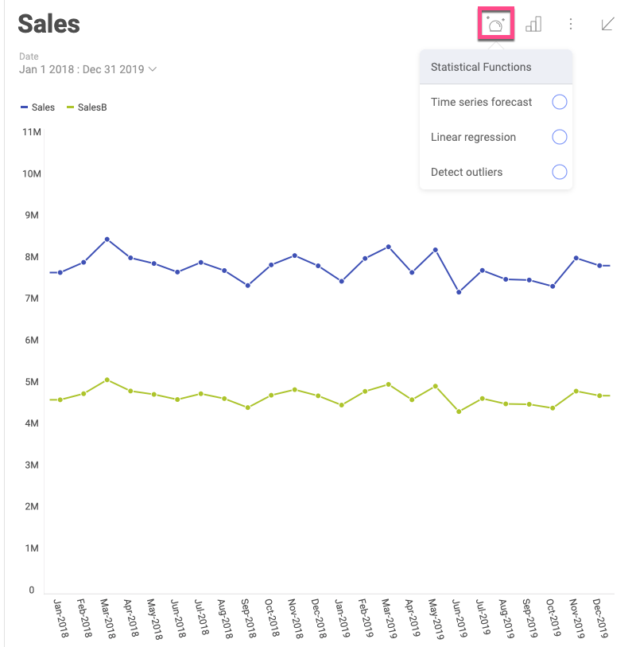
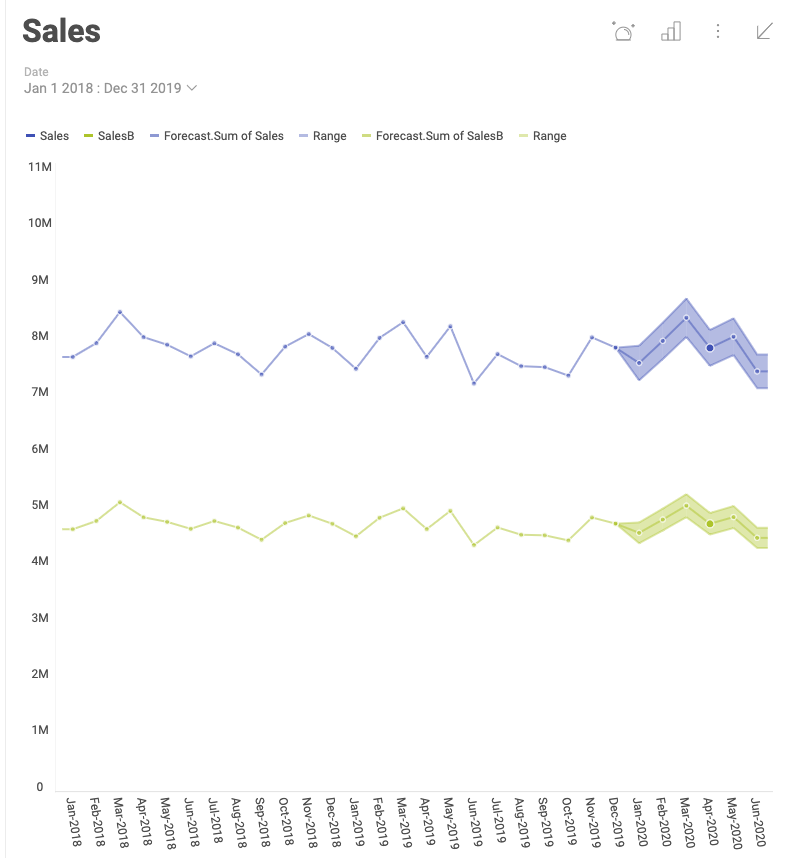
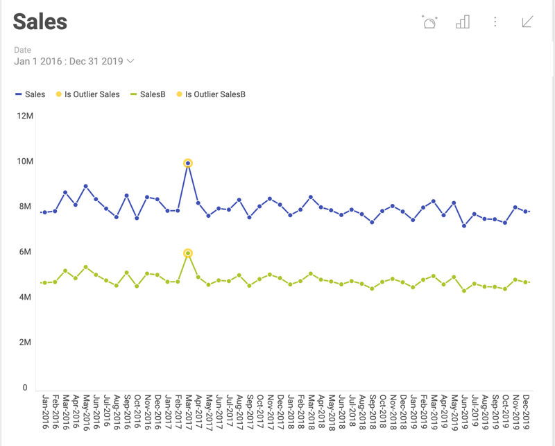

## Statistical Functions in Reveal

Reveal's Statistical functions allow you to receive more insight from
your visualizations. They provide you with three types of advanced
predictive analysis. You can use the [*Time series forecast*](#time-series-forecast), [*Linear regression*](#linear-regression) and [*Detect outliers*](#detect-outliers)
to make predictions, recognize and evaluate trends, or discover outliers
in your data series.

### Accessing Statistical Functions

To apply one of the three *statistical functions* to your visualization
you need to:

1.  Open your dashboard in *Dashboard view mode*.

2.  **Maximize** a visualization (by clicking the *arrow* icon in its
    top right corner).

3.  Click/tap the icon, which appears in the top right section of the
    screen (see below).

>[!NOTE] **Enabling/Disabling Functions**.
>You can have only one of the three functions enabled for a visualization at the same time. Click the enabled function again to turn it off or select another function from the list to switch to.

### Statistical Functions Types

The table below explains what every function is used for, the algorithm
the function uses, and for which visualizations the function can be
enabled.

| **Function**            | **Algorithm**            | **What is it used for?**                                                                                                                                                            | **Which visualizations support it?**                                                                                                                      |
| ----------------------- | ------------------------ | ----------------------------------------------------------------------------------------------------------------------------------------------------------------------------------- | --------------------------------------------------------------------------------------------------------------------------------------------------------- |
| Time series forecasting | Exponential smoothing    | To make a forecast of the data, for a given data series. Users can select a time range in the future.                                                                               | [Category charts](category-charts.md): Area, Bar, Column, Line, Spline, Spline Area, Step Area, Step Line                                                    |
| Linear regression       | Linear regression        | To evaluate a trend by finding the linear relationship between two variables. The algorithm calculates a line, close to most of the points in the chart to show the on-going trend. | [Category charts](category-charts.md): Area, Bar, Column, Line, Spline, Spline Area, Step Area, Step Line; [Scatter and Bubble](scatter-bubble-charts.md) chart |
| Detect outliers         | Interquartile range rule | To detect data that stands out from the rest because of random factors.                                                                                                             | [Category charts](category-charts.md): Area, Column, Line, Spline, Spline Area, Step Area, Step Line; [Scatter](scatter-bubble-charts.md) chart                 |

#### Time series forecast

The *Time series forecast* function is used to provide prediction of the
data for a given data series. In the example below, the function is used
to provide a forecast of the sales of two products for the next 6
months.

To achieve the forecast shown above, perform the following steps:

1.  Select *Time series forecast* from the *Statistical Functions* menu.

2.  The following settings dialog opens:

    

    Here you need to configure *Season length* and *Periods to
    Forecast*.

    *  ***Season Length*** - select **the number of days, months or
        years** in a season for your visualization. The time unit for
        the season length is determined based on whether your *Date*
        field is measured in days, month or years.

        In time series data, **a season is a specific regular interval at which variations occur**. The Exponential smoothing algorithm
        in Reveal computes an evolving trend and uses a seasonal
        adjustment to equate it.

        For example, the sales of ski accessories varies within a year -
        they may reach their peak in November and December and decrease
        significantly in April. This tendency will repeat the next year.
        That means the season length for this example is 12 months.

        >[!NOTE]
        **Minimum data available for the Time series function**.
        >Your visualization must contain a minimum of two seasons of  data, otherwise you won't be able to use the Time series function. This means that if your season length is 12 months, you should have data for at least 24 months, if it is 6 months -  data for at least 12, etc.

    * **Periods to Forecast** - select **the number of days, months or years**, for which you want your data predicted. The time unit for the periods is determined based on whether your *Date* field is measured in days, month or years.

The forecast is visualized by a line and a shaded area around it. The
line displays the prediction and the **shaded area** shows the range in
which the future dataset is expected to fall in.

If you check the **visualization's underlying data** after the
application of the Time series function, you will notice the forecasted
values are highlighted in yellow (see below).

>[!NOTE]
**Time series function available only for charts over time**
>If your visualization does not contain a *Date* field, you will receive an error when you try using the Time series function.

#### Linear regression

The Linear regression is a statistical model, attempting to show the
relationship between two variables with a linear equation. The
regression analysis results in graphing a line over your visualization,
which **aims to evaluate an on-going tendency**. The line is calculated
to go close to most of the points in the dataset, fitting the overall
shape of the data.

The *Linear regression* function also allows you to include a **linear
forecast of the data for a selected period of time**. After selecting
the *Linear regression* function from the *Statistical functions* menu,
you will see the following dialog:

For *Periods to forecast* select **the number of days, months or
years**, for which you want your data predicted. The time unit for the
periods is determined based on whether your *Date* field is measured in
days, month or years.

Below you can see the *Linear regression* function applied to a
visualization, where the line is extended for 6 months to show a
prediction based on the observed tendency:

The line rendered across the visualization above shows the extent to
which changes in the sales (variable placed on the y-axis), can be
attributed to time (or other variable, placed on the x-axis). The linear
relationship between sales and time data determines the line, which
makes the tendency of sales slowly going down more visible.

If you check the **visualization's underlying data** after the
application of the Linear regression, you will notice the forecasted
values are highlighted in yellow (as shown in the last screenshot of the
[Time series forecast](#time-series-forecast)).

#### Detect outliers

Outliers are extreme values that deviate from other observations on
data. The *Detect outliers* function shows points that deviate
considerably from the average values of the rest of the points in the
data series.

In the example above, the detected data points lay far from the rest of
the distribution and show a sudden rise in sales in a particular moment,
which diverges significantly from the overall pattern of sales.

If you check the **visualization's underlying data** after the
application of the Detect outliers function, you will notice the data
detected as outlier is highlighted in yellow.
