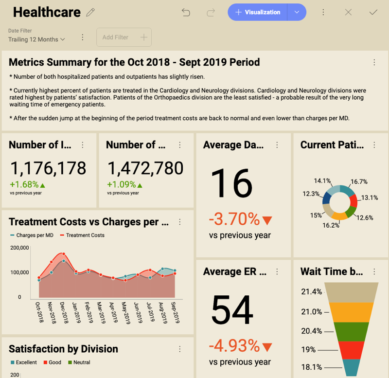
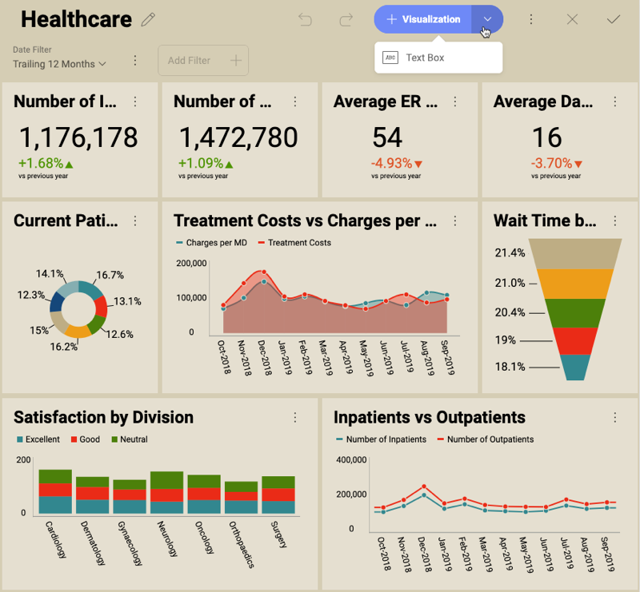
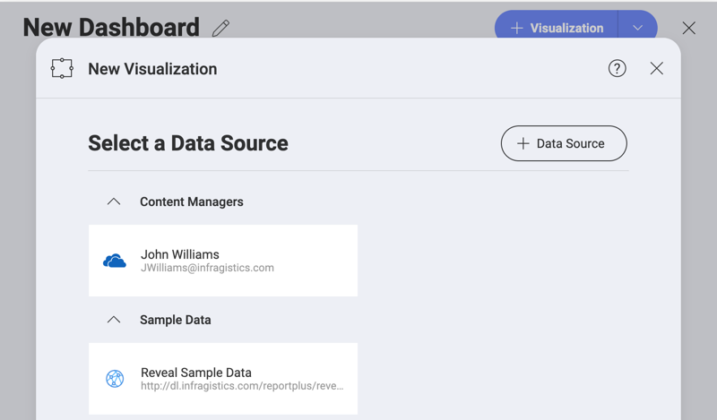
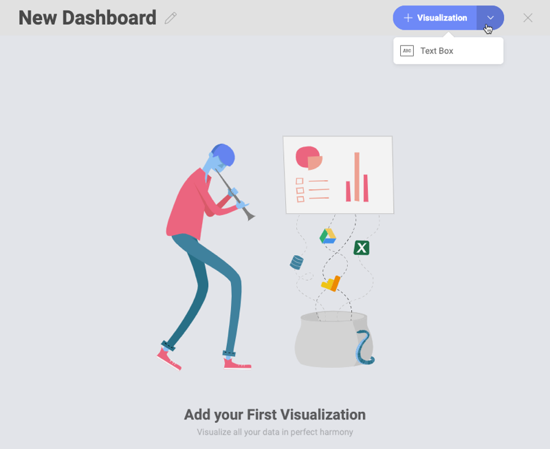
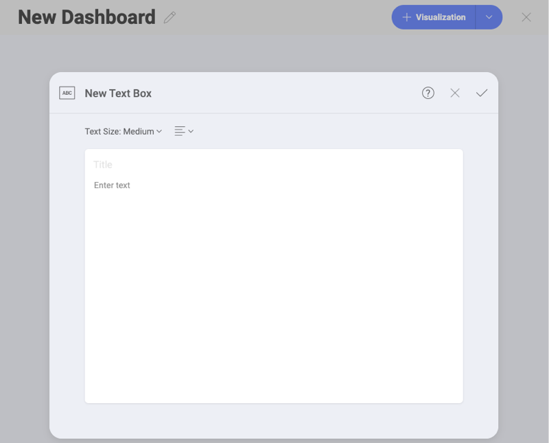

## Text Box Visualization

Text box visualizations, as their name suggests, consist of a text body
and an optional title. They are not connected to a data source. A common
scenario for using a Text box is adding a text summary to your report.

### Adding a Text Box to Your Dashboard

To add a Text box to an existing dashboard:

1.  Open the dashboard in *Edit mode*.

2.  Click/Tap the arrow on the right of the *+ Visualization* split
    button ⇒ *Text Box*.

When adding a Text box visualization to an existing dashboard, it
appears **at the bottom of your dashboard**.

### Creating a Text Box as a First Visualization in a Dashboard

Sometimes you may want to start your dashboard by creating a Text Box
visualization showing a summary or brief introduction. To access the
Text Box creation menu, follow the steps below:

1.  Click/Tap the *+ Dashboard* split button in the top right corner of
    Reveal's initial screen.

2.  The *New Visualization* dialog opens and prompts you to select a
    data source:

    

    Click/Tap the *X* to close the dialog.

3.  Click/Tap the *arrow* of the *+ Visualization* split button ⇒ *Text
    Box*:

    

### Working With the Text Box Visualization

After choosing to add a new Text box visualization, the following empty
form appears:

In this dialog:
 
  - choose between *Small*, *Medium* and *Large* *Text Size*;

  - select the alignment of the text (next to *Text Size*).
  
  - *(optional)* add a *Title*;
  
  - write your own text in the text body (the *Enter text* box);

>[!NOTE]
>**Formatting Restrictions**
>You can choose *Text Size* and alignment only for your body text. If you have a title, it will keep its default size and left alignment.

Click/Tap the *tick icon* to save your text box.
