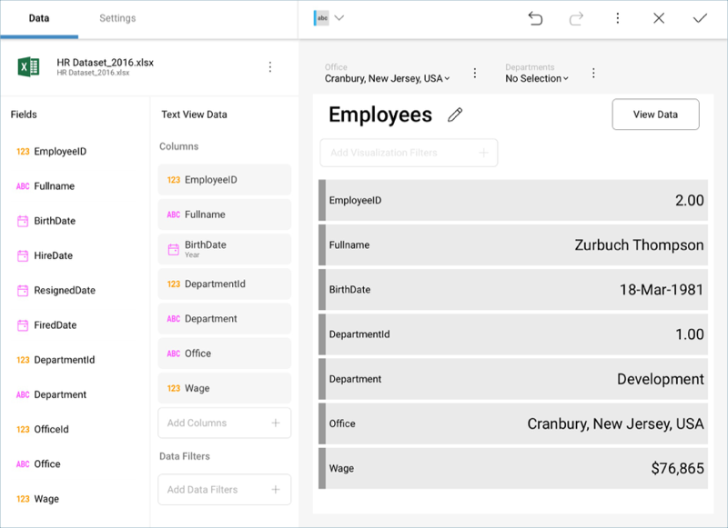

## Text View

The Text View displays information that follows a key-value pattern,
such as the employee record shown below. It does so by displaying
only the first row of data paired with the column's label. In order to
display a specific row, it's possible to apply filters to make sure
that's the only row displayed, so it's the one picked up by the Text
View. This approach is suitable when you want to help the viewer digest the attributes of a single entity easily. Examples include product
specifications, a person's contact information, etc.

The **Text View supports conditional formatting**, as explained in [this section](~/en/fields/conditional-formatting.md).

