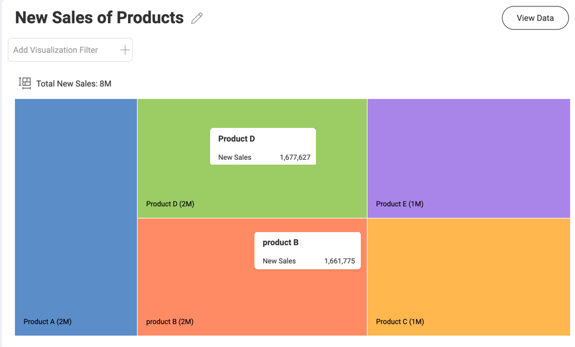
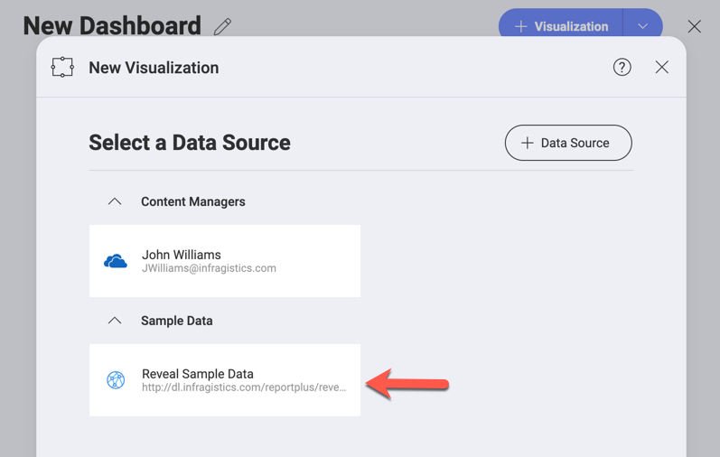
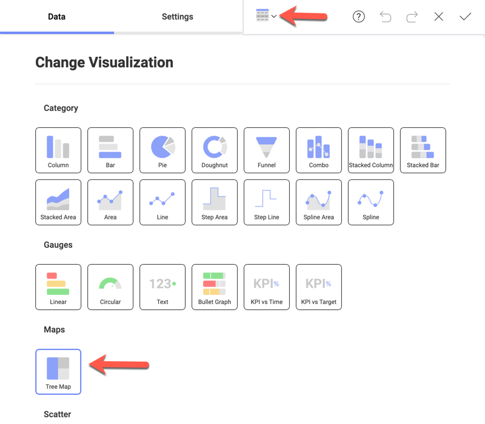
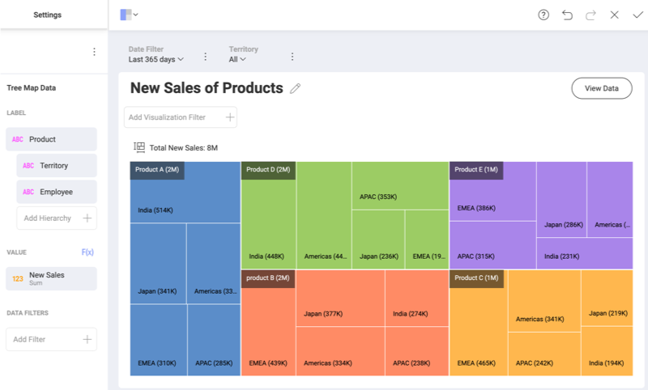
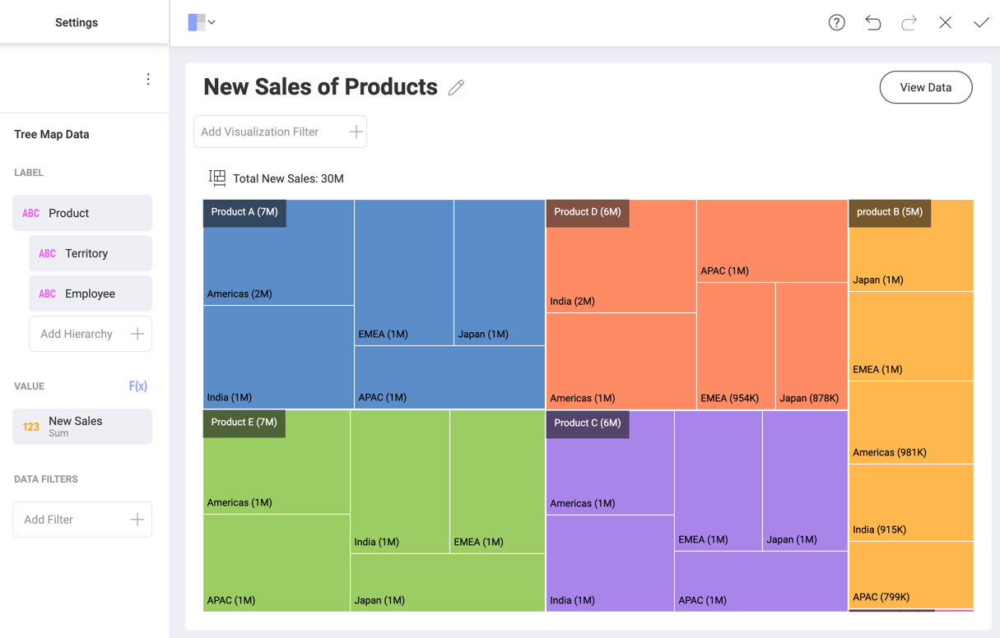
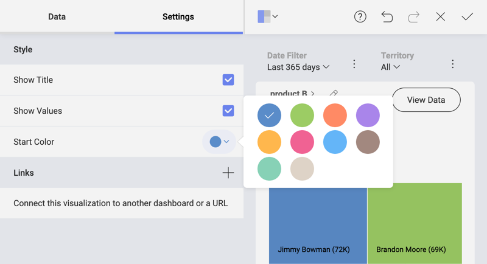

## Treemaps in Reveal

The Treemap visualization is used to display hierarchical data as a set of nested rectangles. Rectangles of each level are of different sizes and colors.

Each characteristic of the building tiles (rectangles) has a role in the data analysis:

  * **Color** - shows the categories by which the treemap visualization is divided. Fields data, used to define this characteristic, can be numerical (_123_), string (_ABC_), or date.
  * **Size** - shows the value for each category. Fields data, used to determine size, can only be numerical (_123_).
  * **Label** - shows the category and value for each rectangle in the visualization (for link:#flat-treemap[flat treemaps (i.e. without hierarchical data)]). When you have a link:#hierarchical-treemap[treemap with hierarchical data], there is an additional label showing the category and value for the current level.

### Treemap Visualizations Without Hierarchical Data

You can create a **visualization without hierarchical data** like the one shown below:

You can use treemaps with no hierarchies to show patterns and part-to-whole relations in an attractive and clear way.

The visualization above displays _New Sales_ by _Product_. To build this visualization you need to do the following:

1. In the _Select Data Source_ dialog, choose *_Reveal Sample Data_*.

    

2. In the _Visualization Editor_ choose the **Tree Map visualization**.

    

3. In the *Tree Map Data section* drop _Product_ in _Label_, and _New Sales_ in _Value_.

Note that the *data dropped in _Label_ (_Product_) determines the* **color** and tiles the visualization in five different rectangles.

The biggest tile indicates the largest _New Sales_ value. Rectangles are *arranged in size from top left (biggest) to right bottom.*

*The label at the left bottom* of each rectangle shows rounded approximate value for each product. To see exact values, click on a tile to show tooltips (see the screenshot example).

### Treemap Visualizations With Hierarchical Data

Handling hierarchical data is the treemap's initial purpose. You can have only one value metric, but unlimited different categories, organized into hierarchy.

In the example above the treemap is split into five big rectangles (branches of the treemap), determined by the _Product_ category. Each of them *contains smaller rectangles*, determined by the next category level - _Territory_. Lower levels are not presented.

You may notice *two kinds of labels* in the example above:

- for the big rectangles, top left - show information about total new sales of each product;
- for the smaller rectangles, bottom left - show how much of each product is sold in a particular country.

Information about the color and size characteristics of the tiles is similar to what was said about the [Treemaps without hierarchies](#flat-treemap.md).

#### Drilling Up and Down Hierarchy Levels

You can drill up and down the treemap visualization to navigate between different hierarchy levels. To do this, *click on a big rectangle* area (irregardless of the tiles it contains). In the tooltip, select _Drill Down/Up to_.

#### Treemap Levels Specifics

When you reach the bottom of the hierarchy (the last field dropped in _Label_), your visualization will look exactly like the [flat treemaps](#flat-treemap.md).

The *totals label* over the top of the treemap visualization (on the left) changes at every level. The _Totals_ reflect the changes in the _Value_ field for each hierarchy level in _Label_ (compare totals in the previous examples). In the example above the totals label shows all new sales of product B in Japan.

Use the *breadcrumbs in the title* to identify the current level, which is displayed. You can also click on them to navigate (instead of drilling up).

### Working With the Visualization Editor Settings

In the _Settings_ section of the Treemap visualization you can configure the following:

- **Show Title** - choose whether to show the visualization's title;
- **Show Values** - choose whether to show **labels**, displaying information about categories and values for rectangles at different levels;
- **Start Color** - choose a start color from a 10-color palette, Reveal will use your choice to adjust a color scheme;
- **Links** - connect the visualization to a dashboard or URL. For more information, please refer to the [Linking Dashboards](~/en/dashboards/dashboard-linking) topic.
