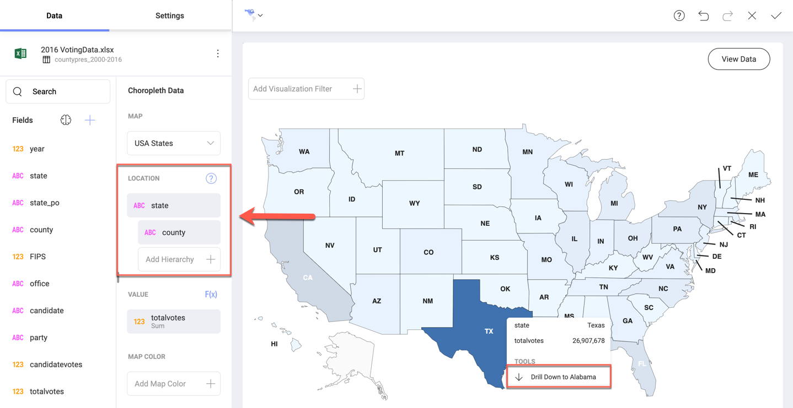

## Choropleth Maps

Choropleth maps are widespread thematic maps meant to depict statistical data in divided geographical areas or regions. Each area on the map is filled with a uniform color in relation to a data variable.
Further in this topic, areas on the map are also called "regions" or "shapes".

In Reveal, the map type displayed for the choropleth is a standard political map, i.e. the individual shapes in the map can be continents, countries, states, counties, political unions, etc.

The map supports the three different coloring schemes listed below.

  * The *Single color* scheme styles all shapes containing data with the same color. Shapes with no data are greyed out.
  * The *Range of values* scheme styles the shapes using one of seven colors, where colors progressing light to dark represent data values from low to high.
  * The *Map Color* scheme assigns a theme color to each unique identifier in the _Map Color_ field. With this scheme, the shape ends up being styled based on the identifier with the highest/lowest value for that shape - see link:#map-color[this example].

Find how to set the color of your map in the link:settings-choropleth-map[Choropleth Map Settings] topic.

The choropleth map in Reveal also allows you to link:#drill-down[drill down] through your hierarchical data.

### Using the Choropleth Map Visualization

Typically, choropleth maps are used to present in a digestible manner public reporting, statistical analysis, and any other information, for which boundaries are important. The choropleths are great for displaying densities (ratios) of quantities, making comparisons of regions, examining trends, discovering patterns and anomalies. For example, you can use the choropleth to find regions on the US map with higher obesity rates, or show how homicide percentage vary across Europe.

Be careful how you use your data with a choropleth map. Sometimes you will want to compare regions that are too different in terms of magnitude. Then, it's best to present your data as *rates/ratio* (percentage) and not in raw counts (numbers) to make the insight realistic.

If, for example, you compare traffic deaths in different countries only by raw counts, you will receive misleading results due to the population factor. More densely populated countries like China would always be colored in darker colors because of bigger raw counts.

Below, you can see a map, showing traffic deaths per 100 000 population in Eastern Asia. Here, you can make realistic conclusions about the driving culture of Asian countries, avoiding the chance to be deluded by the population of bigger countries.

Your choice of data for the choropleth map visualization highly depends on the insight you want to provide. If you aim to present the spread of a contagious disease through a region, then the use of raw counts may be more appropriate.

### Data Requirements for Location Data

Reveal has a great variety of predefined maps available for your choropleth visualizations. The minimum information required to provide in your data set is:

  - quantitative data (values) for a given location;
  - location names.

*Location names* column in your data set has to match the actual geographic units on the selected map. For example, if you choose the USA map, you need to provide a column in your data set containing state names.

To have your location column recognized by Reveal, provide the locations' full names or official 2- or 3-letter abbreviations. Be consistent with the format you provide and don't mix full names and abbreviations.

Find more specific information about the Location format and requirements in link:location-data-requirements[How to prepare Your Data for a Choropleth Map].

### Creating a Choropleth Map

In the example below, we will use a choropleth map to analyse the results of the last presidential elections (2016) in the United States.

To follow this walkthrough, download the [2016 November General Election](https://download.infragistics.com/reveal/help/samples/2016_November_General_Election.xlsx) spreadsheet, upload it to a cloud provider and follow the steps below.

1. Connect to the cloud provider where you uploaded the spreadsheet. For more information on adding a data source in Reveal, visit the link:data-sources[Data Sources] section.
2. In the visualization editor, select the Choropleth Map visualization:

    

3. In the _Choropleth Data_ section, select the US States map from the _Map_ dropdown  An outline of the United States map will be displayed on the screen.

    

4. In the _Location_ placeholder, drop the _State_ or _State Abv_ filed. Both of them contain a list of the US states' names.

5. For _Values_, select the field containing the quantitative data you want to map. For this example, we will use the _Total Votes (%)_, containing the voting rates in every state.

6. Format the _Value_ field to show percentage. Select the _Total Votes (%)_ under _Value_ > _Formatting_ > _Type_ > _Percent_. Find more about formatting fields in the link:field-settings[Field Settings] topic.

7. _(Optional)_ Add a filter. For our example, drop the _year_ field in the _Data Filters_ placeholder. Click on the field, select _Filter type_ > _Select Values_ > _2016_.

    

As a result you can see the USA map, divided into states. The larger the percent of voters in a state, the more intensive the blue color of the state is.

### Using the Map Color to Create a Multi-Color Choropleth Map

You can alternatively set the _Map Color_ property to control the color of each area on the map. This is useful to reflect things like which candidate or party had the most/least votes in an area.

In the example above, Donald Trump, Hilary Clinton, and "Other" are compared by votes in the 2016 elections. States are colored differently, depending on who won the most votes in the elections.

To change the coloring condition, go to:

_Settings_ > _Color based on_ > _Lowest Value_.

### Drilling Up and Down Hierarchy Levels

You can drill up and down your choropleth map areas to dynamically uncover hierarchy levels of your location data.

To enable the drill down option, you need to add more than one data field in the _Location_ placeholder to create subordinate levels. Adding counties under the US states as a new hierarchy level, for example, will allow you to see the big picture at state level and also explore finer details at county level.

Hovering over a shape on the map will highlight it, and a tooltip will appear (see below). Click on the _Drill down_ option to reveal the map for the next location hierarchy level.  

  
  
>[!NOTE]
>**Available Maps.**
>You can drill down into maps only if the map for the subordinate level is available. Find the available maps under _Map_ in the _Choropleth Data_ section.
