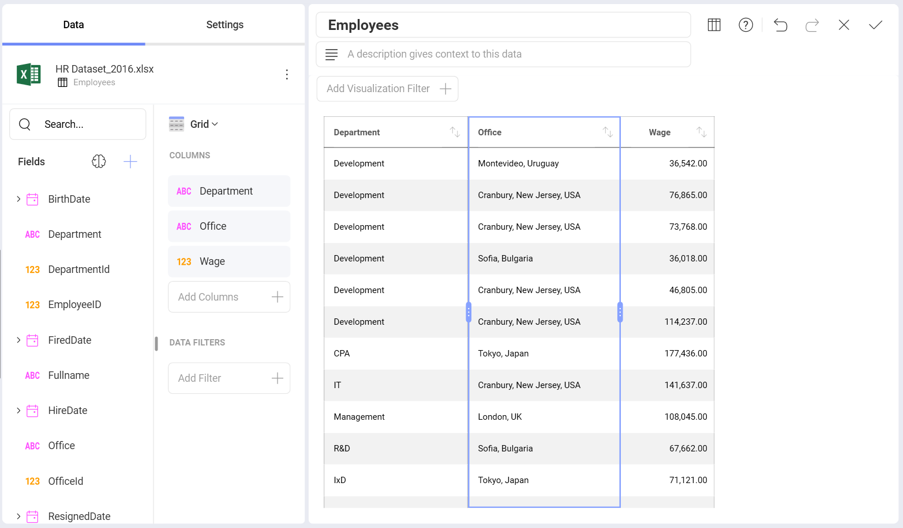
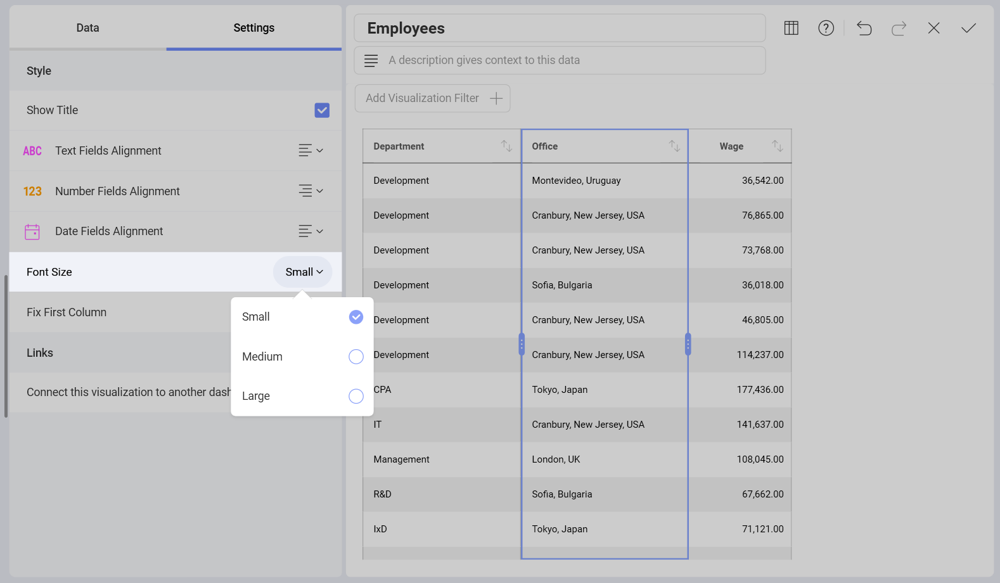

# Grid Chart

## Working With the Grid Chart in the Visualization Editor

The grid chart is a visualization option for displaying data, which presents the information in a matrix. You can **resize a column's width** by selecting the grid header, which will highlight the whole column. Drag the a side left or right to modify the column's width.

You can adjust the size of your font by going to the **Settings**
section and choosing a different size; the default one is *Small*. The
*Medium* size will increase the size by 2px, whereas *Large* will
increase it by 4px.

You can also set the first column to be in a fixed position by checking
the *Fix First Column* option under **Settings**. This is particularly
useful whe working with many columns.

>[!NOTE]
>The grid chart is suitable in a dashboard when the number of rows and columns is less than 10. When you're dealing with small amounts of data, the preferred approach may be to "just show the numbers".

## Column Sorting in Dashboard View Mode

The grid chart allows you to change the sorting of your columns
(ascending or descending) in *Dashboard View mode* . You can do so by selecting the
arrows icon next to the column name.

You can apply more than one sorting criteria. You will see small number
icons appearing next to the existing column headers. The direction of the
arrow will help you determine whether you applied ascending or
descending sorting.

You can also choose to remove any existing sorting options you have
entered with the *None* or *Clear All* options. If any other sorting
options remain, the order in which they will be applied will be
determined by the number next to the column header.

