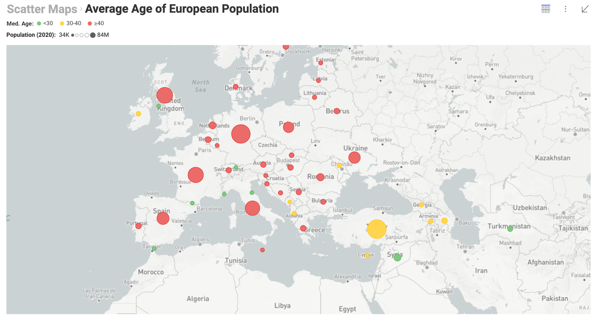
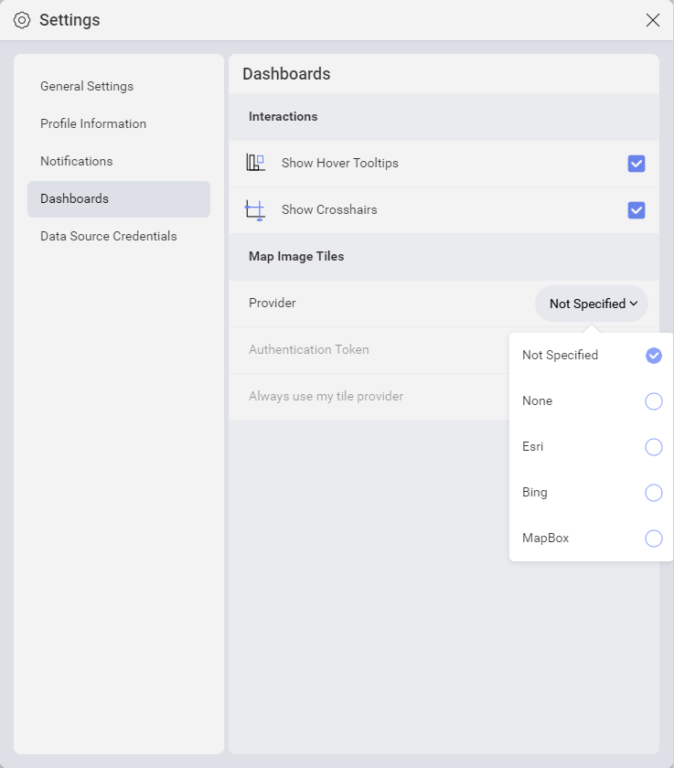
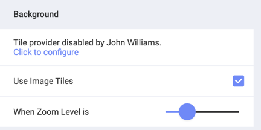
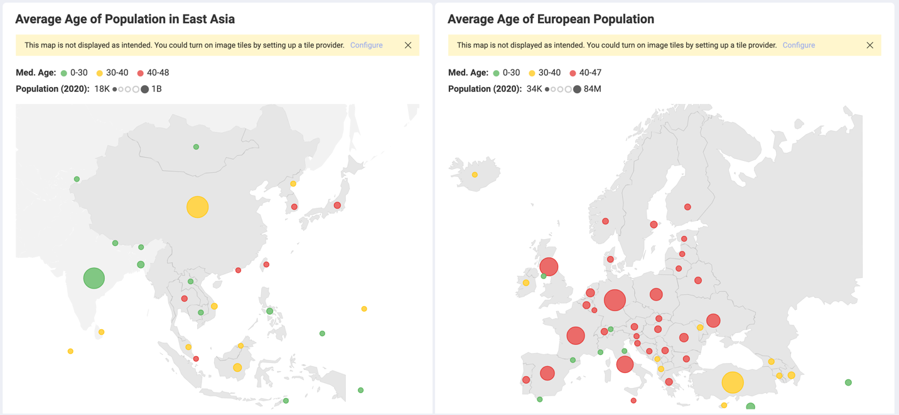

## Using Image Tiles with Scatter Maps

The *image tiles* feature allows you to switch from the clear grey background of Reveal to a different map layer upon zooming. The additional detail coming from the map service provider will provide more context to your analysis.

You can use the *slider* provided in the *Visualization Editor Settings* to specify at which zoom level you want to transition to using image tiles. Sliding left to right changes the moment of transition from minimum to maximum zoom. 
 

### Adding Image Tiles to Your Maps

To use image tiles upon zooming your scatter:  

1. In the _Visualization Editor_, go to _Settings_ > _Background_ and make sure _Use Image Tiles_ box is checked.  
2. If no tile provider is configured, click the button in the yellow banner that shows up (see screenshot below). 

    
   
    Here you are presented with three levels to configure a tile provider at: 

    * personal (*member*);
    * *team* - this option only appears when you creatе the dashboard inside a team;
    * *Organization* - this option will not appear, if you are not part of an Organization team or you creatе the dashboard inside a personal team.

3. Choose the level you prefer to set up a tile provider. 

    The dialog that opens is similar for all levels. You can also find this dialog anytime in your *personal settings* or your *team's/Organization's settings*. 

    

    >[!NOTE] **Setting up a tile provider at Organizational/team level**. 
    > You can configure a tile provider at Organizational or team level only if you are an *Owner* in the Organization/team. This will allow all members of this team/Organization use the tile provider you configured. 

4. For _Provider_ choose one of the following map service providers: 

    * *Esri*
    * *Bing*
    * *MapBox*

    If you choose the *None* option you will disable the tile provider at this level, but Reveal will let others know about this.

    
     
    The *Not Specified* option will also disable using a tile provider at the selected level (personal, team or organizational) without notifying other users. This option, however, makes Reveal ignore this level when determining which tile provider to use in its so called [_Resolution Process_](#resolution-process).  
 
5. Add the _Authentication Token_ for the selected provider. The token can be found in your map service account. Once you add it, it will be stored in Reveal for future use. You can use it without adding it again no matter how many times you disable the tile provider in your settings.  

6. Click/tap *Update* and close the dialog.

### How does Reveal determine which file provider to use? The Resolution Process.

When you open a scatter map where *Use Image Tiles* is enabled, Reveal attempts to resolve which tile provider to be used. The tile provider (and its authorization token) can be specified on any of three levels of user settings: Personal, Team, Organization (see more in [Adding Image Tiles](#adding-image-tiles) above). 

When the *Not Specified* option is selected for tile providers at all settings levels, you will see the following banner over the scatter map visualization in _Dashboard View_ mode and in the _Visualization Editor Settings_: 

However, there is another scenario where a tile provider is **specified on more than one level**. And you will notice that one of the tile providers is being used for the scatter map you opened. How did Reveal choose it? 

The most important factor in determining which level settings take precedence over the others is who owns the dashboard. There are three possible scenarios, which you can check below. 

#### When the dashboard is owned by a user

When the dashboard is owned by a user i.e. it's personal, created in the _My Stuff_ space, Reveal checks for a tile provider, as follows: 

1. In the *Organization* team settings, if the user is part of an Organization.
2. In *Personal* settings. 

#### When the dashboard is owned by the Organization 

When the dashboard is owned by the Organization, i.e. it's created in the Organization dashboard's space, Reveal checks for a tile provider: 

1. In the *Organization* team settings.
2. In *Personal* settings of the user opening the dashboard. 

#### When the dashboard is owned by a team 

When the dashboard is owned by a team, i.e. it's created in the Organization dashboard's space, Reveal checks for a tile provider: 

1. In the *Team* settings.
2. In the *Organization* settings when the owning team is *part of the Organization*.
3. In *Personal* settings of the user opening the dashboard.

>[!NOTE] **Always use my tile provider**. 
> Marking this checkbox in your personal settings makes Reveal always choose your tile provider when tile providers on multiple levels are configured. This goes for all three scenarios above. 

