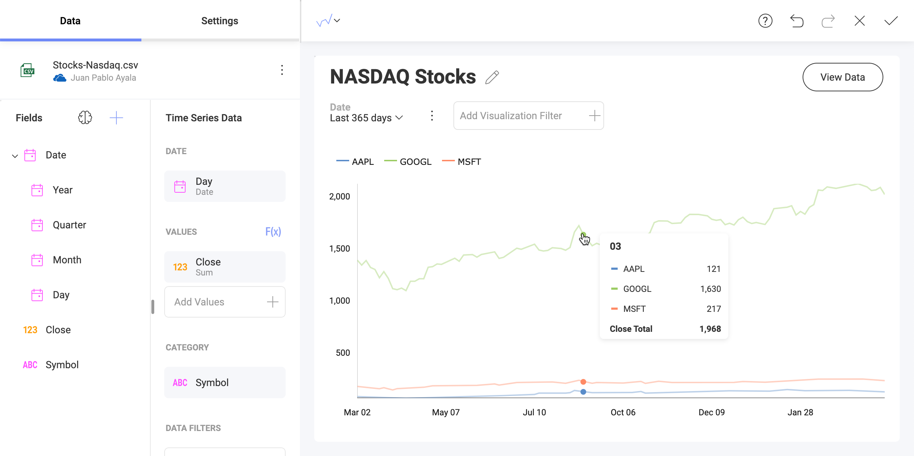
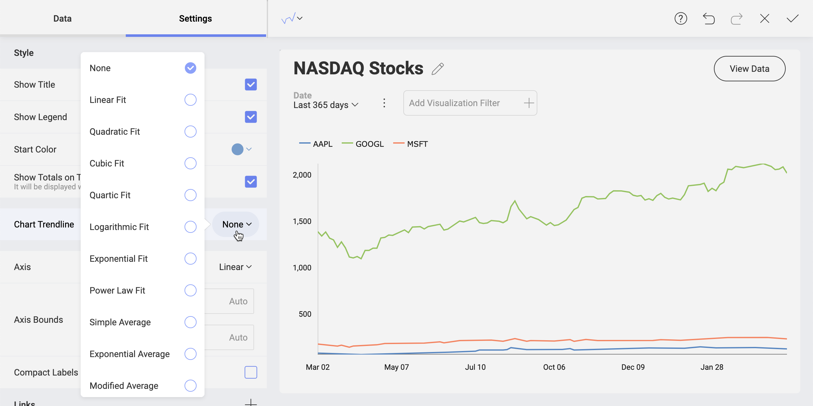

## Time Charts

A Time Series chart is used to display data points indexed in time order. It is commonly used to detect trends at a glance, allowing an easy observation of development over time.

Very similar to a conventional line chart, the Time Series chart always has a time-based horizontal axis (x-axis).

### Chart Trendlines

Chart settings enable the display of trend lines, which are lines that
are painted across a chart, based on an algorithm. Trendlines are a very
simple, yet powerful tool to help you determine trends in datasets, and
define thresholds for taking action. The supported algorithms are Linear
Fit, Quadratic Fit, Cubic Fit, Quartic Fit, Logarithmic Fit, Exponential
Fit, Power Law Fit, Simple Average, Exponential Average, Modified
Average, Cumulative Average, Weighted Average.

### Settings for Time Charts

In *Settings* you can:

  - **Hide elements displayed by default**.
    You can choose to hide the title, legend, and tooltip totals(only available when you have categories).

  - **Display Trendlines**.
    Chart settings enable you to display trendlines, choosing among different supported algorithms as described in the previous section.

  - **Choose between Linear scale or Logarithmic**.
With Logarithmic, the scale for your values will be calculated with a non-linear scale which takes magnitude into account instead of the usual linear scale.

  - **Setup the minimum and maximum values for your charts**.
Minimum is set to 0 by default and maximum is calculated
    automatically depending on your values.

  - **Choose Compact Labels**.
With this setting you avoid redundant label information when you zoom your chart, as shown below.

### Zooming and Panning

When the Time Series chart is maximized, you can zoom in and out. As shown in the image above, this allows you to focus on a specific time interval and is a clear scenario where using the Compact Labels setting makes sense.

### Statistical Functions Not Supported

Reveal provides you with three types of advanced
predictive analysis. These are *Time series forecast*, *Linear regression*) and *Detect outliers*. You can use them to make predictions, recognize and evaluate trends, or discover outliers
in your data series.

The newly released Time Series chart does not support statistical functions yet. This means you cannot use Time series forecast, Linear regression or Detect outliers for now. They will be supported in the future. Currently, you can use a Line chart to achieve a similar result, as shown here [*Time series forecast*](~/en/data-visualizations/statistical-functions.html#time-series-forecast).
