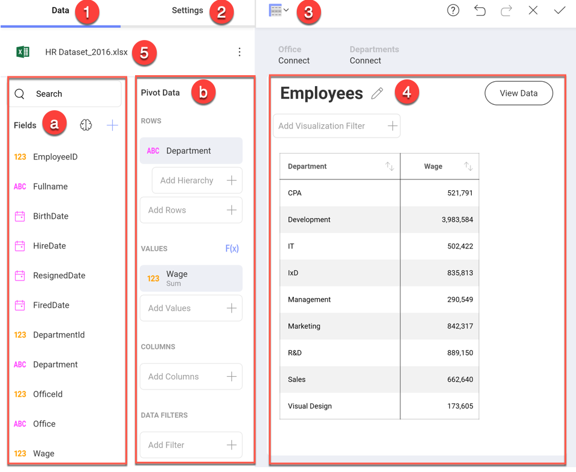

## Visualizations Editor

The Visualization editor is where you create and edit your visualizations. It helps you work with the data to get the most desired view.

### Accessing the Visualizations Editor

You can access the Visualization editor in two ways:

***1. In the visualization creation process***

Once you have selected and configured your data source, the Visualization editor will open automatically.

***2. In the dashboard editing process***

After opening a chosen dashboard and entering _Dashboard Edit mode_, you will be able to **access the visualizations editor** by selecting *Edit* from a visualization's overflow button.

### Visualization Editor Overview

There are three main areas in the
visualizations editor:

  1. **Data Section**, where you will find the list of available fields in the selected dataset and the data editor. This tool is meant to help you slice-and-dice data according to your needs. You can use the search to find a data field, when the available fields are more than ten.

  2. **Settings Section**, where you can access the settings for the
    specific visualization you are using and the *General Settings* for
    the visualization.

  3. **Visualizations Selector**, where you can choose your desired
    visualization and preview the final result.

Among other things, you will be able to:

  - [**Sort**](~/en/data-visualizations/fields/sort-by-field.md) & [**filter**](~/en/filters/visualization-filters.md) data.

  - [**Bind the visualization data to a dashboard page selection**](~/en/dashboards/dashboard-linking.md).

  - [**Aggregate data**](~/en/data-visualizations/fields/field-settings.md) in the data editor.

  - **Search**, **Visualize** & [**format**](~/en/data-visualizations/fields/conditional-formatting.md) data.

After you're done building the visualization and selecting the
appropriate visualizations, select the *Back arrow* to return to the
Dashboard Editor. In the Dashboard Editor, you can control the layout,
size, and location of the visualizations by simply dragging
visualizations and their borders.
