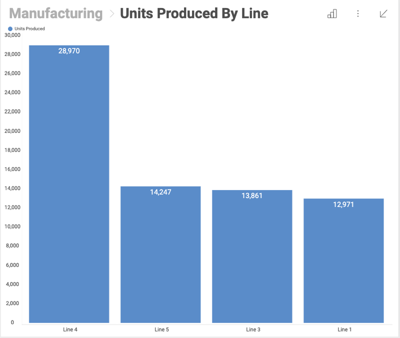
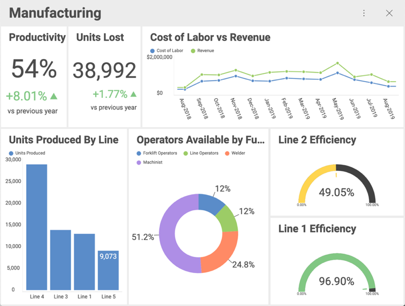
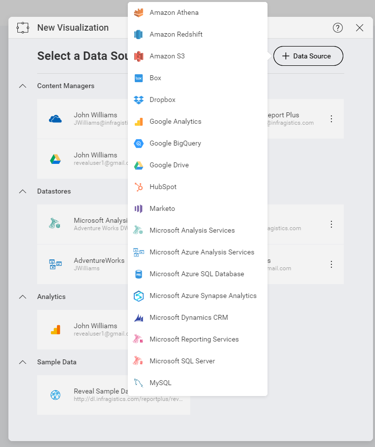

## What is a Visualization?

Visualizations are individual pieces of information. Any dashboard is
composed by one or more visualizations. The image below shows the
quantity of units produced by different lines in a [Column Chart](category-charts.md) visualization.

### How are Visualizations presented?

In order for users to get the most insight possible out of business
data, Reveal provides several options to customize the way information
is visualized. These are called "visualizations".

In the dashboard above, you see the following visualization types:

  - **Productivity**: [Text Gauge](Gauge-Views.html#text-gauge)

  - **Units Lost**: [Text Gauge](Gauge-Views.html#text-gauge)

  - **Cost of Labor vs Revenue**: [Line Chart](category-charts.md)

  - **Units Produced by Line**: [Column Chart](category-charts.md)

  - **Operators Available**: [Doughnut Chart](category-charts.md)

  - **Line 1 Efficiency**: [Circular Gauge](gauge-views.md)

  - **Line 2 Efficiency**: [Circular Gauge](gauge-views.md)

### How do you create a Visualization?

Once you select the + sign to add a new dashboard, you will be prompted
to enter a new or an existing [data source](~/en/datasources/data-sources.md). This will be
the first step towards creating your visualization.

With the data source selected, the visualization will be created. You
can edit it through the [Visualizations Editor](visualizations-editor.md).

### How do you edit Visualizations?

Once a dataset is selected for a dashboard, the **Visualizations Editor** is automatically displayed. This helps
you work with the data to get the most desired view.

To learn how to work in the Visualization editor and also access it, read [this topic](visualizations-editor.md)
