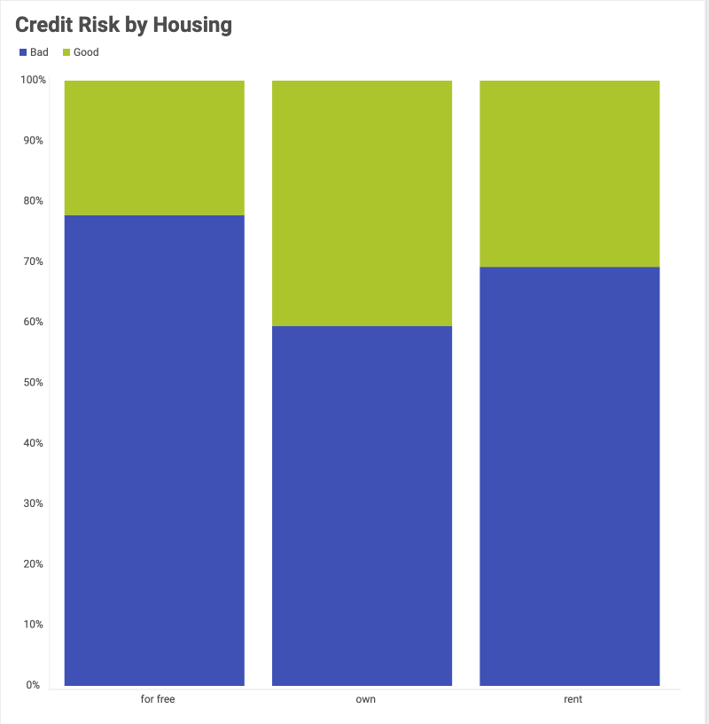
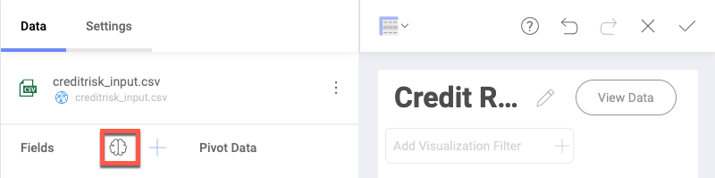
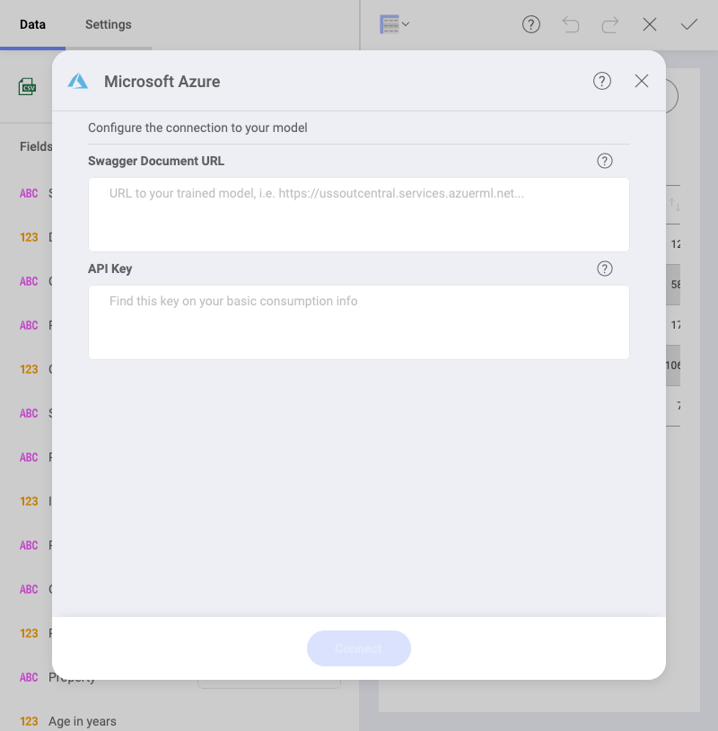
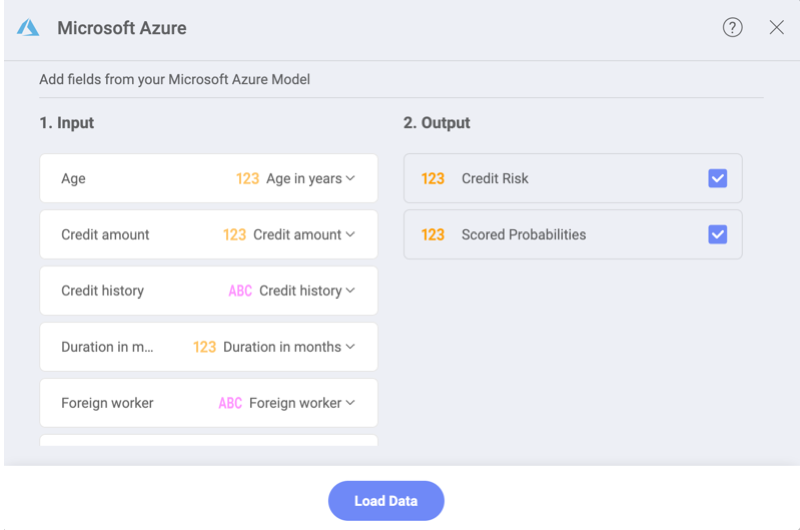
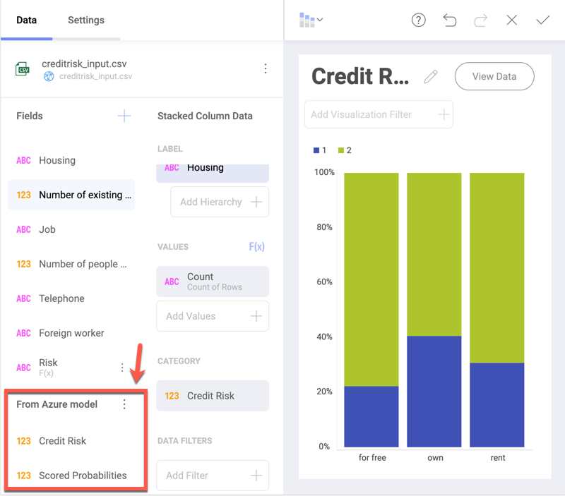

## Azure Machine Learning in Reveal

You can use your trained models data from Azure Machine Learning Studio
in Reveal. Get better insights than ever! Just choose your data source,
build a visualization, and use the integration to connect to a trained
machine learning model.

For example, you may have a machine learning (ML) model that is trained
to predict the credit risk for a bank's clients, using specific
information about the clients. This ML model can be used in Reveal to
build a visualization giving insight about how the clients' housing type
relates to their credit risk:

### Prerequisites

To use the Azure Machine Learning integration in Reveal, you first need
to have an account in **MS Azure Machine Learning Studio** as well as a
**trained machine learning model** to connect to when building your
visualization.

### Accessing Azure Machine Learning Integration

To access the Azure Machine Learning Integration, follow the steps
below:

1.  Connect to a data source of your choice. It should contain
    information related to the data your machine learning model
    predicts.

    Please, refer to the [Creating a New Data Source Connection](creating-new-datasource.md) topic for more information on
    how to connect to a data source.

2.  In the *Visualization editor*, click/tap the **brain icon** located
    at the top of the *Fields* list to the left. Then choose **Azure
    Machine Learning**.

    

### Connecting to Your Azure Machine Learning Model

To connect to your Machine Learning Model in Azure, you need to do the
following:

1.  Provide the requested values in the configuration dialog below in
    order to access the Web Service exposed by the Azure Machine
    Learning Model:

    

    To find the **Swagger Document URL** and **API key** you need to do
    the following:

    a.  Go to **MS Azure Machine Learning Studio**.

    b.  Select **Web Services** in the menu on the left.

    c.  From the list, choose the web service (exposed by the trained model) you want to integrate with Reveal.

    d.  Copy the **API key** you are given for this service.

    e.  From the **Default Endpoint** table for the same service select **REQUEST/RESPONSE**.

    f.  In the **API Documentation page** that opens, copy the URL of the **API Swagger Document** and paste it in Reveal.

2.  The dialog displayed requires you to map the data in Reveal to the
    input expected by your ML model.

    

    In the dialog above you have the following columns to consider:

    a.  **Input** - the left column displays what kind of data the model requires in order to calculate the output information (e.g. *Credit Risk*). In the right column, select the fields in your dataset (e.g. *Age in years*) that match the requested data in the left column (e.g. *Age*) for the model. Reveal automatically matches all fields in the *Input* list sharing the same name with the model's requested data.

    b.  **Output** - choose the information you want calculated (predicted) by the model. The result will appear as new fields
    in the Visualization editor, under *From Azure model*.

    c.  **Parameters** - some Azure ML models require you to fill in values for the parameters they need in order to calculate the output. In this case you will see a third *Parameters* column between *Input* and *Output*.

      

You can use the fields returned by the Azure model as regular fields in
the Visualization editor.
