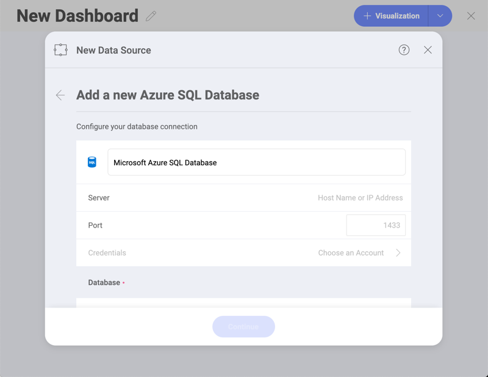

## Azure SQL

To configure an Azure SQL data source, you will need to enter the following information:

1.  **Data Source Name**: this field will be displayed in the Data
    Sources list.

2.  **Server**: the computer name or IP address assigned to the computer
    on which the server is running.

3.  **Port**: if applicable, the server port details. If no information
    is entered, Reveal will connect to the port in the hint text (1433)
    by default.

4.  **Credentials**: after selecting *Credentials*, you will be able to
    enter the credentials for Azure SQL or select existing ones if
    applicable.

      - *Default name* of the data source: Your data source name will be displayed in the list of accounts in the previous dialog. By default, Reveal names it *Microsoft Azure SQL Database*. You can change it to your preference.

      - *(Optional)* **Domain**: the name of the domain, if applicable.

      - **Username**: the user account for Azure SQL.

      - **Password**: the password to access Azure SQL.

5.  *(Conditional)* **Database**: Once you connect to your account, you
    will get your databases to choose from (if more than one).

Once ready, select **Create and Use**.

### Further Information

Finally, if you want to know more about any of the following:

  - How to find your Server Information

  - Working with Views

  - Working with Stored Procedures

Please refer to [**SQL Server**](microsoft-sql-server.html#how-to-find-server) as both Reveal data sources work similarly.
