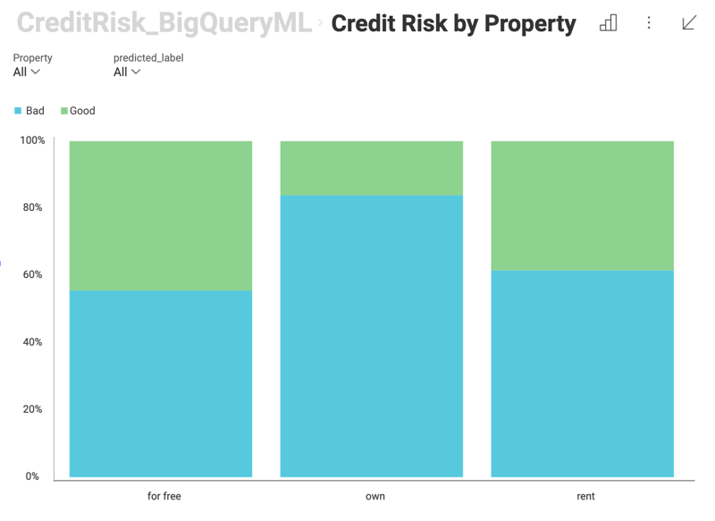
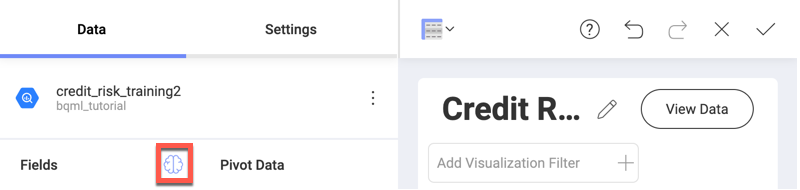
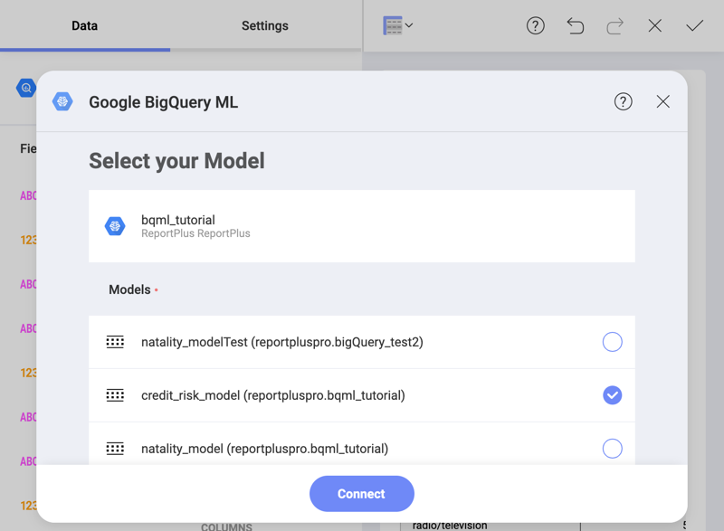
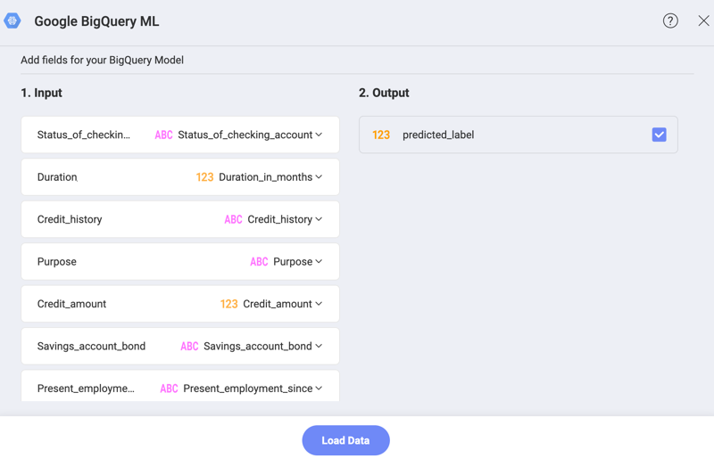
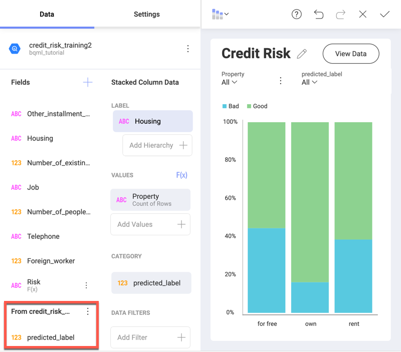

## BigQuery Machine Learning in Reveal

You can use your trained machine learning models data from BigQuery in Reveal. Get better insights than ever! Just choose BigQuery as your data source for building a visualization, and use the integration to connect to a trained machine learning model.

For example, you may have a machine learning (ML) model that is trained to predict the credit risk for a bank's clients, using specific information about the clients. This ML model can be used in Reveal to build a visualization giving insight about how the clients' housing type relates to their credit risk:

### Prerequisites

To use the BigQuery Machine Learning integration in Reveal, you need to **connect to a BigQuery data source** account, where you have a **trained machine learning model**.

### Accessing BigQuery Machine Learning Integration

To access the BigQuery Machine Learning Integration, follow the steps below:

1. Connect to a BigQuery data source. Select the dataset, which contains information necessary for your machine learning model predictions.

    Please, refer to the [Google BigQuery](google-bigquery.md)  topic for more information on the BigQuery data source.

2. In the _Visualization editor_, click/tap the **brain icon** located at the top of the _Fields_ list to the left.

    

### Connecting to Your Machine Learning model

To connect to your BigQuery machine learning model you need to do the following:

1. Select from your trained BigQuery models in the dialog that opens:

    

2. The next dialog requires you to map the data loaded in Reveal to the input expected by your ML model.

    

    In the dialog above you have the following columns to consider:

    a. **Input** - on the left you see the kind of data the model requires in order to calculate the output information (e.g. _Duration_). On the right, you need to select the fields in your dataset (e.g. _Duration_in_months_) that match the requested data on the left. Reveal automatically matches all fields from the loaded BigQuery dataset, which share the same name with the model's requested data.

    b. **Output** - choose the information you want calculated (predicted) by the model. The result will appear as new fields in the Visualization editor, under _From (name of the model)_, e.g. *From credit_risk_model*.

    c. (_Optional_) **Parameters** - some of your BigQuery models may require you to fill in values for the parameters they need to calculate the output. In this case you will see a third _Parameters_ column between _Input_ and _Output_.

You can use the fields returned by the BigQuery model as regular fields in the Visualization editor.
