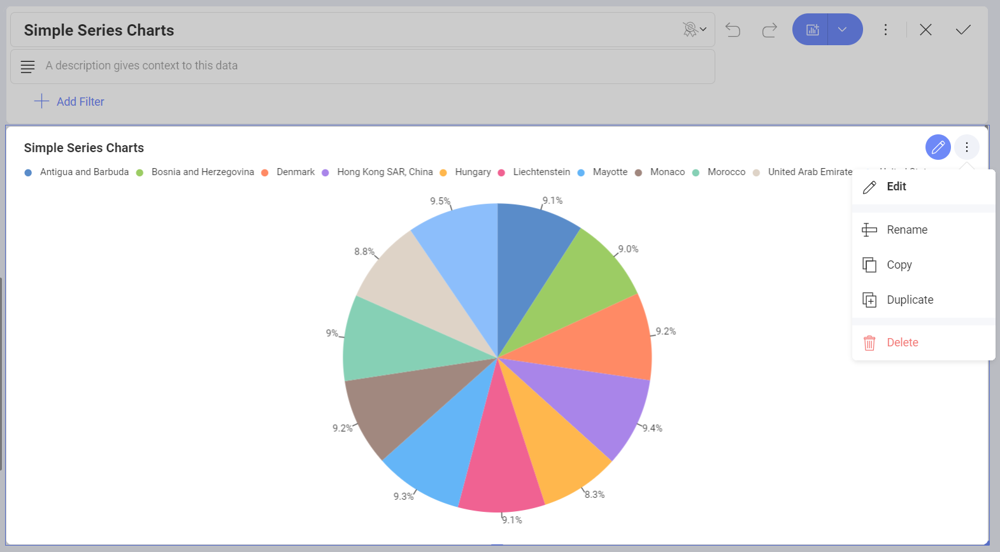
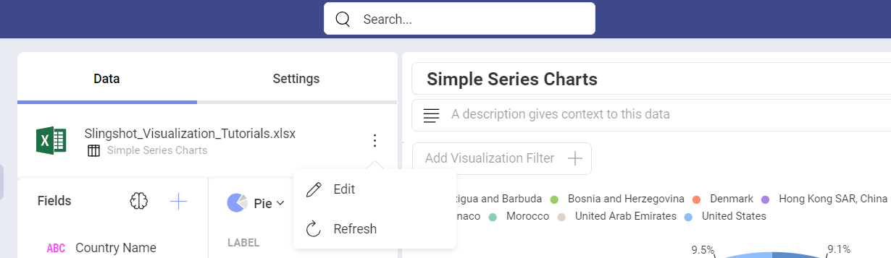
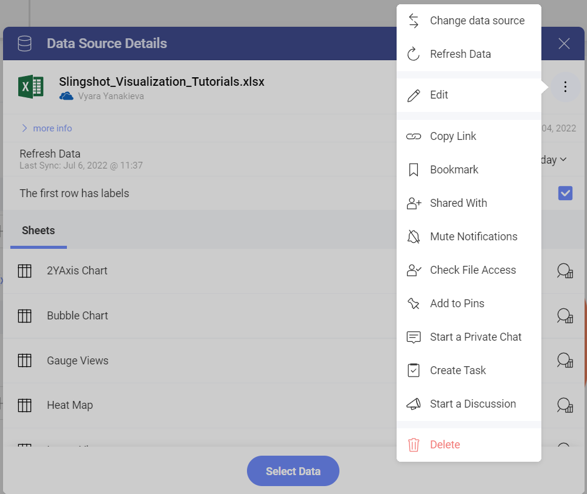
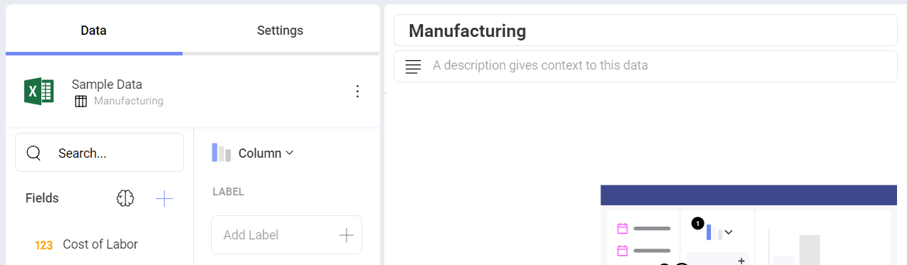

# Changing the Data Source for a Visualization

After visualizations are created, it is still possible to change their
linked data sources. To do this:

1. Access *Dashboard Edit mode* by selecting **Edit** from the overflow menu in the top right hand corner.
2. Click/tap on **Edit** in the overflow menu of a chosen visualization.

 

3. You will see your current data source listed in the *Data* section. In order to change it, select the overflow button next to the data source
name and click/tap on **Edit**.

 

4. This will display the **Visualization Data**, where you will see your
current data source. You can choose another collection of data from the same data source or click/tap on **Change data source** next to your data
source's name and choose the data source you want from one of the
supported in the list.

  

5. Once you have chosen the data source, a **Data Source Details** dialog will open up. Here you can select the information you want to use for the visualization editor. The data already present in the editor will be completely replaced by the data in your new data source.

6. You will see the name of the data source updated in the *Data* section of the Visualization editor.

 
