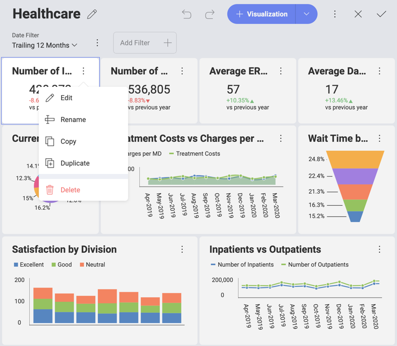
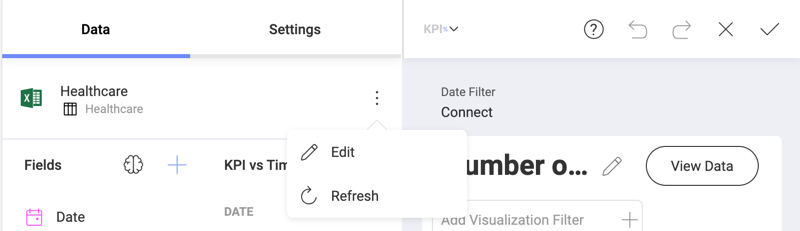
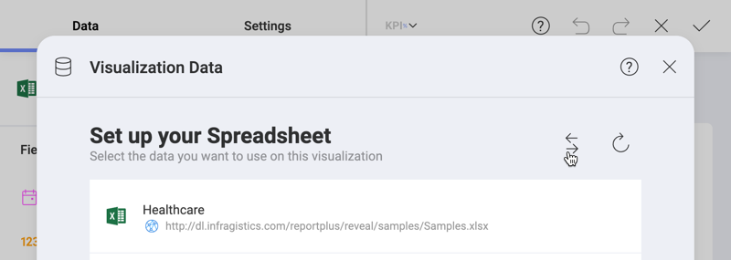
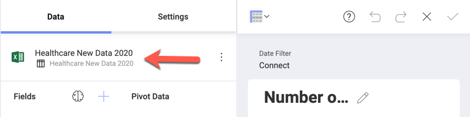

## Changing the Data Source for a Visualization

After visualizations are created, it is still possible to change their
linked data sources. To do this:

1. Access **Dashboard Edit mode** by selecting *Edit* from the overflow menu in the top right hand corner.
2. Click/tap on **Edit** in the overflow menu of a chosen visualization:

You will see your current data source listed in the **Data** section. In order to change it, select the overflow button next to the data source
name.

This will display the **Visualization Data**, where you will see your
current data source. Select the **swap** button next to your data
source's name, and choose the data source you want from one of the
supported in the list.

This will open the _Select a Data Source_ dialog.
Here you can choose a new data source. The data already present in the editor will be completely replaced by the data in your new data source.

You will see the name of the data source updated in the **Data** section of the Visualization editor.

