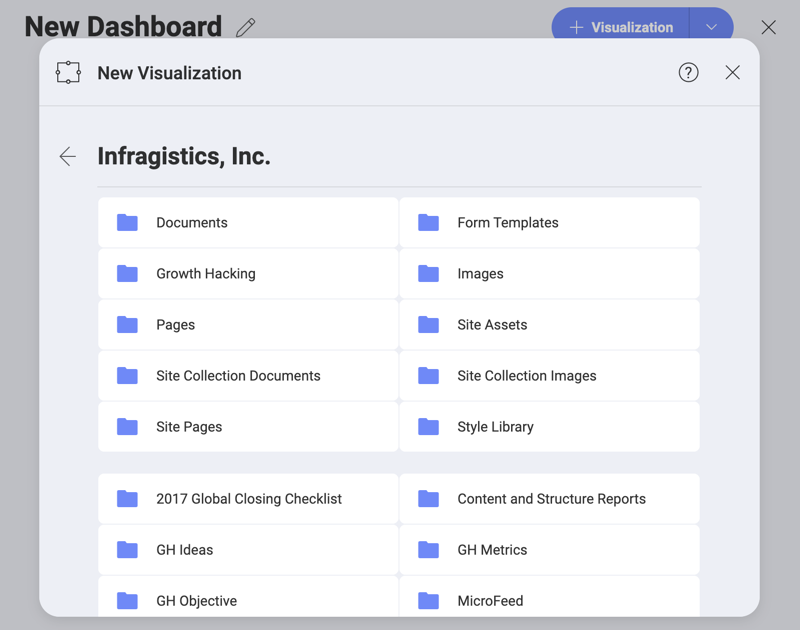

## Creating a New Data Source Connection

Click/tap the **+Dashboard split button** in the home screen to open the *New Visualization* dialog.

If you have any data sources that have
already been configured, you will see them in the _Select a Data Source_ dialog (shown above).

If you want to create a new data source connection, for example, to a [Google Drive](google-drive.md) account, you need to select the **+ Data Source button**, then *Google Drive*. Once you've done this, you are expected to log in with your Google account.

The specific login or details you need to configure vary between the different **web-based data sources**. Once you have entered all the required information, you can select **Next**.

In the case of a [SharePoint connections](sharepoint.md), you can
navigate the hierarchy of sites, subsites, and lists. In the dashboard creation process, you can use files, such as Excel spreadsheets hosted
in document libraries, by selecting them.

Once you have selected a data source, you can easily add a new dataset to the dashboard. Just select the information you want to use, and it will be added to the canvas automatically.

Other examples would be configuring a connection to **data sources, which are not web-based**. If you choose [SQL Server](microsoft-sql-server.md) database, for example, you will see the following dialog prompting you to enter connection details and provide account credentials:

Once you save the connection, you will be able to navigate to the list
of all databases in a SQL Server instance, and within a database see all
tables, views and stored procedures.

