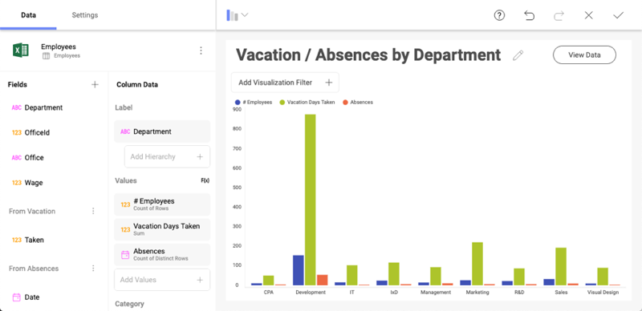
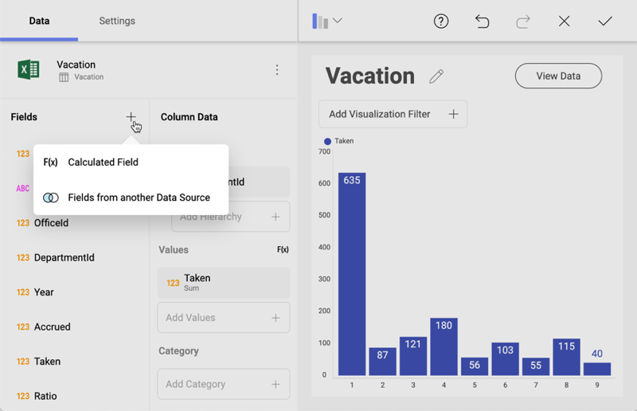
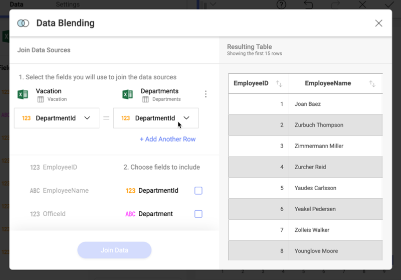
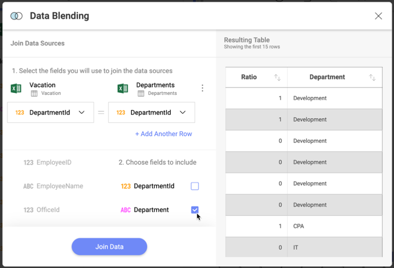
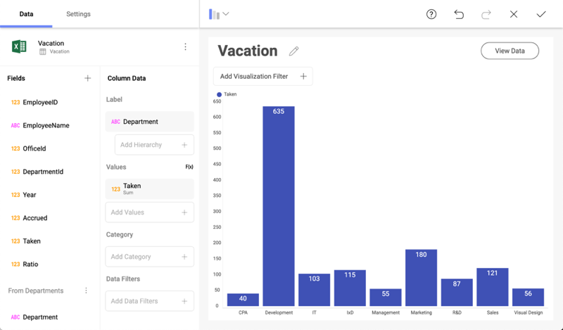

## Combining Data Sources in one Visualization

Sometimes you need **Data Blending** to extract value from **more than
one data source** in the same Reveal visualization.

For example, you may want to compare vacation days taken with other
employee absences by department, to gain insight about the correlation
of those variables.

Follow these steps to combine two data sources in one visualization:

1.  **Open the Data Blending dialog**.

    Click/Tap the **+** button in the *Fields* section and select
    *Fields from another Data Source*.

    

2.  **Choose the new Data Source**.

    Connect to the data source that you want to combine.

3.  **Specify the JOIN Condition**

    Configure the equality condition that needs to match to combine the
    two data sets.

    

4.  **Choose the fields you want**

    Specify which are the fields that you want to combine, so you can
    access them in your visualization.

    

5.  **Select Join Data**

    After merging the two data sets, you can find the new fields at the
    bottom of the *Fields* section.

    

    As shown in the image above, you can now visualize vacation days by
    Department name instead of using the internal Department ID.

### The JOIN Condition

When adding fields from other data sources, you actually join two different data sets. The join operation used by Reveal is LEFT (OUTER)
JOIN.

Below you can see how the **Vacation (left table)** and the
**Departments (right table)** data sets are joined, using the DepartmentId
field in both tables as the relationship between them (equality condition: DepartmentId = DepartmentId).

**Before JOIN operation:**

<table>
<colgroup>
<col style="width: 50%" />
<col style="width: 50%" />
</colgroup>
<tbody>
<tr class="odd">
<td><h4 id="_vacation" style="text-align: center">Vacation</h4></td>
<td><h4 id="_departments" style="text-align: center">Departments</h4></td>
</tr>
<tr class="even">
<td>
<table>
<colgroup>
<col style="width: 50%" />
<col style="width: 50%" />
</colgroup>
<thead>
<tr class="header">
<th>Taken (days)</th>
<th>DepartmentId</th>
</tr>
</thead>
<tbody>
<tr class="odd">
<td>
40
</td>
<td>
1
</td>
</tr>
<tr class="even">
<td>
92
</td>
<td>
10
</td>
</tr>
</tbody>
</table></td>
<td><table>
<colgroup>
<col style="width: 50%" />
<col style="width: 50%" />
</colgroup>
<thead>
<tr class="header">
<th>DepartmentId</th>
<th>Department (name)</th>
</tr>
</thead>
<tbody>
<tr class="odd">
<td>
1
</td>
<td>
CPA
</td>
</tr>
<tr class="even">
<td>
100
</td>
<td>
HR
</td>
</tr>
</tbody>
</table></td>
</tr>
</tbody>
</table>

**After JOIN operation:**

| **Taken (days)** | **DepartmentId** | **DepartmentId** | **Department (name)** |
| ---------------- | ---------------- | ---------------- | --------------------- |
| 40               | 1                | 1                | CPA                   |
| 92               | 10               |                  |                       |

Notice that LEFT JOIN operation returns all records from the left table,
and keeps only matching records from the right table.
