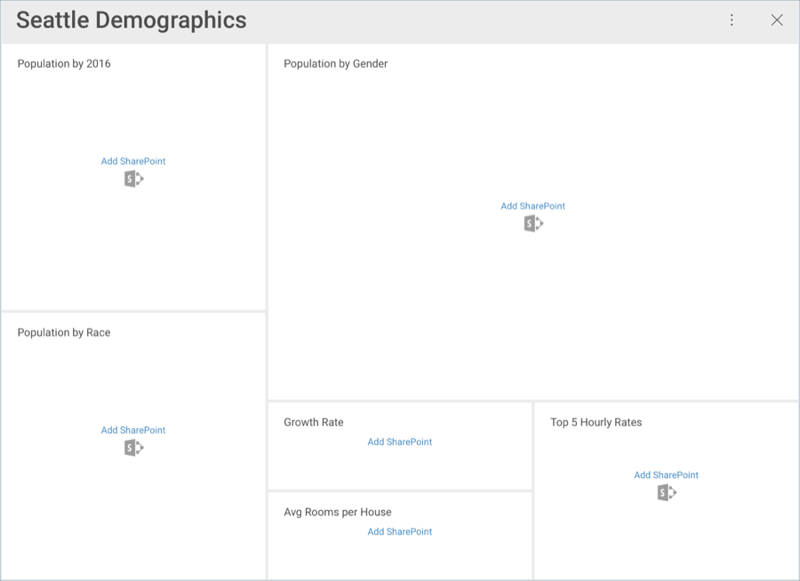
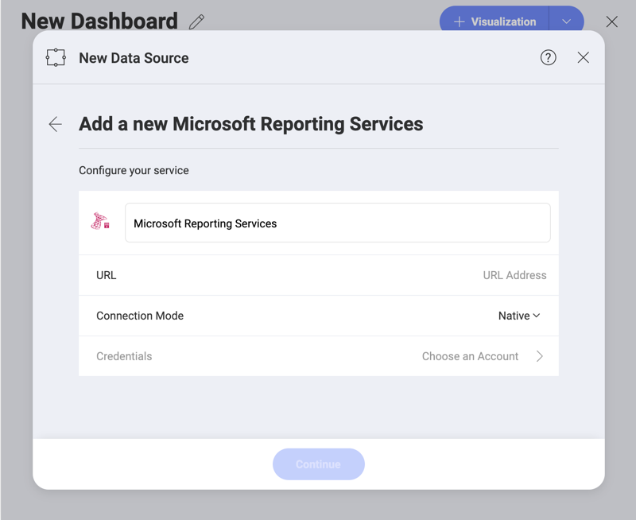
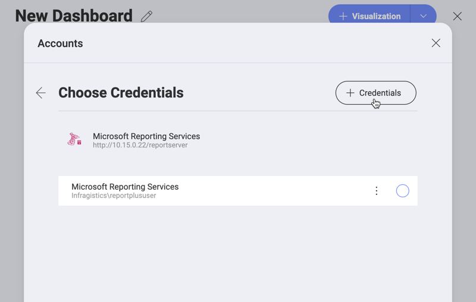
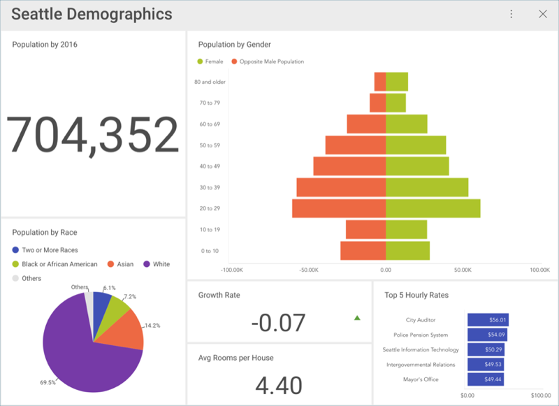

## Data Sources

As listed in the [features](Feature-Matrix.md) section, Reveal provides you
with the opportunity to connect to different enterprise data sources to
retrieve information. While there are no changes to be made on the
server side, you will need to configure the Data Sources within Reveal
to access the data. You can choose from any of the following options:

  - **Analytics tools**: [Google Analytics](google-analytics.md)), [Google BigQery](google-bigquery.md),[MS Azure Synapse Analytics](microsoft-azure-synapse-analytics.md).
  - **Content Managers** and **Cloud Services**: [Box](box.md),
    [Dropbox](dropbox.md), [Google Drive](google-drive.md),
    [OneDrive](onedrive.md), and [SharePoint Online](sharepoint.md).

  - **Customer Relationship Managers**: [Microsoft Dynamics CRM](microsoft-dynamics-crm.md) On-Premises and Online).

  - **Databases**: [Microsoft SQL Server](microsoft-sql-server.md),
    [Microsoft Analysis Services Server](microsoft-analysis-services.md), [MS Azure SQL](azure-sql.md),
    [MySQL](mysql.md), [PostgreSQL](postgresql.md), [Oracle](oracle.md),
    [Sybase](sybase.md).[\*](feature-matrix.html#databases-web)

  - **Other Data Sources**: [OData Feed](odata-feed.md), [Web Resources](web-resource.md), [JSON files](working-with-json-files.md), [Salesforce](salesforce.md).

>[!NOTE]
>The current Reveal release lets you create content manager data sources *only*. Analytics tools, Customer Relationship Managers and Databases are supported for dashboards imported with those data sources.

### Entering your Credentials

If you open an existing dashboard and have not yet added the Data Source
credentials, you will see a message similar to the following one:

When you select any of the data sources, you will see a new dialog pop up prompting you to enter details for your data source. You will see one
of two screens:

1.  When using a web-based cloud, you will see a **web login** dialog.

2.  When using any other provider, you will be prompted to [**add an account**](#adding-account).

### Adding an Account

If you add a data source which is not web-based, you will see the following dialog:

The _Credentials_ box will be enabled after adding the necessary information to connect to the data source. Then, click/tap **Choose an Account** and the following dialog will open:

You can either **select existing credentials**, which are applicable for your data source, or enter new ones by clicking/tapping the _+ Credentials_ button. Some data sources provide the _No Account_ option, i.e. data sources with free/public access.

When **adding new credentials**, you need to provide the following details:

You will need to provide the following details:

  - *(Optional)* **Domain**: the name of the domain, if applicable.

  - **Username**: the user account for the data source.

  - **Password**: the password for the data source.

To add and edit credentials for your data sources,you can also use the **Manage Reveal Credentials** menu in your General Settings. To learn more, read the [Managing Data Source Credentials](managing-data-source-credentials.md) topic.

Once ready, select **Create and Use**. You will then be able to see your
dashboard displayed in Reveal.

