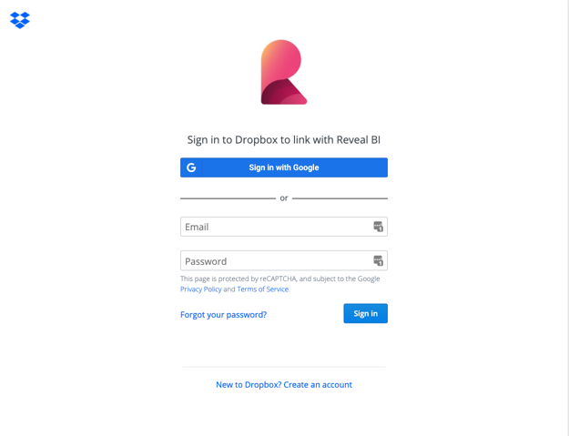

## Dropbox

Upon selecting Dropbox, you will see the following log in prompt.

Enter your login credentials and select *Sign In*.
You will then see an
authorization prompt; select *Allow* to grant the Reveal application access to files on your Dropbox cloud.

### Supported Files

When working within Reveal, you will be able to use a wide variety of
files:

  - **Spreadsheets & tabular data**: Excel (.xls, .xlsx), CSV, TSV, which you can use
    dynamically within Reveal.

  - **Other files** (including images or document files such as PDFs,
    texts, etc.), which will be displayed in a preview mode only.
