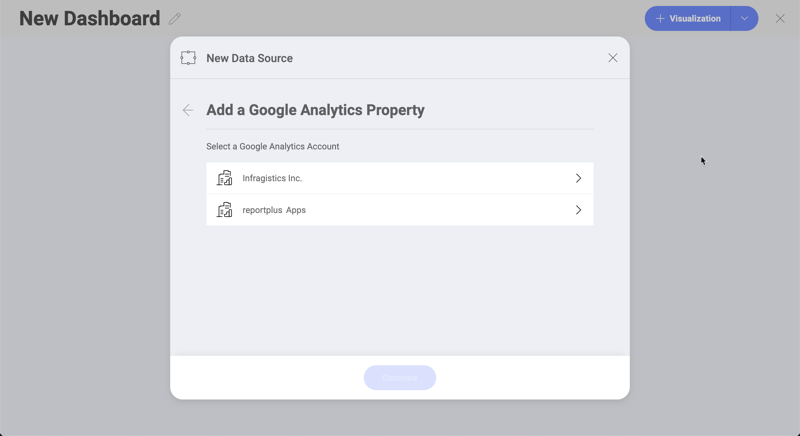
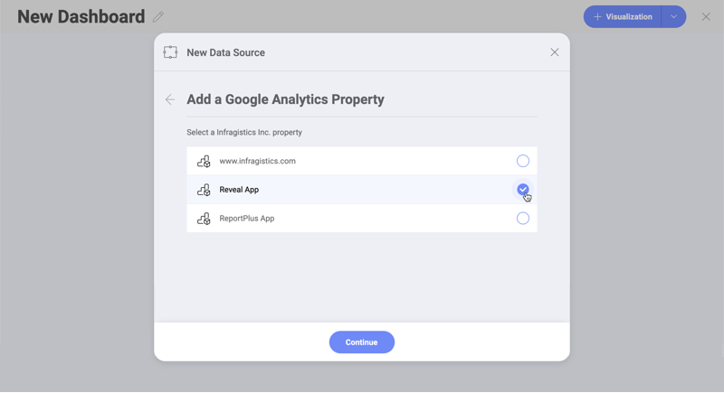
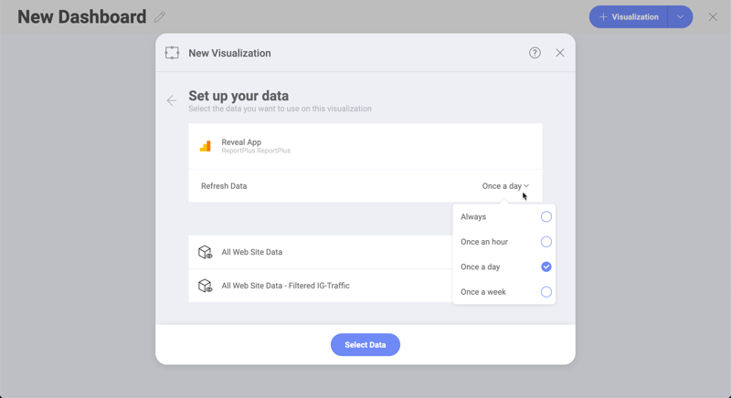
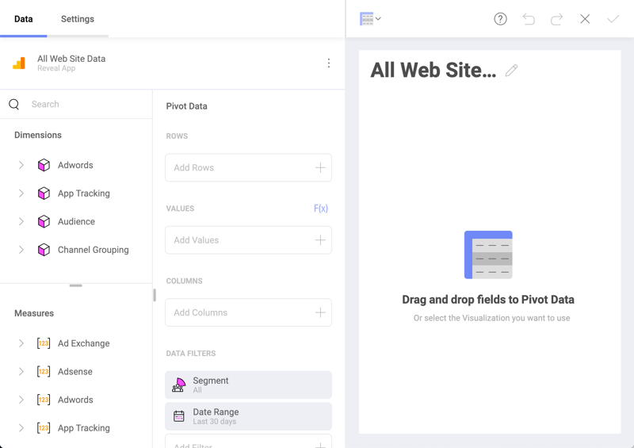
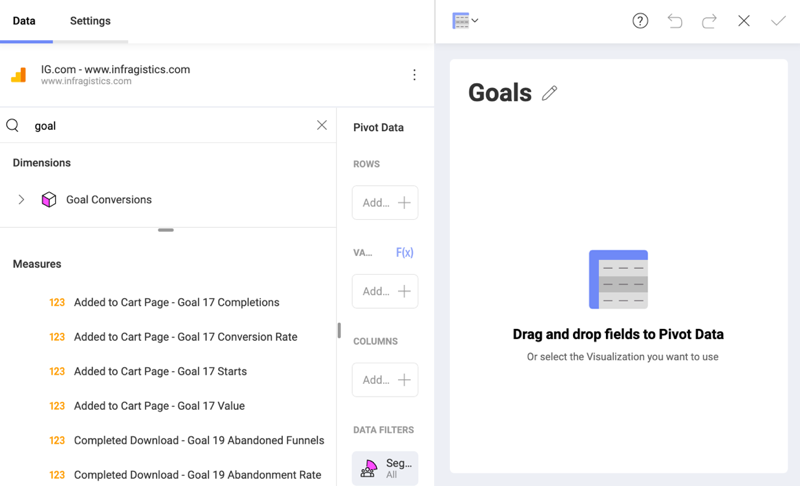

## Google Analytics

Google Analytics is one of the most used web analytics services in the
web, it tracks and reports website traffic. In addition, Google also
provides an SDK to gather usage data from iOS and Android apps.

### Configuring a Google Analytics Data Source

1.  **Log in**

    1.  Select Google Analytics as your data source and you will see
        Google's login screen.

    2.  Enter your login credentials and click/tap _Sign In_. You will then
        see an authorization prompt; click/tap _Allow_.

2.  **Choose an account**

    If you have several Google Analytics accounts, select the one you
    want to use.

    

    Once logged in, you can also use the same account later to create
    another visualization unless you delete the data source.

3.  **Choose a Property**

    Select the Google Analytics property that you want to use.

    

    In Google Analytics, **properties** can be websites, mobile apps,
    blogs, among others.

4.  **Choose a database cube**

    Select the data cube that you want to use.

    

    In this dialog you can configure the Refresh Data setting to to the
    following values:

      - Always

      - Once an hour

      - Once a day

      - Once a week

After your credentials are verified, Reveal will take you to the
Visualizations Editor showing Dimensions and Measures.

### What is a Data Cube?

A data cube is used to store and represent multidimensional data. Unlike
two-dimensional data models, where two dimensions are used (arranged in
row and column format) to view, analyze and calculate data, a data cube
has three or more dimensions.

The concept of a data cube is used to represent the dimensions of data
available to a user. For example, "sales" could be measured in the
**dimensions** of product category, geography, date, customers, etc. In
this case, "sales" is the **measure** attribute of the data cube.

### Working in the Visualization Editor

When you create a dashboard with information coming from Google
Analytics, you will see fields organized differently as seen in the
screenshot below.

As you can see, there is no "Fields" heading. In its place, there are
two sections in their own query field:

1.  **Dimensions** (depicted by a cube icon with a pink side):
    Dimensions are structures used to categorize data that can be
    measured. Elements in a dimension are organized in attributes.
    Attributes are elements with single level hierarchies (e.g. a
    "Demographic" attribute, containing groups of elements like
    "Gender", "Marital Status", etc.)

2.  **Measures** (depicted by *123* icon): Measures consist of
    numeric data.

The default visualization type for the Google Analytics data source is a
Pivot table. For *Rows and Columns* you must use **Dimensions** data,
for *Values* you use **Measures** data.

For more information on dimensions and measures, please visit this
[Technet article](https://docs.microsoft.com/en-us/previous-versions/sql/sql-server-2012/ms174527\(v=sql.110\)).

#### Using Goals from Google Analytics

You can use *Goals* defined in Google Analytics in the *Visualization
Editor*. Your *Goals* are listed as part of the metrics in both
**Dimensions** and **Measures** data types.

As you can see in the example above, the titles of your Google Analytics
*Goals* in Reveal include one or more of the following:

  - a **numeric ID**, from 1 to 20.

  - a **label** at the beginning - this is the name of the goal you
    configured for the specific goal, e.g. *Completed Download* for
    *Goal 19*.

  - a goal **type** at the end - e.g. *Completions*, *Abandoned Funnels*, etc.

For more information about Goals, please refer to this Google Analytics
[help page](https://support.google.com/analytics/answer/1012040?hl=en).
