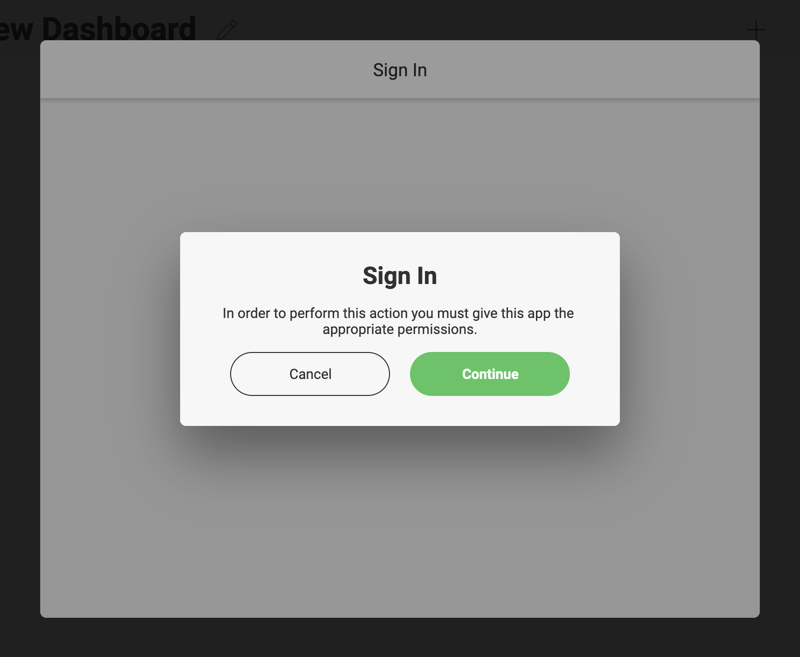

## Google Drive

If you are signed in with your Google account, you will have your Google
Drive automatically added to your data sources:

To use your Google Drive data, follow the steps below.

1.  Upon selecting your Google Drive (or a folder inside it), you will
    see the following log in prompt:

    

    Enter your **login credentials** and select *Next*.

2.  **For first-time users only**, you will see an *Authorize* dialog, prompting you to give Reveal **appropriate permissions** so that it can use your Google Drive data.

    

    By clicking *Continue*, you will be redirected to an **authorization
    prompt**:

    

3.  Select *Allow* to authorize Reveal to use (see and download) your
    Google Drive files.

You can now use your Google Drive data to build your visualizations and
will not be asked for these permissions again.

### Supported Files

When working within Reveal, you will be able to use a wide variety of
files:

  - **Spreadsheets & tabular data**: Excel (.xls, .xlsx), CSV, TSV, which you can use
    dynamically within Reveal.

  - **Other files** (including images or document files such as PDFs,
    texts, etc.), which will be displayed in a preview mode only.
