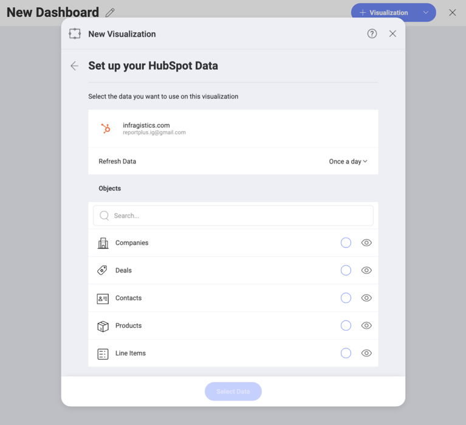

## Hubspot

Upon connecting Hubspot, you will see the following login prompt:

Enter your login credentials, and click _Log In_.

You will then see an authorization prompt. Click _Grant Access_.

### Setting Up Your Data

After logging in you can set up your Hubspot data in the following dialog:

Here you will find a list of your Hubspot _Objects_. Use the search in big lists to find quickly the object you need.

>[!NOTE]
>**Calendar Objects**.
>Calendar Events objects require you to set two parameters - _from_ and _to_ (dates) to query the data, before you can continue to the Visualization editor. 

