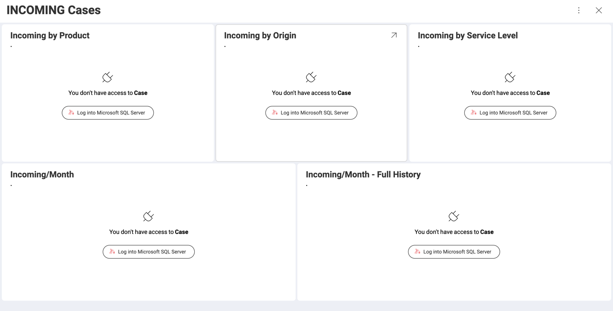
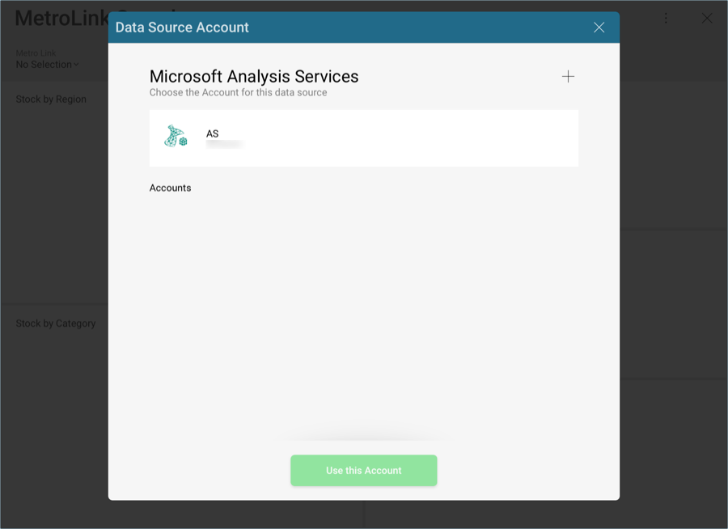
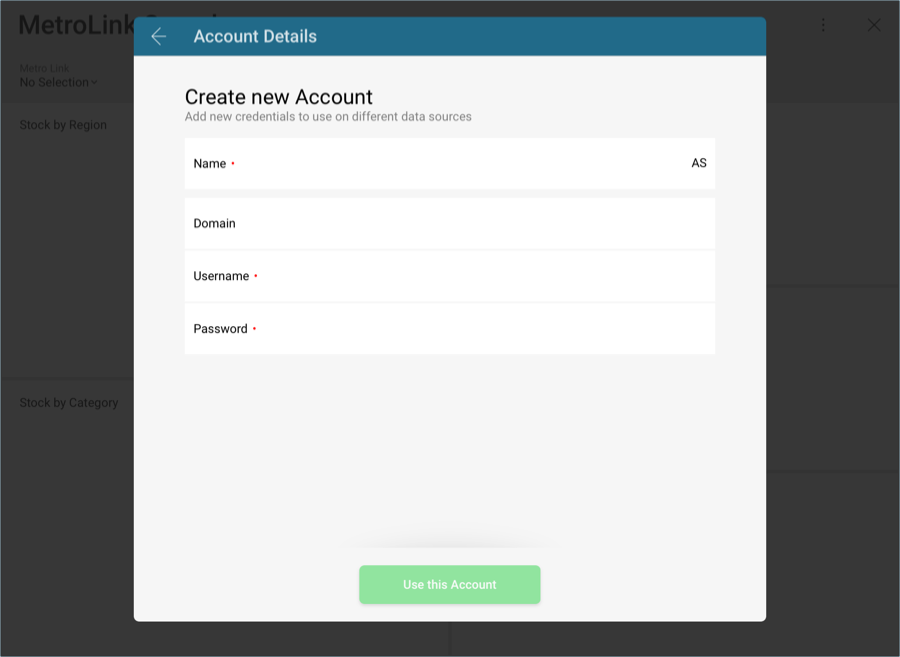
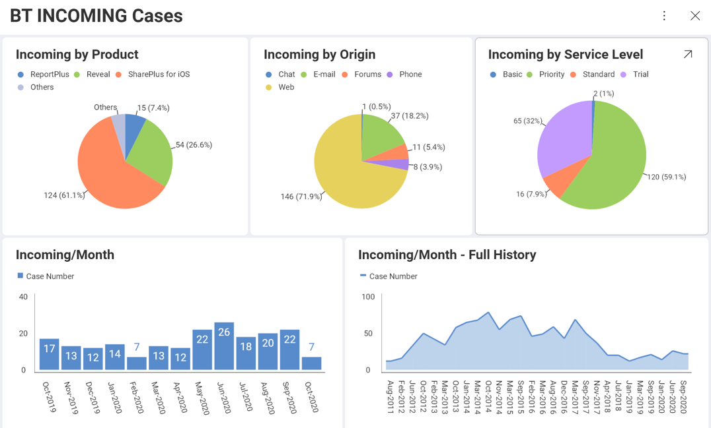

## Managing Dashboards With Their Own Data Sources

With Reveal, you might receive a dashboard with data sources you have
not yet added into your application. For example, let's take a look at
the following dashboard:

The connection details (such as server, port, etc.) will be imported
automatically. You will only need to enter the account details for the
data source if they had not already been added in order to access the
data within the dashboard. You can do so by selecting the + sign on the
top right corner of the screen.

This will display the new account prompt, where you will be able to
enter the credentials for your data source.

Once ready, the complete dashboard will be displayed in view mode. If
you need to edit the data in it, you can do so by accessing the **Dashboard Edit**
mode from the overflow menu.

