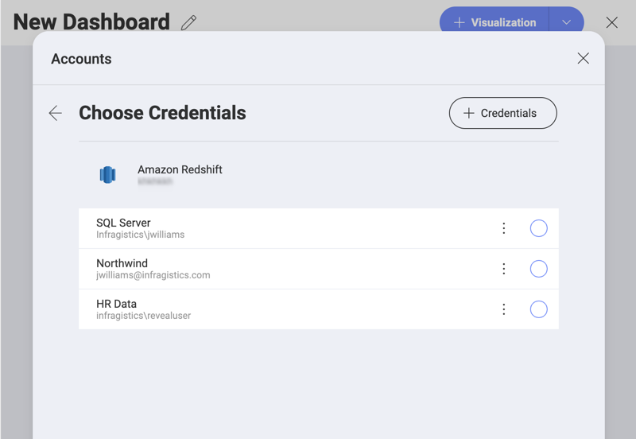

## Managing Your Data Source Credentials

When configuring certain data sources in Reveal, you need to provide
your account credentials for these services to access your information.
These credentials are encrypted and **automatically stored** by Reveal for future use.

To access and manage all your credentials, in the home screen, select: your **profile picture** (top right corner) > **Settings** > **Manage Reveal Credentials**.

### Adding New Account Credentials

In the _Manage Reveal Credentials_ section, you can create, edit and remove credentials for all your data sources accounts. To add new account credentials follow the instructions below.

1. In _Manage Reveal Credentials_, click tap the **+ New** blue button (upper right corner).
2. The *Account Details* menu opens:

  

  Here, you need to fill in the following information:

  -  **Name**: choose a name, which suggests the data source(s) you are going to access with these credentials. It will be displayed in the *Choose Credentials* dialog when connecting to a data source.

  - *(Optional)* **Domain**: the name of the domain, if applicable.

  - **Username**: the user account for the service.

  - **Password**: the password to access the service.

3. Click/Tap **Create** to finish. You will find your newly saved credentials at the bottom of the list in _Manage Reveal Credentials_.

### Using Your Stored Credentials

Unless you remove them, the accounts' credentials stored in Reveal will always appear in the *Choose Credentials* screen when configuring a data source requiring credentials.

> [!NOTE] **Useful tip!** Take your time to add and organize here all credentials that you intend to use with multiple data sources. 

