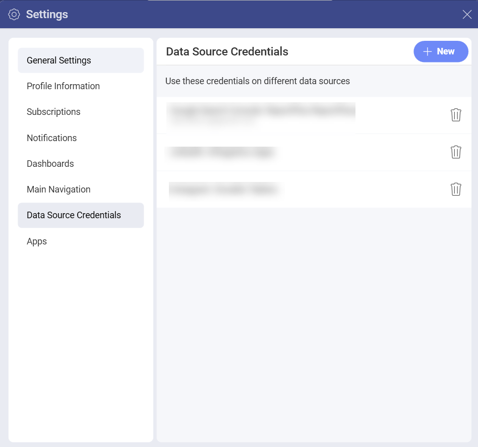
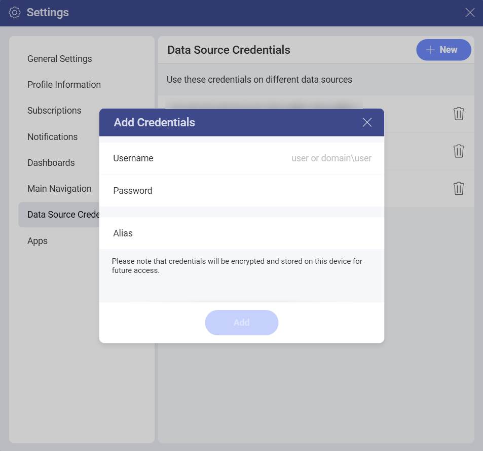
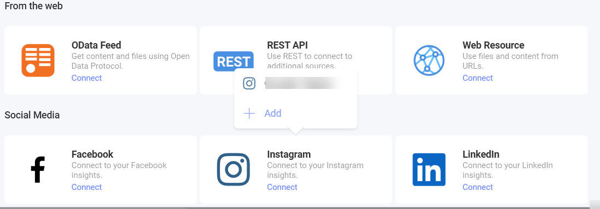

# Managing Your Data Source Credentials

When configuring certain data sources in Reveal, you need to provide
your account credentials for these services to access your information.
These credentials are encrypted and **automatically stored** by Reveal for future use.

To access and manage all your credentials, select: your **profile picture** (top right corner) > **Settings** > **Data Source Credentials**.

## Adding New Account Credentials

In the *Data Source Credentials* section, you can add and remove credentials for all your data sources accounts. To add new account credentials follow the instructions below.

1. In **Data Source Credentials**, click/tap on the **+ New** blue button (upper right corner).
2. The *Add Credentials* menu opens:

  

  Here, you need to fill in the following information:

  - **Username/Domain**: the username or the name of the domain for the service.

  - **Password**: the password to access the service.

  - **Alias**: choose a name, which suggests the data source(s) you are going to access with these credentials. It will be displayed in the list of accounts when connecting to a data source.

3. Click/Tap on **Add** to finish. You will find your newly saved credentials at the bottom of the list in *Data Source Credentials*.

## Using Your Stored Credentials

Unless you remove them, the accounts' credentials stored in Reveal will always appear in the list of accounts when configuring a data source requiring credentials.

> [!NOTE] **Useful tip!** Take your time to add and organize here all credentials that you intend to use with multiple data sources. 

