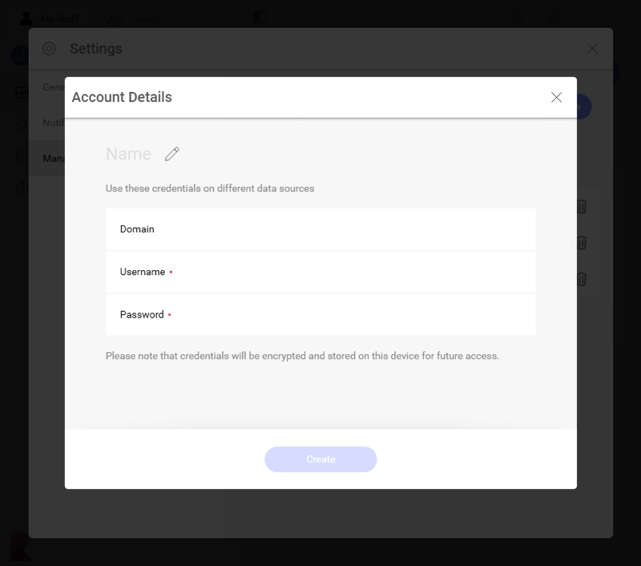

## Managing Your Data Source Credentials

When configuring certain data sources in Reveal, you may need to provide
your account credentials for these services to access your information.
These credentials are encrypted and stored by Reveal for future use.

To access and manage all your credentials, in the home screen click/tap on your **profile picture** (top right corner) -> **Settings** -> **Manage Reveal Credentials** section.

In this section, you can create, edit and remove credentials for all your data sources accounts.

### Adding New Account Credentials

To add new account credentials to the list, click/tap on the *+ New* button in the dialog shown above. The *Account Details* menu opens:

You need to fill in the following information:

  - **Name**: the name for your data source account. It will be
    displayed in the list of accounts in the Credentials dialog of every
    data source requiring your credentials.

  - *(Optional)* **Domain**: the name of the domain, if applicable.

  - **Username**: the user account for the service.

  - **Password**: the password to access the service.

Click/Tap *Create* to finish adding your account details.

>[!NOTE] **Using Your Stored Credentials**.
>Unless you remove them, the accounts' credentials stored in Reveal will always appear in the *Choose Credentials* screen when configuring a data source requiring credentials.
>
