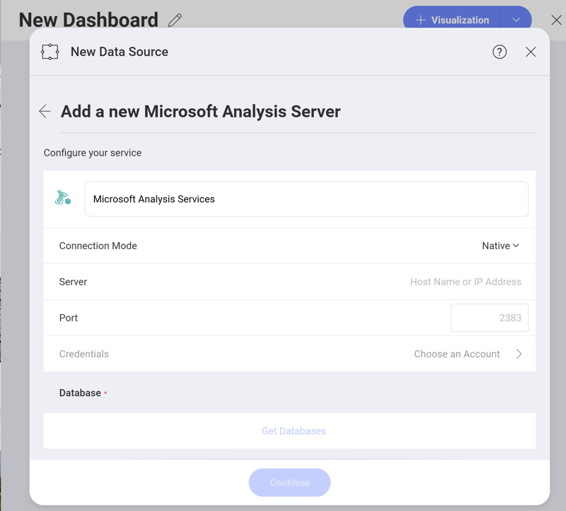
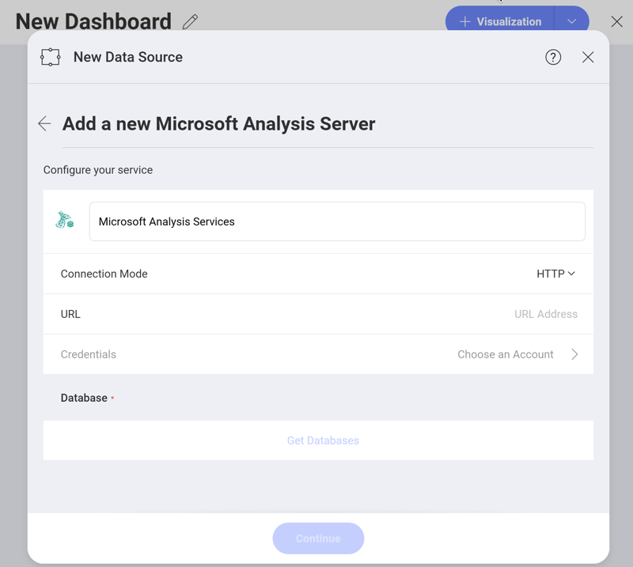
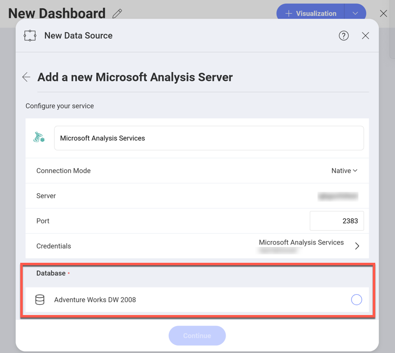
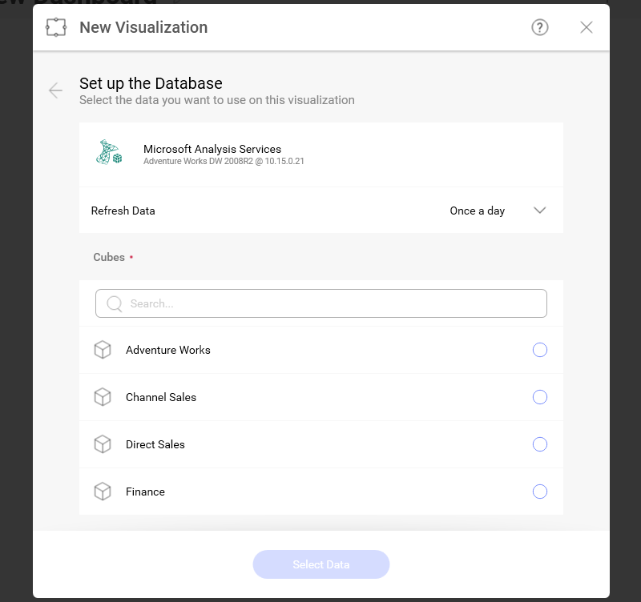

## Microsoft Analysis Services

Microsoft SQL Analysis Services (SSAS) is an OLAP (online analytical
processing of information from multiple database systems at the same
time) and data mining tool in Microsoft SQL Server.

### Configuring a Microsoft Analysis Services Data Source

There are two modes you can use when configuring a Microsoft Analysis
Services data source depending on your server's settings -
[*Native*](#native) and [*HTTP*](#http).

For more information on both Native and HTTP mode, visit the [Microsoft Instance Management help](https://docs.microsoft.com/en-us/sql/analysis-services/instances/connect-to-analysis-services?view=sql-server-2017).

#### Using Native

To configure the Microsoft Analysis Services data source for *Native*
mode, you will need to enter the following information:

1.  **Data Source Name**: this field will be displayed in the Data Sources list. Default name: *Microsoft Analysis Services*

2.  **Server**: this is the hostname or IP address of the computer on
    which the server is running

    You can find the *hostname* by following the steps below. Please
    note that the commands should be executed on the server machine.

    | WINDOWS                                                                                                         | LINUX                                                                                                         | MAC                                                                  |
    | --------------------------------------------------------------------------------------------------------------- | ------------------------------------------------------------------------------------------------------------- | -------------------------------------------------------------------- |
    | 1\. Open the File Explorer.                                                                                     | 1\. Open a Terminal.                                                                                          | 1\. Open System Preferences.                                         |
    | 2\. Right Click on My Computer \> Properties.                                                                   | 2\. Type in **$hostname**                                                                                     | 2\. Navigate to the Sharing Section.                                 |
    | Your Hostname will appear as "Computer Name" under the *Computer name, domain and workgroups settings* section. | Your Hostname will appear along with your DNS domain name. Make sure you only include **Hostname** in Reveal. | Your Hostname will be listed under the "Computer Name" field on top. |

  You can find the *IP address* by following the steps below. Please note that the commands should be executed on the server machine.

  | WINDOWS                              | LINUX                             | MAC                                                           |
  | ------------------------------------ | --------------------------------- | ------------------------------------------------------------- |
  | 1. Open a Command Prompt.            | 1. Open a Terminal.               | 1. Launch your Network app.                                   |
  | 2. Type in **ipconfig**              | 2. Type in **$ /bin/ifconfig**    | 2. Select your connection.                                    |
  | **IPv4 Address** is your IP address. | **Inet addr** is your IP address. | The **IP Address** field will have the necessary information. |

3.  *(Optional)* **Port**: server port details. If no information is
    entered, Reveal will connect to the port in the hint text (2383) by
    default.

4.  **Credentials**: after selecting *Credentials*, you will be able to
    enter the credentials for your Microsoft Analysis Services or select
    existing ones if applicable.

#### Using HTTP

To configure the Microsoft Analysis Services data source for *HTTP*
mode, you will need to provide the following information:

1.  **Data Source Name**: this field will be displayed in the Data Sources list. Default name: *Microsoft Analysis Services*.

2.  **URL**: the HTTP eService URL to the server. For example,
    *10.1.0.15/olap/msmdpump.dll*.

3.  **Credentials**: credentials of your user account for the Analysis Services server.

### Configuring Databases

After your credentials for the Analysis Services server are verified,
Reveal will load and show the databases on the server:

Select a database and click *Continue* to set it up.

Choose a database *cube* in the *Set Up the Database* dialog.

#### What is a Data Cube?

A data cube is used to store and represent multidimensional data. Unlike
two-dimensional data models, where two dimensions are used (arranged in
row and column format) to view, analyze and calculate data, a data cube
has three or more dimensions.

The concept of a data cube is used to represent the dimensions of data
available to a user. For example, "sales" could be measured in the
**dimensions** of product category, geography, date, customers, etc. In
this case, "sales" is the **measure** attribute of the data cube.

For more information on how to work with the Microsoft Analysis data
source, please refer to
[this](#Working-with-Microsoft-Analysis-Services.md) topic.
