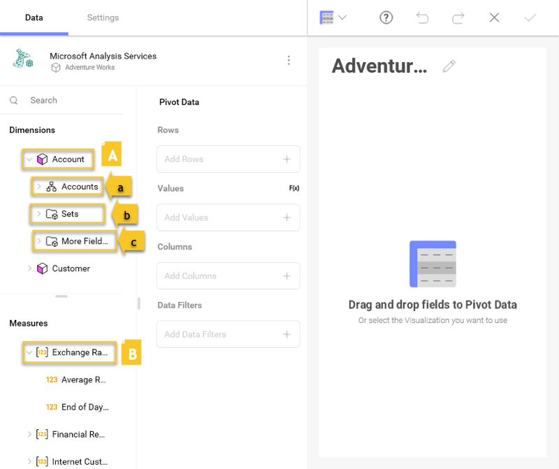
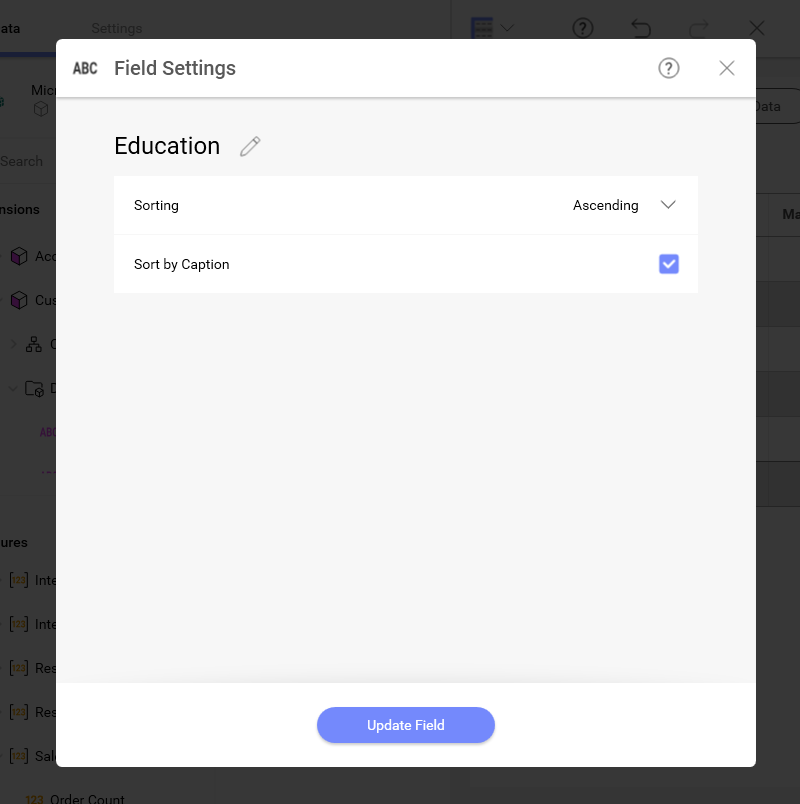
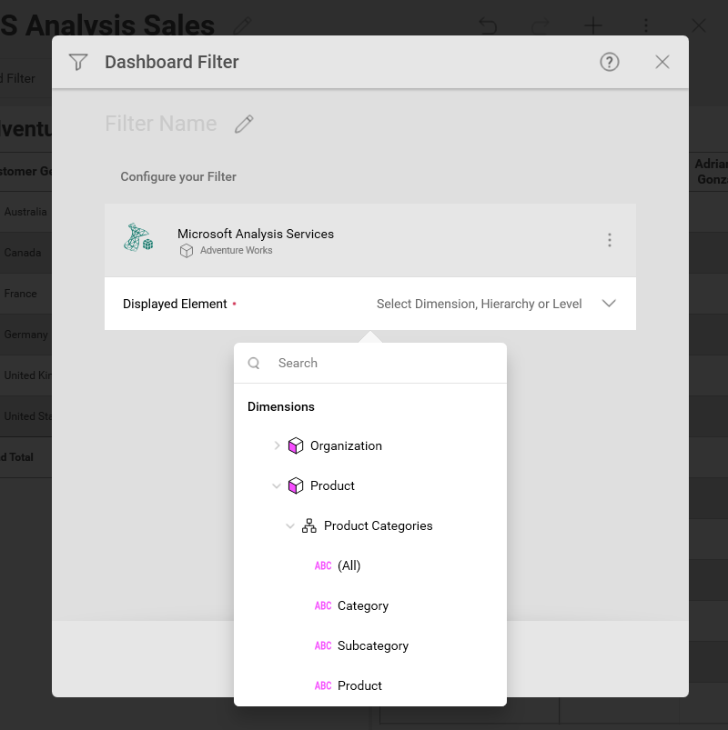
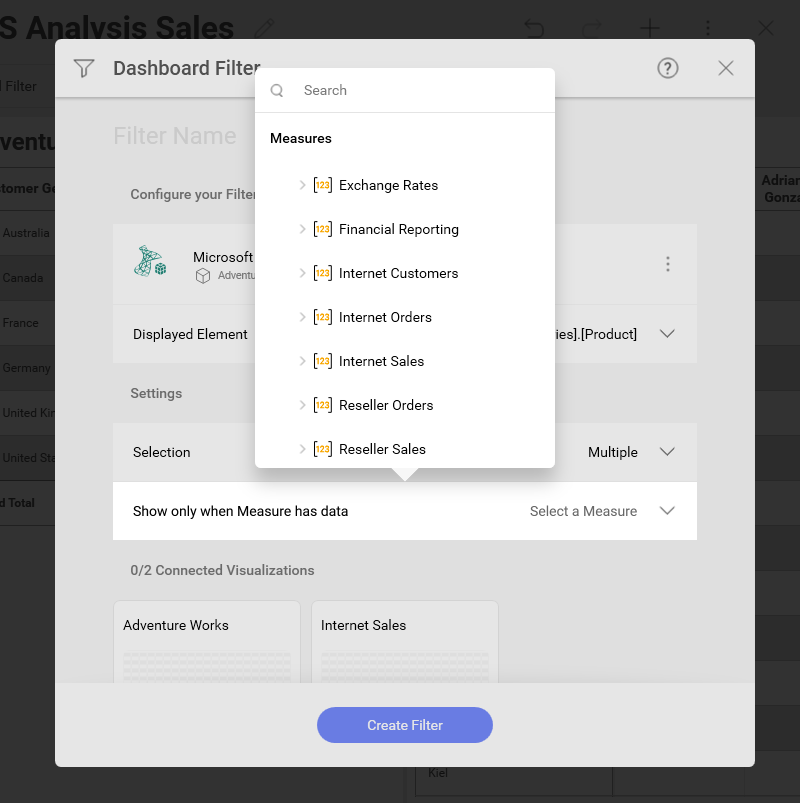

## Working with Microsoft Analysis Services

Microsoft Analysis Services as a data source shows some specifics regarding:

  - [Working with Microsoft Analysis data sources in the Visualization Editor](#visualization-editor);

  - [Field Settings](#sort-by-caption-setting);

  - [Dashboard Filters](#dashboard-filters).

### Working in the Visualization Editor

When you create a dashboard with information coming from Microsoft
Analysis Services, you will see fields organized differently, as seen in
the screenshot below.

As you can see, there is no "Fields" heading. In its place, there are
two sections in their own query field:

1.  **Dimensions** (depicted by a cube icon with a pink side):
    Dimensions are structures used to categorize data that can be
    measured. Elements in a dimension can be organized by:

    1.  **Hierarchy** - when elements in a dimension are organized by
        hierarchy, you can use the whole hierarchy or part of it,
        starting from an element at any lower level. For example, if you
        have a "Geography" dimension organized in "Country → State →
        City" hierarchy, you can drag and use only the "State → City"
        part of this hierarchy.

    2.  **Named Sets** (depicted by a folder icon and named "Sets") - an
        arbitrary collection of elements with a name (e.g. "Top 50
        Customers").

    3.  **Attributes** - elements are organized in single-level
        hierarchies (e.g. a "Demographic" attribute, containing groups
        of elements like "Gender," "Marital Status," etc.)

2.  **Measures** (depicted by *[123]* icon): Measures consist of
    numeric data.

The default visualization type for the Microsoft Analysis Services data
source is a *Pivot table*. For *Rows* and *Columns* you must use
*Dimensions* data and for *Values* - *Measures* data, when you build a
Pivot table visualization:

For more information on dimensions and measures, please visit this
[Technet article](https://docs.microsoft.com/en-us/previous-versions/sql/sql-server-2012/ms174527\(v=sql.110\)).

### Sort by Caption Setting

There is also a Sort by Caption option which defines whether the filter
will be applied to the dimension's labels or to the corresponding
values. When enabled, *Sort by Caption* sorts the dimensions
alphabetically by their label

To enable it, select a dimension in *Rows* or *Columns*. Enable
*Sorting* for the field by choosing *Ascending* or *Descending* to have
the *Sort by Caption* option show up:

### Dashboard Filters

When configuring a SSAS-based dashboard filter, there are two data
fields for you to set up:

1.  **Displayed Element** - select a Dimension, Hierarchy or Level data
    field to display dashboard filter values

    

2.  *(Optional)* **Show only when Measure has data** - select a Measure
    to limit the dashboard filter values to ones that contain data for a
    certain Measure

    

For example, if you use the *Product* Dimension as a *Displayed element*
to filter sales data in a visualization, your dashboard filter will
contain a list of products (e.g. bikes, clothes, etc). When you select a
value from the list, the connected visualizations will be refreshed to
show data only for the selected product.

If you additionally select the *Internet orders* Measure for *Show only when Measure has data* field, dashboard filter values, which do not contain information about the *Internet orders* Measure, will not be an option. For example,  if there are no internet orders of bikes, you will not be able to select this product as a filter value.

For more information on how to work with filters, please refer to:

  - [Dashboard Filters and Their Properties](~/en/filters/dashboard-filters-properties.md)

  - [Connecting Dashboard Filters to a Visualization](c~/en/filters/connecting-dashboard-filters-visualization.md)
