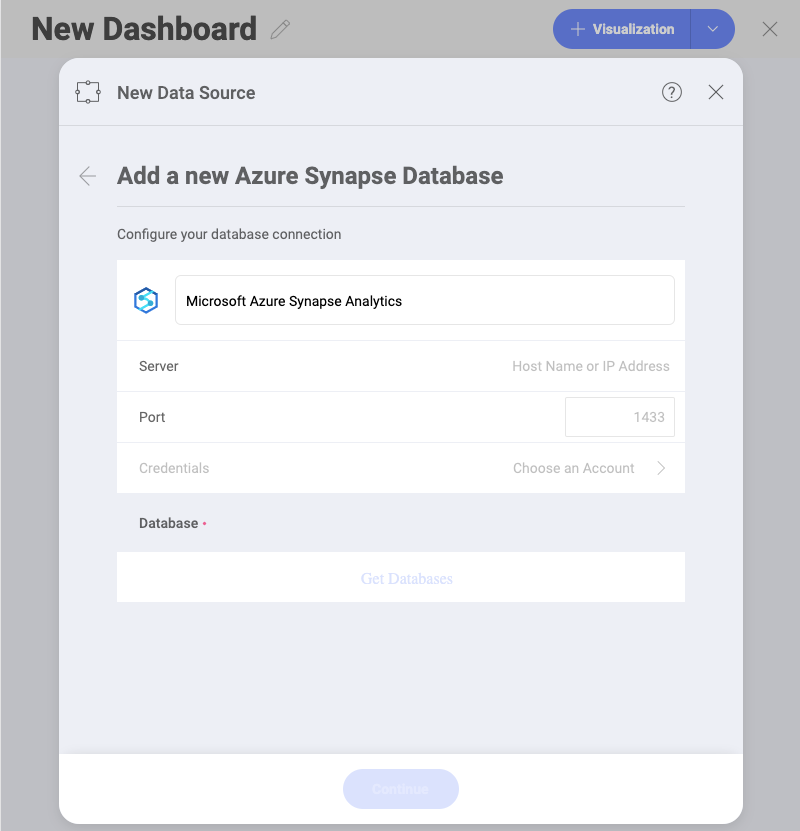

## Microsoft Azure Synapse Analytics

The Microsoft Azure Synapse data source provides a significant speed
increase when processing big data within Reveal. This allows you to use
massive datasets for your visualizations with no slow down.

### Configuring an Azure Synapse Analytics Data Source

To configure a Microsoft Azure Synapse Analytics data source, you will
need to enter the following information:

1. **Default name** of the data source: Your data source name will be displayed in the list of accounts in the previous dialog. By default, Reveal names it *Microsoft Azure SQL Synapse Analytics*. You can change it to your preference.
   
2.  **Server**: the computer name or IP address assigned to the computer
    on which the server is running.

3.  **Port**: if applicable, the server port details. If no information
    is entered, Reveal will connect to the port in the hint text (1433)
    by default.

4.  **Credentials**: after selecting Credentials, you will be able to
    enter the credentials for your Microsoft Azure Synapse Analytics or
    select existing one if applicable.

    Once ready, select *Create Account*. You can verify whether the
    account is reaching the data source or not by selecting Test
    Connection.

5.  **Database**: Once you connect to your account you will get your databases to choose from.
Select *Continue*.

### How to find your Server Information

You can find your server by following the steps below. Please note that
the commands should be executed on the server.

| WINDOWS                                                                                                         | LINUX                                                                                                         | MAC                                                                  |
| --------------------------------------------------------------------------------------------------------------- | ------------------------------------------------------------------------------------------------------------- | -------------------------------------------------------------------- |
| 1\. Open the File Explorer.                                                                                     | 1\. Open a Terminal.                                                                                          | 1\. Open System Preferences.                                         |
| 2\. Right Click on My Computer \> Properties.                                                                   | 2\. Type in **$hostname**                                                                                     | 2\. Navigate to the Sharing Section.                                 |
| Your Hostname will appear as "Computer Name" under the *Computer name, domain and workgroups settings* section. | Your Hostname will appear along with your DNS domain name. Make sure you only include **Hostname** in Reveal. | Your Hostname will be listed under the "Computer Name" field on top. |

You can find your *IP address* by following the steps below. Please note
that the commands should be executed on the server.

| WINDOWS                              | LINUX                             | MAC                                                           |
| ------------------------------------ | --------------------------------- | ------------------------------------------------------------- |
| 1\. Open a Command Prompt.           | 1\. Open a Terminal.              | 1\. Launch your Network app.                                  |
| 2\. Type in **ipconfig**             | 2\. Type in **$ /bin/ifconfig**   | 2\. Select your connection.                                   |
| **IPv4 Address** is your IP address. | **Inet addr** is your IP address. | The **IP Address** field will have the necessary information. |

### Working with Views

Once you connect to a database in MS Azure Synapse Analytics, you can
choose to retrieve data from an entire table or a particular view.

Working with views when using Azure Synapse Analytics closely resembles
working with views when using MS SQL Server. For more information,
please refer to [this section](Microsoft-SQL-Server.html#working-with-views)
of the **MS SQL Server data source** topic.

### Limitations in the Visualization Editor

When working with big data in Reveal, there are a couple of limitations
in the Visualization Editor due to the specific approach used to handle
data sources storing millions of records.

#### Limitations in Functions Available for Calculated Fields

Currently, only a limited number of **functions** are available for
*Calculated Fields* using data from Azure Synapse Analytics:

- [Logic](~/en/fields/logic-calculated-fields.md) - false; true; not.
- [Math](~/en/fields/math-calculated-fields.md) - abs; log; log10; sign; sqrt.
- [Strings](~/en/fields/string-calculated-fields.md) - find; len; trim; lower; mid; upper.

#### Limitations in Data Blending

Currently, Data Blending ([combining data sources in one visualization](data-blending.md)) is **not available** when using data from the Azure Synapse Analytics data source.
