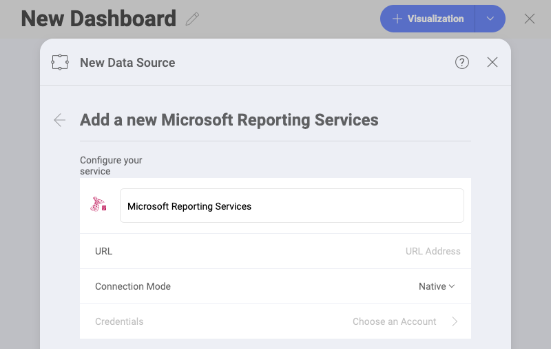
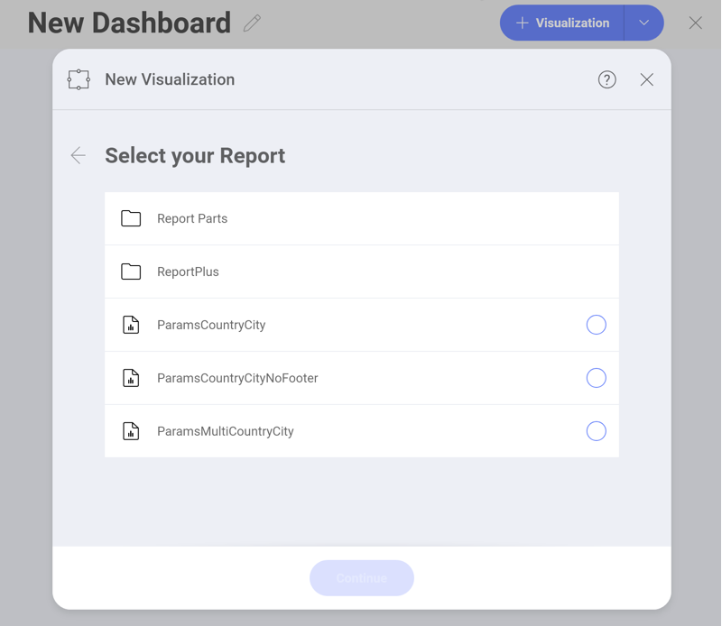
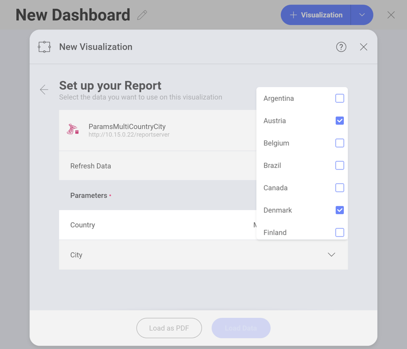

## Microsoft Reporting Services

You can now use your existing Microsoft Reporting Services (SSRS)
reports in Reveal by embedding them as PDF files in your dashboards or
simply getting the data from the reports to create a visualization.

### Configuring a Microsoft Reporting Data Source

To configure a Microsoft Reporting Services (SSRS) Data Source, you will
need to enter the following information:

1.  **Default name** of the data source: Your data source name will be displayed in the list of accounts in the previous dialog. By default, Reveal names it *Microsoft Reporting Services*. You can change it to your preference.

2.  **URL**: the URL to the server.

3.  **Connection Mode**: depending on your server's settings, you can
    choose:

      - **Native** - this is the default mode for report server
        instances. In native mode, a report server is a stand-alone
        application server that provides all viewing, management,
        processing and delivery of reports and report models, or

      - **Integrated** - in a SharePoint integrated mode, a report
        server must run within a SharePoint server farm.

4.  **Credentials**: a new dialog will be displayed. You can either
    enter new credentials for Microsoft Reporting Services or select
    existing ones if applicable.

### Advanced Configuration: Working with Microsoft Reporting Services

After configuring the connection to your Microsoft Reporting Services
reports, the following dialog will open, prompting you to choose a
Report:

The order of reports and folders closely resembles the one in your
Microsoft Reporting Services account.

Depending on your data, you will need to configure specific
**parameters** for your Reports, as shown below:

After selecting/filling the parameters for your report, you can choose
the format in which the report will load in the *Visualization editor*:

  - *Load as PDF* - You will have your report embedded as a PDF document
    in the visualization editor. You will be able to scroll, zoom,
    download or print the pdf inside the Visualization editor.

  - *Load Data* - Your report data will be loaded in the standard
    format, providing you with fields to build your visualization.

>[!NOTE] **Editing the Data Source in the Visualization editor.**
>Carefully choose the report format (pdf or data) because once loaded, you will not be able to change it. When you *Edit* your data source, you will only be able to change the configuration of the report's parameters.
