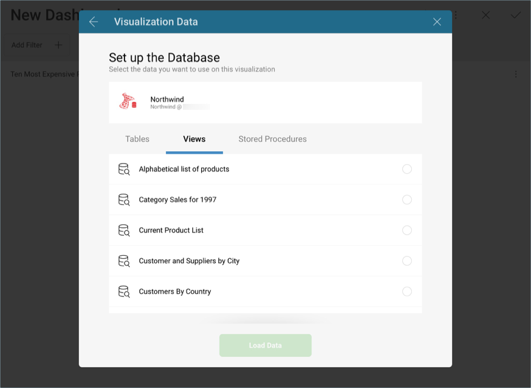
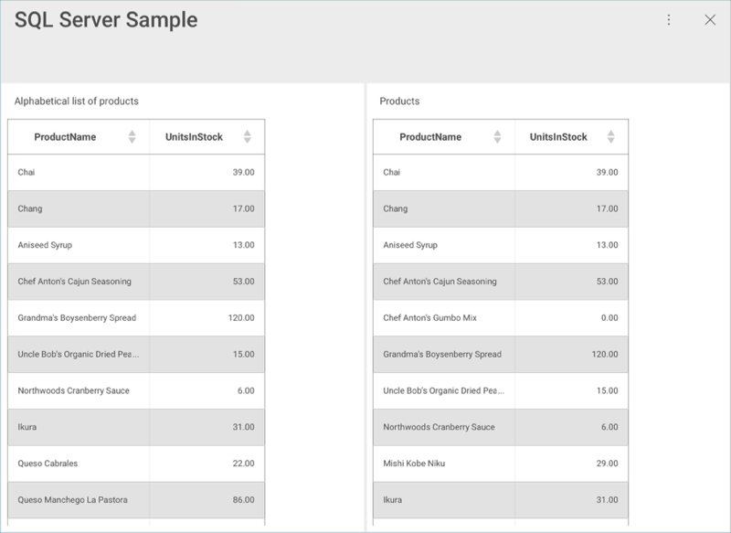
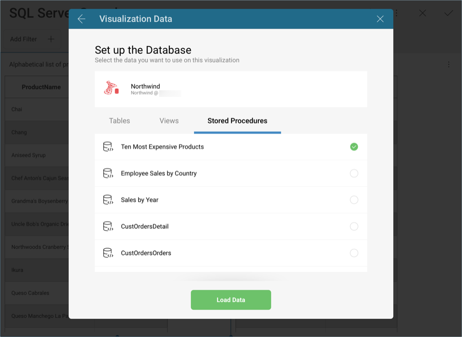
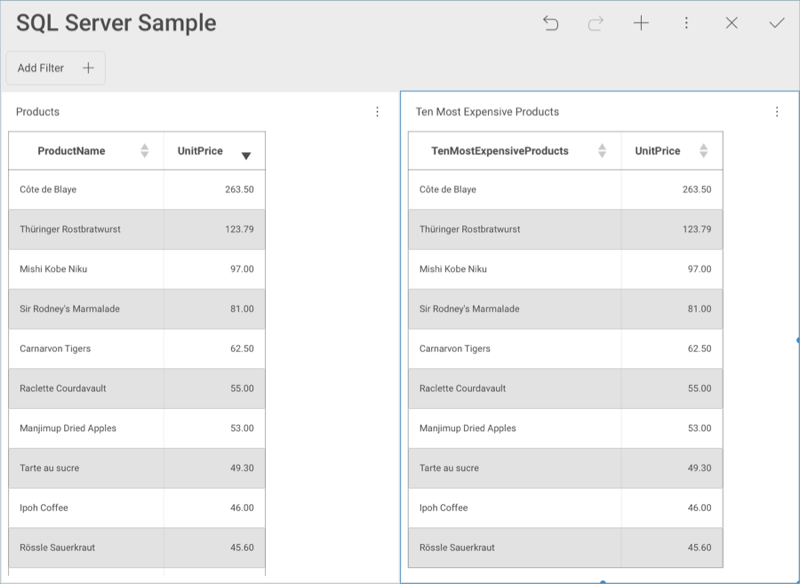

## Microsoft SQL Server

To configure a Microsoft SQL Server data source, you can set the following information:

1.  **Default name** of the data source: Your data source name will be displayed in the list of accounts in the previous dialog. By default, Reveal names it *Microsoft SQL Server*. You can change it to your preference.

2.  [**Server**](#how-to-find-server): the computer name or IP address
    assigned to the computer on which the server is running.

3.  **Port**: if applicable, the server port details. If no information
    is entered, Reveal will connect to the port in the hint text (1433)
    by default.

4.  **Credentials**: after selecting *Credentials*, you will be able to enter the credentials for your Microsoft SQL Server or choose existing ones if applicable.

      - **Name**: the name for your data source account. It will be
        displayed in the list of accounts in the previous dialog.

      - *(Optional)* **Domain**: the name of the domain, if applicable.

      - **Username**: the user account for the SQL Server.

      - **Password**: the password to access the SQL Server.

    Once ready, select **Create Account**. You can verify whether the
    account is reaching the data source or not by selecting **Test
    Connection**.

### How to find your Server Information

You can find your server by following the steps below. Please note that
the commands should be executed on the server.

| WINDOWS                                                                                                         | LINUX                                                                                                         | MAC                                                                  |
| --------------------------------------------------------------------------------------------------------------- | ------------------------------------------------------------------------------------------------------------- | -------------------------------------------------------------------- |
| 1\. Open the File Explorer.                                                                                     | 1\. Open a Terminal.                                                                                          | 1\. Open System Preferences.                                         |
| 2\. Right Click on My Computer \> Properties.                                                                   | 2\. Type in **$hostname**                                                                                     | 2\. Navigate to the Sharing Section.                                 |
| Your Hostname will appear as "Computer Name" under the *Computer name, domain and workgroups settings* section. | Your Hostname will appear along with your DNS domain name. Make sure you only include the **Hostname** in Reveal. | Your Hostname will be listed under the "Computer Name" field on top. |

You can find your *IP address* by following the steps below. Please note
that the commands should be executed on the server.

| WINDOWS                              | LINUX                             | MAC                                                           |
| ------------------------------------ | --------------------------------- | ------------------------------------------------------------- |
| 1\. Open a Command Prompt.           | 1\. Open a Terminal.              | 1\. Launch your Network app.                                  |
| 2\. Type in **ipconfig**             | 2\. Type in **$ /bin/ifconfig**   | 2\. Select your connection.                                   |
| **IPv4 Address** is your IP address. | **Inet addr** is your IP address. | The **IP Address** field will have the necessary information. |

### Working with Views

With Reveal, you can retrieve SQL Server data from entire tables, but
you can also select a particular
[view](https://docs.microsoft.com/en-us/sql/relational-databases/views/views?view=sql-server-2017)
that returns a subset of data from a table or a set of tables instead.

In the sample above, the **Alphabetical list of products** view contains
part of the data in the **Products** table in the SQL Server.

For more information on views and MS SQL Server, visit [this documentation website](https://docs.microsoft.com/en-us/sql/relational-databases/views/views?view=sql-server-2017).

### Working with Stored Procedures

In MS SQL, stored procedures allow users to run a set of query
statements in a relational database with specific parameters. The
following are just a set of sample stored procedures running in a test
server with
[Northwind](https://docs.microsoft.com/en-us/dotnet/framework/data/adonet/sql/linq/downloading-sample-databases)
data:

This stored procedure, for example, returns the products in the
**Products** table ordered by their **Unit Price**. The **ProductName**
has been renamed to **TenMostExpensiveProducts**.

In this case, the stored procedure requires users to configure the start and end date to display the **Sales by Year** information.

For more information on Stored Procedures and MS SQL Server, visit [this documentation website](https://docs.microsoft.com/en-us/sql/relational-databases/stored-procedures/stored-procedures-database-engine?view=sql-server-2017).

#### Limitations for Stored Procedures in Reveal

  - For stored procedures that return more than one result set, Reveal
    displays only the first one.

  - [Output parameters](https://docs.microsoft.com/en-us/sql/connect/jdbc/using-a-stored-procedure-with-output-parameters?view=sql-server-2017)
    in stored procedures are ignored.

  - Stored procedures that return no result sets will be listed in the Data Sources list but will fail.
