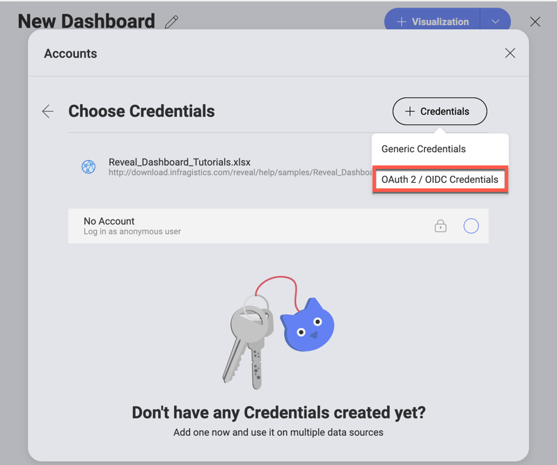
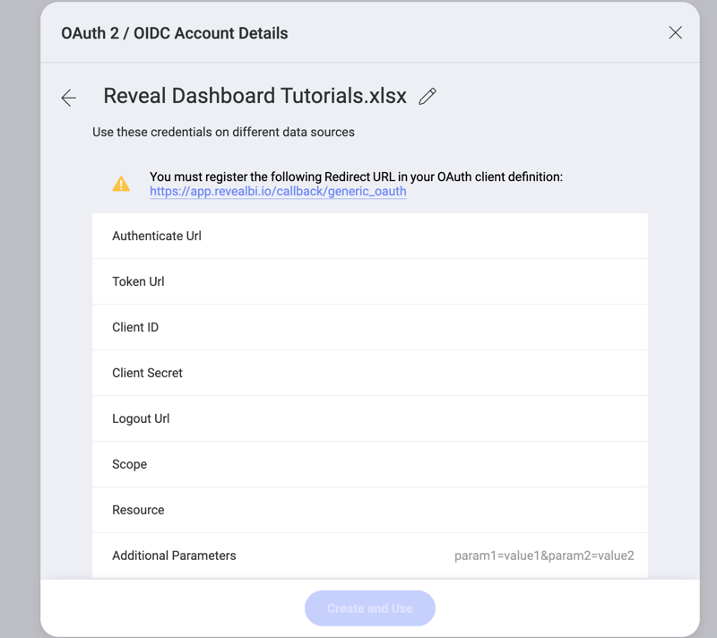
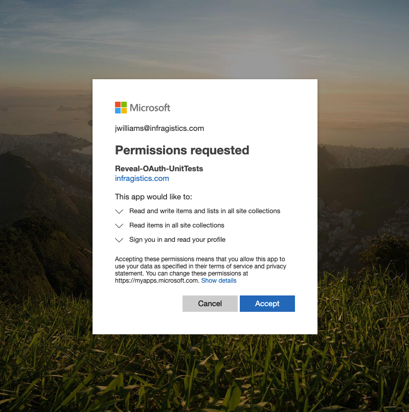

## OAuth 2 / OIDC User Authentication with REST, OData, and Web Resources

When using [OData Service](odata-feed.md), [Rest API](rest-api.md) or [Web resources](web-resource.md), some of your resources might be protected. In
this case, you need to grant Reveal access to these resources by setting
up an OAuth 2 / OIDC account.

### What is OAuth 2?

OAuth 2.0 is an authorization framework that supersedes the original
OAuth protocol. It is commonly used to grant users limited access to
specific resources, without exposing their credentials. Like OAuth 1.0,
this protocol enables access from one location (third-party application
or website) called OAuth client to another location with protected data.

For further information, please refer to
[OAuth 2.0](https://oauth.net/2/)

### What is OIDC?

OIDC is a simple identity layer on top of the OAuth 2.0 protocol. OIDC
enables websites or applications to grant users access to their content
by authenticating the user through their account in another service or
application (е.g. Google, Office 365) saving them the trouble of
maintaining a bunch of different accounts.

For further information, please refer to [OpenID Connect](https://openid.net/connect/).

### Using protected resources with an OAuth 2 / OIDC Account

To use data sources with an OAuth 2 / OIDC аccount you will need to
perform these 4 steps:

1.  **Register the OAuth Client** (Reveal) on your resource server (this
    is the server hosting the resource, protected with OAuth, that you
    want to use - e.g. Microsoft, Google, etc.)

2.  Choose one of the three **data sources** in Reveal, which are
    enabled to work with OAuth 2 / OIDC accounts - [OData Service](odata-feed.md), [Rest API](rest-api.md) or [Web Resource](web-resource.md).

3.  Use credentials provided for the Client by the resource server to
    **set up your OAuth 2 / OIDC account in Reveal**

4.  **Give Reveal permissions** to access and use your data.

### Registering an OAuth Client

Navigate to the **resource server** (e.g. Microsoft, Google, etc.) and
register Reveal as an OAuth Client/Application by filling in the
required information. Usually the name of the application and a redirect
URL are required.

>[!NOTE]***Redirect URL***.
>Pay attention that the redirect URL is provided in the Reveal's *OAuth 2 / OIDC Account Details* screen.

When you complete the registration, the resource server will generate
the credentials necessary for configuring the *OAuth 2 account* in
Reveal.

### Choosing your data source

1.  Navigate to Reveal and **choose a data source** - *OData Feed*,
    *Rest API* or *Web Resource*.

2.  Give this data source a meaningful *Name*.

3.  Provide the *URL* where the data is located.

4.  Click/tap *Choose an account*.

    In the following screen that opens you need to select *OAuth 2 / OIDC Credentials* from the **+ Credentials** dropdown menu:

    

### Setting up your OAuth 2 / OIDC account in Reveal

In the *OAuth 2 / OIDC Account Details* screen you will need to fill in
the credentials that are already generated for Reveal by the resource
server.

The following fields are mandatory:

1.  **Default name** of the data source: Your data source name will be displayed in the list of accounts (this is not a credential provided by the resource server). You can change the name given by default to your preference by selecting the pencil icon.
 
2.  the name for your data source account. It will be
    displayed in the list of accounts 

3.  **Authenticate Url**: The authenticate URL is usually in a format
    such as: <https://authorization-server.com/oauth2/authorize> (e.g.
    <https://login.microsoftonline.com/common/oauth2/authorize>).

4.  **Token Url**: The format of the token url is similar to the one of
    the authenticate url (e.g.
    <https://login.microsoftonline.com/common/oauth2/token>).

5.  **Client ID**: The Client ID is the identifier for your app
    (Reveal). Its format is a random combination of symbols. You will
    receive a Client ID when you first register Reveal as an OAuth
    Client.

Other fields are not marked as mandatory in Reveal but depending on your
OAuth service you might also need to provide the following:

*  **Client Secret**: The client secret is used as additional
    protection. Its format is a random combination of symbols.

*  **Scope**: Scope values are used to request additional levels of
    access. The values will depend on the particular service.

*  **Resource**: Here you need to input the url to the service, which
    hosts the protected data (e.g.
    <https://infragisticsinc297.sharepoint.com>)

### Giving Reveal permissions to access and use your data

After configuring the OAuth 2 / OIDC account you will be redirected to a
sign-in screen.
After signing in, you will be asked to allow Reveal to use your data:

After giving the required permissions you can use the data in the
protected data source to build your visualizations and dashboards in Reveal.

The OAuth 2 / OIDC account you configured will be saved in the data
source list of accounts for future use.
