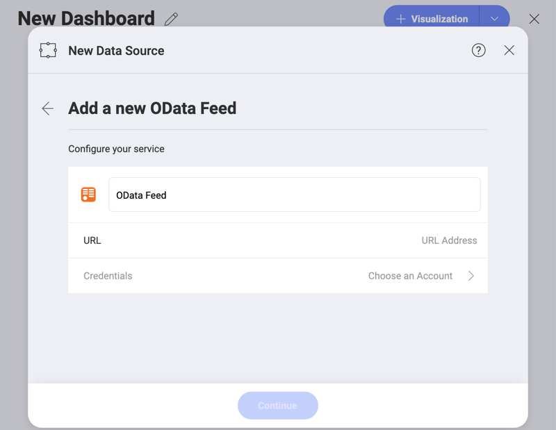
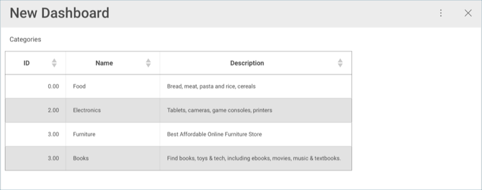
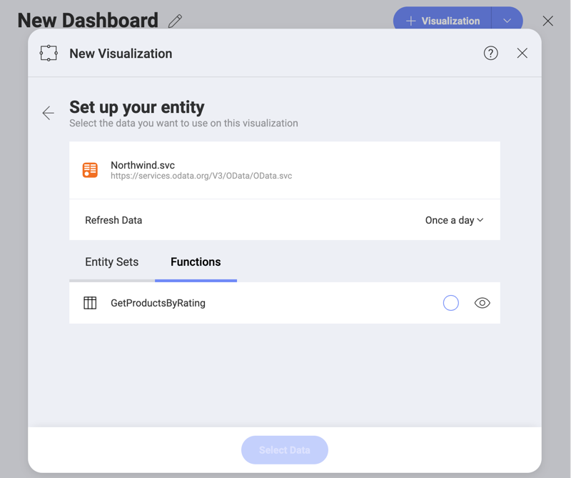
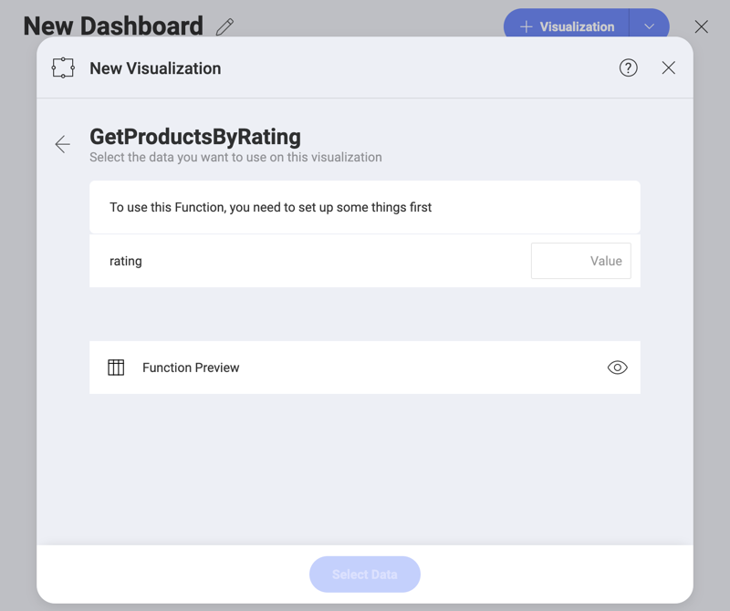
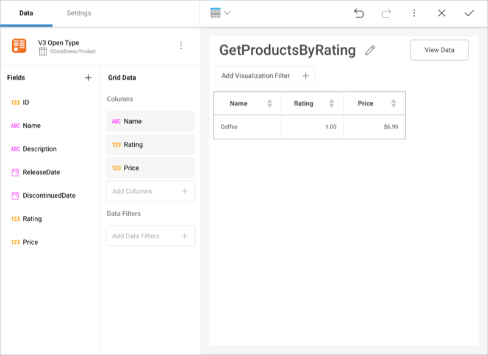

## OData Feed

To configure an OData Service data source, you will need to enter the
following information:

1.  **Default name** of the data source: Your data source name will be displayed in the list of accounts in the previous dialog. By default, Reveal names it *OData Feed*. You can change it to your preference.

2.  **URL**: the URL where the service is located (for example, <http://services.odata.org/Northwind/Northwind.svc> for the Northwind OData Test Service).

3.  **Credentials**: after selecting *Credentials*, you will be able to
    enter the credentials for your OData Service or choose existing ones
    if applicable.

      - **Name**: the name for your data source account. It will be
        displayed in the list of accounts in the previous dialog.

      - *(Optional)* **Domain**: the name of the domain, if applicable.

      - **Username**: the user account for the OData Service, if
        applicable.

      - **Password**: the password to access the OData Service, if
        applicable.

Once ready, select **Create Account**. You can verify whether the
account is reaching the data source or not by selecting **Test
Connection**.

To set up an *OAuth 2 / OIDC account* for a protected OData Service data
source, please read [this topic](OAuth-2-OIDC-User-Authentication.md).

### Open Type Columns

Reveal supports OData feeds with dynamic [*open type*](https://docs.microsoft.com/en-us/aspnet/web-api/overview/odata-support-in-aspnet-web-api/odata-v4/use-open-types-in-odata-v4)
columns. After any changes to the dynamic OData feed, you only need to
refresh the dashboard, and the new data will be picked up.

The following example uses
[one](https://services.odata.org/V3/OData/\(S\(bwrmr2ccg0nex5gmubqxjkkz\)\)/OData.svc/)
of the dynamic OData samples. A visualization was created initially,
which had two fields (**ID** and **Name**) with three categories.

A few records were added to the Categories section through
[Postman](https://www.odata.org/getting-started/learning-odata-on-postman/).
After the changes, the dashboard was refreshed to display the new
records.

For more information on Open Types in OData, refer to [this article](https://docs.microsoft.com/en-us/aspnet/web-api/overview/odata-support-in-aspnet-web-api/odata-v4/use-open-types-in-odata-v4).

### Working with Functions

Any functions you have configured to be exposed by an OData service will
appear in the **Visualization Data** menu for your data source under the
**Functions** tab.

Depending on your function, you might need to enter one or more values
to get your data. The V3 OData sample includes the following sample
function, where you have to enter a **rating** value to get results.

Once ready, the Visualizations Editor will load the fields in the data
source which meet the function condition.

For more information on OData functions, please refer to [this article](https://docs.microsoft.com/en-us/aspnet/web-api/overview/odata-support-in-aspnet-web-api/odata-v4/odata-actions-and-functions).
