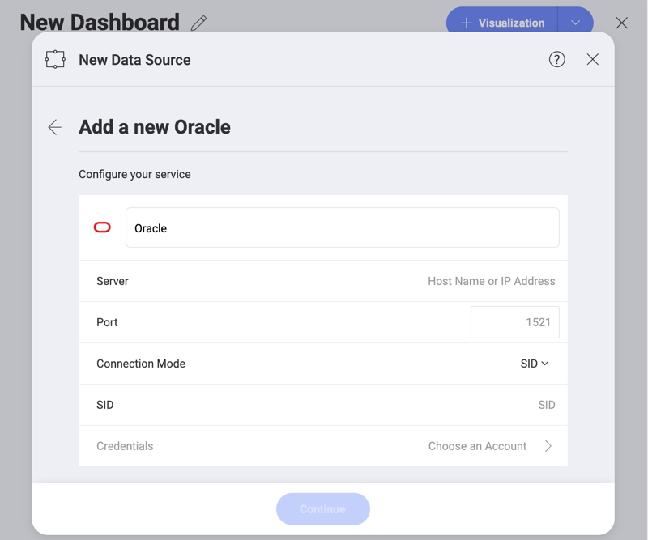
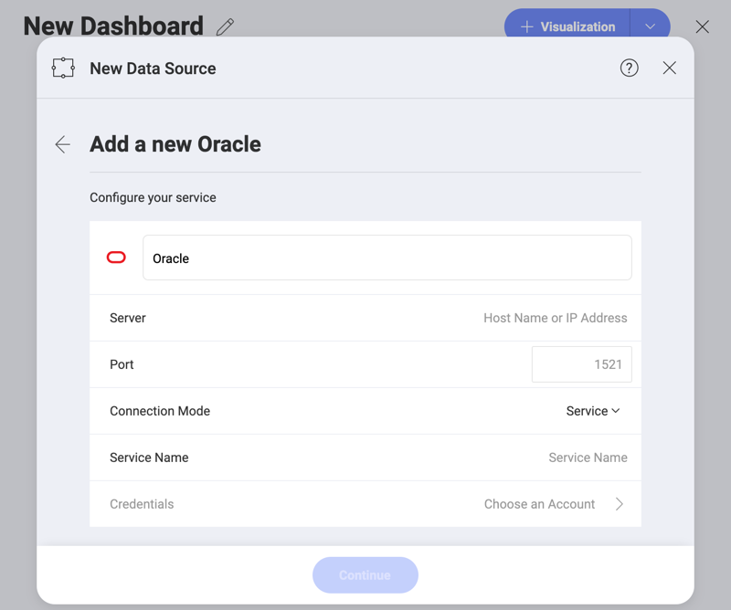
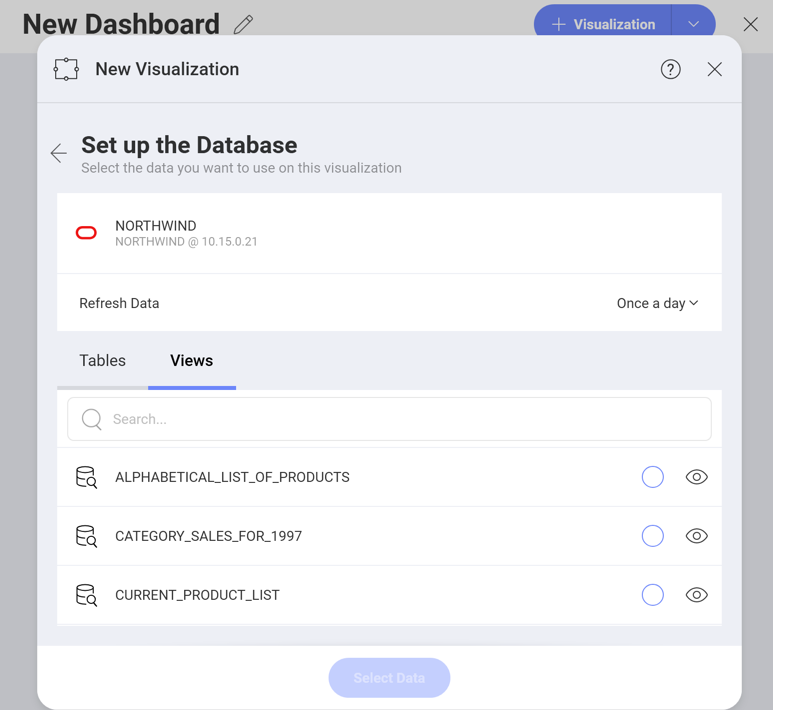
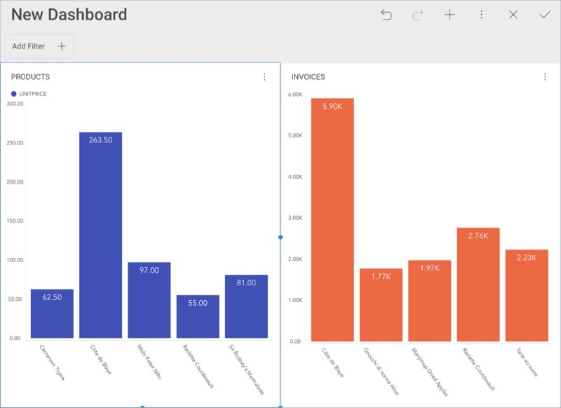

## Oracle

There are two modes you can use to connect to Oracle depending on your
database's settings:

  - [**Using SID**](#using-sid): the unique name of your Oracle database
    instance.

  - [**Using Service**](#using-service): the alias used when connecting
    to the database instance.

### Using SID

To configure Oracle using SID, you will need to enter the following
information:

1. 1.  **Default name** of the data source: Your data source name will be displayed in the list of accounts in the previous dialog. By default, Reveal names it *Oracle*. You can change it to your preference.

1.  [**Server**](#how-to-find-server): the computer name or IP address
    assigned to the computer on which the server is running.

2.  **Port**: if applicable, the server port details. If no information
    is entered, Reveal will connect to the port in the hint text (1521)
    by default.

3.  **Connection Mode**: SID.

4.  **SID**: the unique name of your Oracle database instance. By
    default, the SID for Oracle is orcl. To find your SID, log into
    Server Manager and type select instance from v$thread. This will
    return your ORACLE\_SID.

5.  **Credentials**: after selecting *Credentials*, you will be able to
    enter the credentials for your Oracle server or select existing ones
    if applicable.

     - **Name**: the name for your data source account (default: _Oracle_). It will be
        displayed in the list of accounts in the previous dialog.

      - *(Optional)* **Domain**: the name of the domain, if applicable.

      - **Username**: the user account for the Oracle server.

      - **Password**: the password to access the Oracle server.

    Once ready, select **Create Account**. You can verify whether the
    account is reaching the data source or not by selecting **Test
    Connection**.

### Using Service

To configure Oracle using Service, you will need to enter the following
information:

1.  **Data Source Name**: this field will be displayed in the Data
    Sources list.

2.  [**Server**](#how-to-find-server): the computer name or IP address
    assigned to the computer on which the server is running.

3.  **Port**: if applicable, the server port details. If no information
    is entered, Reveal will connect to the port in the hint text (1521)
    by default.

4.  **Connection Mode**: Service.

5.  **Service Name**: the alias used when connecting to the database
    instance. To find your Service, log into Server Manager and run
    select sys\_context('userenv', 'service\_name') from dual;. This
    will return your Service\_name.

6.  **Credentials**: after selecting *Credentials*, you will be able to
    enter the credentials for your Oracle server or select existing ones
    if applicable.

      - **Name**: the name for your data source account (default: _Oracle_). It will be
        displayed in the list of accounts in the previous dialog.

      - *(Optional)* **Domain**: the name of the domain, if applicable.

      - **Username**: the user account for the Oracle server.

      - **Password**: the password to access the Oracle server.

    Once ready, select **Create and Use**.

### How to find your Server Information

You can find your server by following the steps below. Please note that
the commands should be executed on the server.

| WINDOWS                                                                                                         | LINUX                                                                                                         | MAC                                                                  |
| --------------------------------------------------------------------------------------------------------------- | ------------------------------------------------------------------------------------------------------------- | -------------------------------------------------------------------- |
| 1\. Open the File Explorer.                                                                                     | 1\. Open a Terminal.                                                                                          | 1\. Open System Preferences.                                         |
| 2\. Right Click on My Computer \> Properties.                                                                   | 2\. Type in **$hostname**                                                                                     | 2\. Navigate to the Sharing Section.                                 |
| Your Hostname will appear as "Computer Name" under the *Computer name, domain and workgroups settings* section. | Your Hostname will appear along with your DNS domain name. Make sure you only include **Hostname** in Reveal. | Your Hostname will be listed under the "Computer Name" field on top. |

You can find your *IP address* by following the steps below. Please note
that the commands should be executed on the server.

| WINDOWS                              | LINUX                             | MAC                                                           |
| ------------------------------------ | --------------------------------- | ------------------------------------------------------------- |
| 1. Open a Command Prompt.            | 1. Open a Terminal.               | 1. Launch your Network app.                                   |
| 2. Type in **ipconfig**              | 2. Type in **$ /bin/ifconfig**    | 2. Select your connection.                                    |
| **IPv4 Address** is your IP address. | **Inet addr** is your IP address. | The **IP Address** field will have the necessary information. |

### Working with Views

With Reveal, you can retrieve Oracle data from entire tables. Still, you
can select a particular
[view](https://docs.oracle.com/cd/B19306_01/server.102/b14220/objects.htm#i440066)
that returns a subset of data from a table or a set of tables instead.

The **invoices** view, for example, contains information on sales
projections taken from one of the tables in the database.

For more information on views and Oracle, visit [this documentation website](https://docs.oracle.com/cd/B19306_01/server.102/b14220/objects.htm#i440066).
