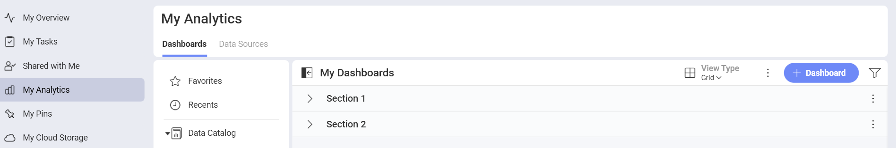
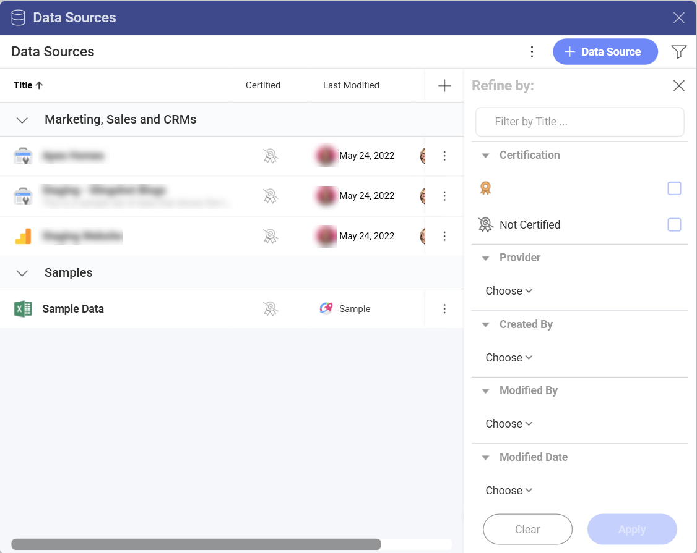

# Data Sources

Data Sources are the places where your data comes from. Reveal provides you with the opportunity to connect to different enterprise data sources. You can choose from analytics tools, content managers, cloud services, CRMs,
databases, spreadsheets, and public data sources.

## Connecting to Data Sources

To retrieve information from a data source and use it for your visualizations you need to connect to it first. Once you have connected to a data source, it will be saved in the *Data Sources* menu for quick selection next time you need it (see the screenshot above).

To connect to a data source, perform the steps below:

1. Go to *My Analytics* or a workspace where you want to a create a dashboard. 
2. Click/tap on the **+ Dashboard** or **Create Dashboard** *(My Analytics)* blue button.
   
3. In the *+ Visualization* dialog, you will see a list of recently used data sources. To create a new connection, select the **+ Data Source** button on the right.

After selecting a data source provider, you will be prompted to **configure** it. Not sure how to do this? Find out in the article about the chosen data source (see the list below).

   - [Amazon Athena](~/en/datasources/supported-data-sources/athena.md)

   - [Amazon Redshift](~/en/datasources/supported-data-sources/redshift.md)

   - [Amazon S3](~/en/datasources/supported-data-sources/amazon-s3.md)
   - [Box](~/en/datasources/supported-data-sources/box.md)

   - [Dropbox](~/en/datasources/supported-data-sources/dropbox.md)

   - [Google Ads](~/en/datasources/supported-data-sources/google-ads.md)
   - [Google Analytics](~/en/datasources/supported-data-sources/google-analytics.md)

   - [Google BigQuery](~/en/datasources/supported-data-sources/google-bigquery.md)

   - [Google Drive](~/en/datasources/supported-data-sources/google-drive.md)

   - [Hubspot](~/en/datasources/supported-data-sources/hubspot.md)

   - [Marketo](~/en/datasources/supported-data-sources/marketo.md)

   - [Microsoft Analysis Services](~/en/datasources/supported-data-sources/microsoft-analysis-services/configuring-microsoft-analysis-services.md)*

   - [Microsoft Azure Analysis Services](~/en/datasources/supported-data-sources/microsoft-azure-analysis-services.md)

   - [Microsoft Azure Synapse Analytics](~/en/datasources/supported-data-sources/microsoft-azure-synapse-analytics.md)
   
   - [Microsoft Azure SQL Database](~/en/datasources/supported-data-sources/azure-sql.md)*

   - [Microsoft Dynamics CRM](~/en/datasources/supported-data-sources/microsoft-dynamics-crm.md)

   - [Microsoft Reporting Services (SSRS)](~/en/datasources/supported-data-sources/microsoft-reporting-services.md)

   - [Microsoft SQL Server](~/en/datasources/supported-data-sources/microsoft-sql-server.md)*

   - [MySQL](~/en/datasources/supported-data-sources/mysql.md)*

   - [OData Feed](~/en/datasources/supported-data-sources/odata-feed.md)

   - [OneDrive](~/en/datasources/supported-data-sources/onedrive.md)

   - [Oracle](~/en/datasources/supported-data-sources/oracle.md)*

   - [PostgreSQL](~/en/datasources/supported-data-sources/postgresql.md)*

   - [Quickbooks](~/en/datasources/supported-data-sources/quickbooks.md)

   - [REST API](~/en/datasources/supported-data-sources/rest-api.md)

   - [Salesforce](~/en/datasources/supported-data-sources/salesforce.md)

   - [SharePoint](~/en/datasources/supported-data-sources/sharepoint.md)

   - [Snowflake](~/en/datasources/supported-data-sources/snowflake.d)

   - [Sybase](~/en/datasources/supported-data-sources/sybase.md)*

   - [Web Resource](~/en/datasources/supported-data-sources/web-resource.md)

   - [JSON files](~/en/datasources/working-files/working-with-json-files.md)
   
   - [Spreadsheets](~/en/datasources/working-files/working-with-spreadsheets.md)

## Filtering your Data Sources

To filter your data sources, you can click on the filter button in the upper right corner.

## Related Topics

- You received a dashboard that consumes data from a data source you still haven't connected to? See how to open it in the [Connecting a Dashboard to Its Data Source](connect-dashboard-to-data-source.md) topic.
- You started creating a visualization, but changed your mind about the data source? Read how to connect to a different data source while you are in the Visualization Editor in [Changing the Data Source for a Visualization](changing-data-source-visualization.md).
- You want to use data from more than one data source for your visualization? Read the [Combining Data Sources in one Visualization](data-blending.md)
