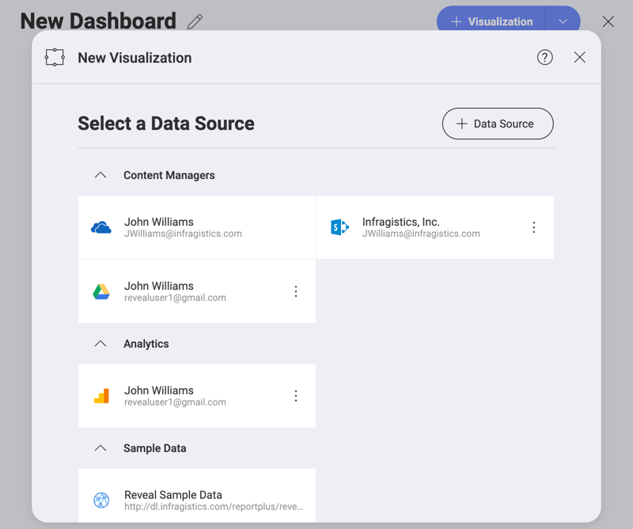

## Data Sources

Data Sources are the places where your data comes from. Reveal provides
you with the opportunity to connect to different enterprise data sources. You can choose from analytics tools, content managers, cloud services, CRMs,
databases, spreadsheets, and public data sources.

The screenshot below displays a number of different data sources the user John Williams has connected to in his application.

### Connecting to Data Sources 

To retrieve information from a data source and use it for your visualizations you need to connect to it first. Once you have connected to a data source, it will be saved in the _Select a Data Source_ menu (see the screenshot above) for quick selection next time you need it. 

To connect to a data source, perform the steps below.  

1. From the *Home screen*, click/tap the **+ Dashboard** split blue button.
   
2. In the _New Visualization_ dialog, you will see a list of recently used data sources. To create a new connection, select the **+ Data Source** button on the right.
   
3. Select a data source provider from the dropdown list. 

After you select a data source provider, you will be prompted to configure your data source.  

* **Analytics tools** [Google Analytics](google-analytics.md), [Hubspot](hubspot.md).
* *Content Managers* and *Cloud Services* ([Box](box.md), [Dropbox](dropbox.md),  [Google Drive](google-drive.md),  [OneDrive](onedrive.md) and [SharePoint Online](sharepoint.md)).
* *Customer Relationship Managers* ([Microsoft Dynamics CRM](microsoft-dynamics-crm.md) On-Premises and Online, [Quickbooks](quickbooks.md))
* *Databases* ([Microsoft SQL Server](microsoft-sql-server.md),  [Microsoft Analysis Services Server](configuring-microsoft-analysis-services.md), [Microsoft Azure Analysis Services](microsoft-azure-analysis-services.md), [MySQL](mysql.md), [PostgreSQL](postgresql.md), [Oracle](oracle.md), [Sybase](sybase.md))
* *Other Data Sources* ([OData-Feed](odatafeed.md), [Web-Resource](web-resource.md), [JSON files](working-with-json-files.md))

>[NOTE]
> **Databases** are not supported in the Web version of Reveal. 

