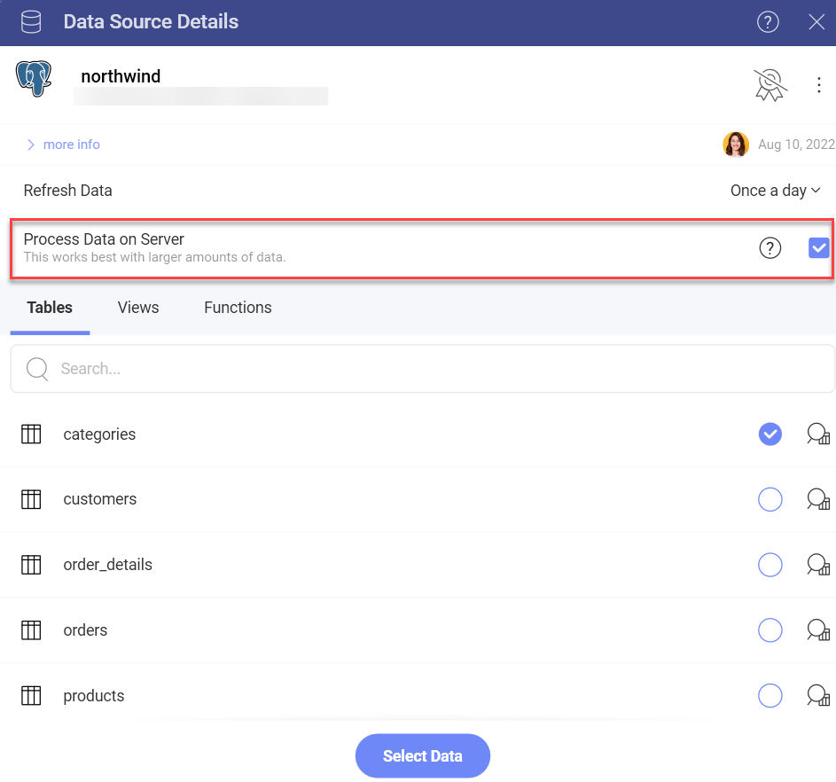

# Processing Data on Server

Basically, when connecting to a data source, all your data on the server is loaded and downloaded locally.  In this way, you have your data set, ready to be directly processed in Reveal - sorted, filtered, aggregated, and used for visualizations.

For some data sources, with much larger data sets, sometimes involving million of records, downloading the data to work with locally isn't a feasible solution. That's why an alternative approach is available in Reveal: processing the data directly on the server.

## Supported Data Sources

For some of the available data sources in Reveal, processing data directly on the server is the **only** approach used. These are:

* [Amazon Redshift](https://www.slingshotapp.io/en/help/docs/analytics/datasources/supported-data-sources/redshift)
* [Google BigQuery](https://www.slingshotapp.io/en/help/docs/analytics/datasources/supported-data-sources/google-bigquery)
* [MS Azure Synapse Analytics](https://www.slingshotapp.io/en/help/docs/analytics/datasources/supported-data-sources/microsoft-azure-synapse-analytics) 
* [Snowflake](https://www.slingshotapp.io/en/help/docs/analytics/datasources/supported-data-sources/snowflake)
* [Amazon Athena](https://www.slingshotapp.io/en/help/docs/analytics/datasources/supported-data-sources/athena)

Processing data on server is an option you can **enable** for the following data sources:

* [MS SQL Server](supported-data-sources/microsoft-sql-server.md)
* [MySQL](supported-data-sources/mysql.md)
* [PostgreSQL](supported-data-sources/postgresql.md)

## How to Enable Process Data on Server?

You can enable the *Process Data on Server* function while connecting to one of the data sources supporting it.

If you need more information on how to do the initial configuration of the data source, select one of the three data sources in the bullet list above and read the article on how to set it up.

After configuring the connection, the *Data Source Details* dialog will show up:

Notice that the *Process Data on Server* is enabled by default. Consider unchecking the box next to this feature in case you need to use any of the capabilities that are limited (see in *Limitations* below), when your data is processed on the server.

## Limitations

The *Process Data on Server* feature helps you build visualizations over very large datasets, where it would otherwise be unfeasible to download all the data locally. However, this feature introduces some limitations to the use of the data source it's enabled for.  

The following capabilities are **not supported** in the Visualization editor when *Process Data on Server* is enabled:

* [Data Blending](data-blending.md)
* [Azure ML models integration](ml-integration/azure-machine-learning-models.md)

Restrictions are placed on the [Pre-Calculated](~/en/data-visualizations/fields/calculated-fields/overview.html#precalculated-fields) fields feature in the Visualization editor. Unavailable functions are greyed out in the *New Calculated Field* dialog.
In this dialog, you can click on the link to disable the *Process Data on Server* feature.

