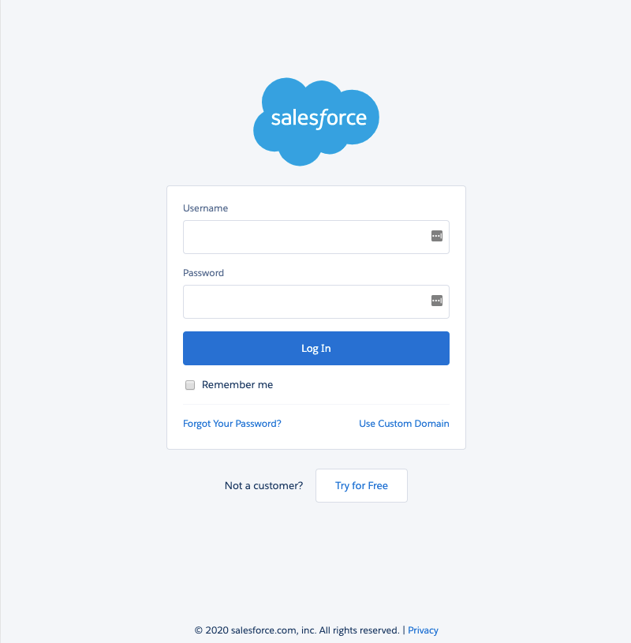
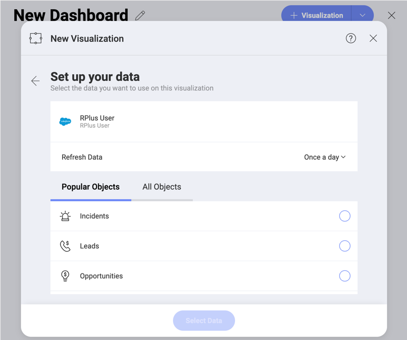

## Salesforce

Upon selecting the Salesforce data source, you will see the following login prompt:

Enter your login credentials and click *Log In*.

If you have Identity Confirmation activations enabled, you will see a
prompt to enter the **verification code** sent to you. For more
information on Identity Confirmation Activations, visit the [Salesforce help](https://help.salesforce.com/articleView?id=security_activation_about.htm&type=5).

You will then see an authorization prompt. Click *Allow*.

### Setting Up Your Data

After logging in, you can set up your Salesforce data in the following
dialog:

Here you can choose the Salesforce object you need from:

  - *Popular Objects* - this category allows quick selection between the
    seven most used objects among our users;

  - *All Objects* - this category displays the full list of objects
    contained in your Salesforce account.  You can use the provided search to find quickly the object you need.
