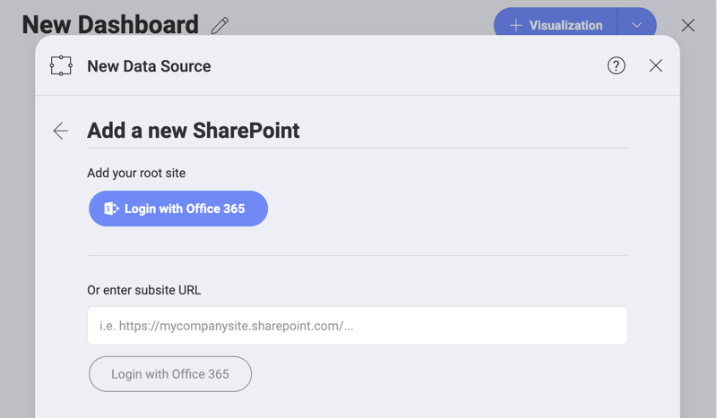

## SharePoint Online

Upon selecting SharePoint, you will see the following dialog:

Here you can login with your Office365 account and connect to your **SharePoint root site**.

You can also enter **a subsite URL** if you want to directly add a SharePoint subsite as a datasource in Reveal.

### Supported Files

When working within Reveal, you will be able to use a wide variety of
files:

  - **Spreadsheets & tabular data**: Excel (.xls, .xlsx), CSV, TSV, which you can use
    dynamically within Reveal.

  - **Other files** (including images or document files such as PDFs,
    texts, etc.), which will be displayed in a preview mode only.
