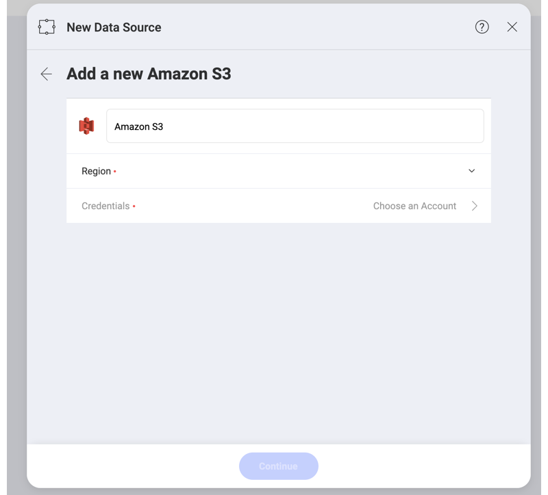

## Amazon S3

Amazon Simple Storage Service (S3) is a highly scalable and fast data storage service. Adding Amazon S3 to your data sources allows you to access and analyze your data from S3 directly in Reveal.

To configure an Amazon S3 data source, you will need to enter the following information:

1.  **Default name** of the data source: Your data source name will be displayed in the list of accounts in the _Select a Data Source_ dialog. By default, Reveal names it *Amazon S3*. You can change it to your preference.
   
2. **Region**: Amazon regions are listed with their names and codes in the dropdown. Choose the one where the data you need is located.  

3. **Credentials**: here you will be asked to provide the root or IAM user credentials: 
   
   * *Access Key*
   * *Secret Key* 

   Add your credentials and click/tap the _Create and Use_ blue button.

   For more information about the AWS credentials, please take a look at this [Amazon article](https://docs.aws.amazon.com/general/latest/gr/aws-sec-cred-types.html).

4. Upon successful connection, you will be returned to the previous dialog where the _Continue_ blue button becomes available. After clicking/tapping it, you can start browsing your directories and files in Amazon S3. 

### Supported Files

When working within Reveal, you will be able to use a wide variety of files from your Amazon S3 directories:

* *Spreadsheets, JSON files & tabular data* (Excel - .xls, .xlsx; CSV, TSV), which you can use dynamically within Reveal to create chart visualizations.
* *Other files* (including images or document files such as PDFs, texts, etc.), which will be displayed in a preview mode only.