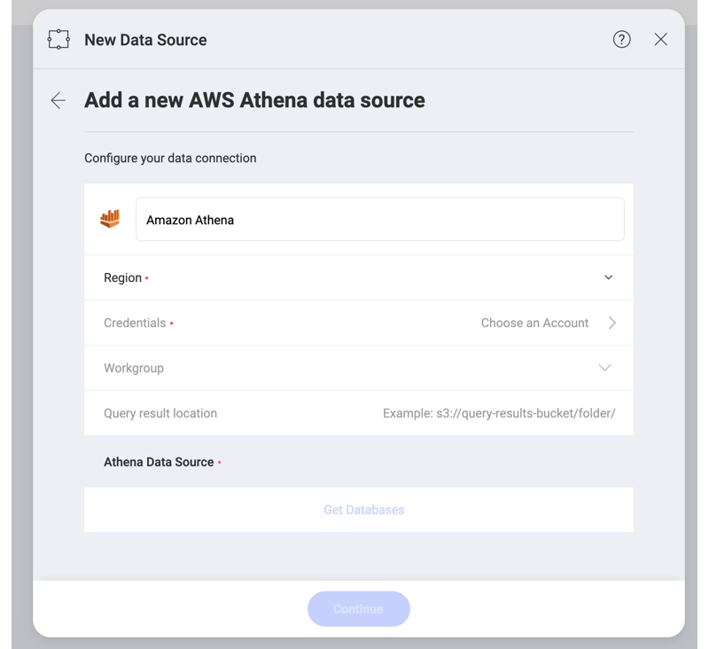
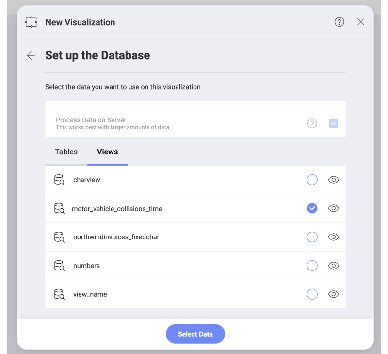
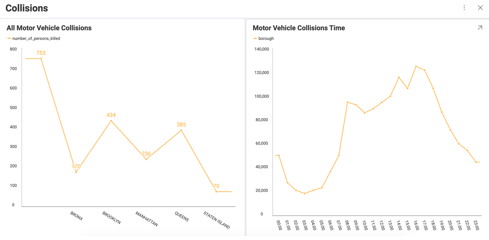

## Amazon Athena 

The Amazon Athena data source in Reveal allows you to access and query unstructured data stored in [Amazon S3](amazon-s3.md), and use it for your visualizations.  

To configure an Amazon Athena data source, you will need to enter the following information:

1.  **Default name** of the data source: Your data source name will be displayed in the list of accounts in the _Select a Data Source_ dialog. By default, Reveal names it *Amazon Athena*. You can change it to your preference.
   
2. **Region**: Amazon regions are listed with their names and codes in the dropdown. Choose the one associated with your Amazon account. 

3. **Credentials**: here you will be asked to provide the two parts of your AWS (Amazon Web Services) access key:
   * *Access Key*
   * *Secret Key* 

   Add your credentials and click/tap the _Create and Use_ blue button. Upon successful connection, you will be returned to the previous dialog where *Workgroup* and *Query result location* become available to configure too. 

   For more information about the AWS access key, please take a look at this [Amazon support article](https://aws.amazon.com/premiumsupport/knowledge-center/create-access-key/).
   
4. *(Optional)* **Workgroup**: choosing one of your workgroups from the dropdown is *optional*. If you don't specify a workgroup, then the *primary* workgroup (which is the default workgroup in your Athena account) will be automatically selected. 
5. *(Optional)* **Query result location**: this is the directory in *Amazon S3* where the results of your query will be stored. You need to provide a valid *S3* path, e.g.: *s3://query-results-bucket/folder/*. If you don't explicitly specify the path in this dialog, the results will be stored in the output location specified in the selected/default workgroup. If there is no output location created in the workgroup, your Athena query will fail.

   >[!NOTE]
   > If you have specified your Query result location (QRL) in Reveal, but you can't find your output in this location, please check  your workgroup configuration in Athena for settings that prevent you from using custom QRLs. For more information, take a look at [Specifying a Query Result Location](https://docs.aws.amazon.com/athena/latest/ug/querying.html#query-results-specify-location) in Athena's documentation. 

6. **Athena Data Source**: also known as _Data Catalog_ containing databases. You can choose it from the list of that will appear after you connect to your Athena account (see steps 1-3). 

### Setting Up Your Data

After configuring your Athena data source connection, you will be prompted to choose a database from the *Data Source (Catalog)* you selected in the previous dialog. 

After selecting a database, you can choose from the *tables* or [*views*](https://docs.aws.amazon.com/athena/latest/ug/views.html) inside it. 

In the screenshot above, the **motor_vehicle_collisions_time** view contains a modified version of the data in the **motor_vehicle_collisions** table in Athena. 
In the screenshot below, the visualization on the left is built with the data in the table, and the the one on the right uses the data contained in the view.  

