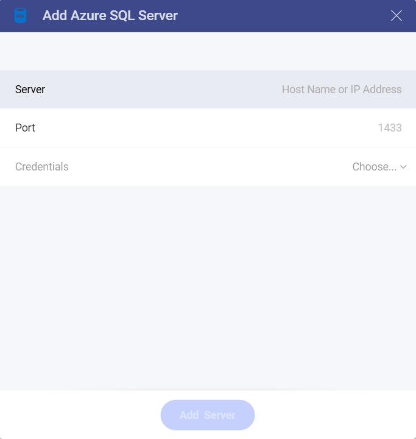

# Azure SQL

>[!NOTE] **Limitations in Web**. In the *Reveal Web* app, you can connect only to publicly accessible Azure SQL addresses. If your Azure SQL address is restricted for the general public (private or hosted in the company's intranet, for example), you can use *Reveal Desktop*, *iOS* or *Android* to connect to it. The device where you're running Reveal needs to have access to the SQL Server address. This limitation does not apply to *Reveal Embedded*.

## Connecting to Azure SQL

To configure an Azure SQL data source, you will need to enter the following information:

1.  **Server**: the computer name or IP address assigned to the computer
    on which the server is running.

2.  **Port**: if applicable, the server port details. If no information
    is entered, Reveal will connect to the port in the hint text (1433)
    by default.

3.  **Credentials**: after selecting *Credentials*, you will be able to enter the credentials for Azure SQL or choose existing ones if applicable.

  - **Username**: the user account for Azure SQL or the name of the domain.

  - **Password**: the password to access Azure SQL.

  - **Alias** of the data source: Your data source name will be displayed in the list of accounts in the previous dialog. By default, Reveal names it *Microsoft Azure SQL Database*. You can change it to your preference.

Once ready, select **Add** and then **Add Server**.

## Further Information

Finally, if you want to know more about any of the following:

  - How to find your Server Information

  - Working with Views

  - Working with Stored Procedures

Please refer to [**SQL Server**](microsoft-sql-server.html#how-to-find-server) as both Reveal data sources work similarly.
