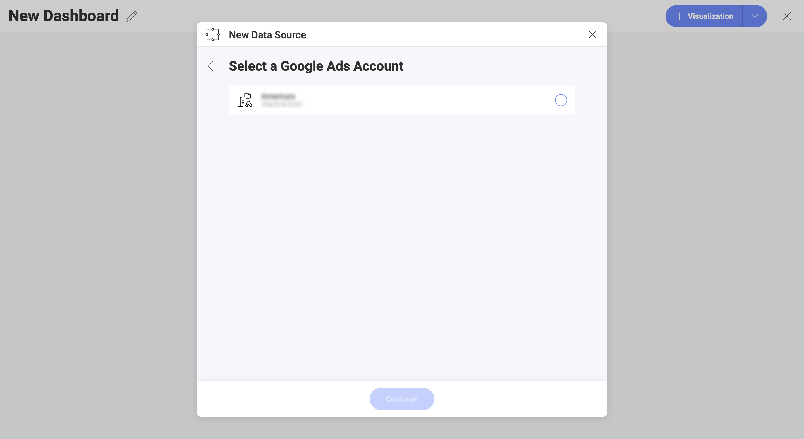
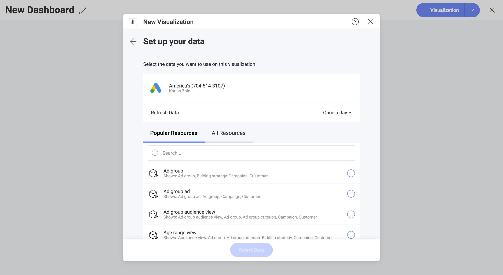
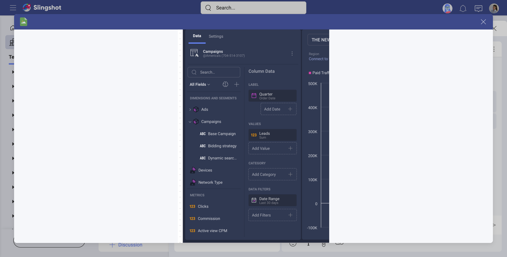

# Google Ads

The *Google Ads*  data source allows you to access and analyze the data tables from your Google Ads (formerly Google Adwords) account. Create visualizations with your Google Ads data to build a high-level understanding of your advertising efforts.
## Connecting to Google Ads

1. Select *Google Ads* as your data source and you will see Google's login screen.

2. If multiple Google accounts are listed, select the account that contains the Google Ads data you want to access. 
3. Enter your login credentials, if you are not already signed in. 

4. In the authorization prompt, select *Allow*.

5. Choose a *Google Ads* account.  

    If your Google account is connected to several Google Ads accounts, select the one you want to use in the following dialog.

    

6. Choose a resource.

    Select the resource that you want to use from one of the two lists: _Popular Resources_ or _All Resources_. Use the search to find quickly what you need.

     

   Under each resource you will see a description. It gives information which dimensions from Google Ads are included in this resource. 

   Click  _Select Data_ to continue to the _Visualizations Editor_.

## Working in the Visualizations Editor 

When you create a dashboard with information coming from Google Ads, you will see fields in the Visualizations Editor are organized differently (as shown in the screenshot below).

You may notice that there is no *Fields* heading on the left in the *Data* pane. Instead, there are two sections in their own query field:

1. **Dimensions (also including Segments)**: 

    a. **Dimensions** are depicted by a cube icon with a pink side. Dimensions contain the attributes of data you can measure. For example, the dimension *Name* under the *Ad Group* cube will show all your ad groups. 

    b. **Segments** are depicted by one icon showing a group of people. Segments are different for each Google Ads *resource* you load in the *Visualizations Editor*. 
    In Reveal, you can use Google Ads segments the same way you use dimensions - as measurable data or as data filters.  
    For more information on segments, consult the official 
    [Google Ads Help](https://support.google.com/google-ads/answer/2454072?hl=en#zippy=).

2. **Measures** (depicted by a *123* icon): Measures consist of numeric data. For example, the measure *Clicks* shows the number of times ads were clicked.

### The Date Range Data Filter

In *Data Filters* (see bottom right of the *Data* pane), you will find a date range filter set to *Last 30 days* by default. This means data will be retrieved for the last 30-day period, including *today*.

You can't remove the date filter, but you can change the default date range by clicking on the *Calendar* icon. Select *from* and *to* dates. Alternatively, click/tap the arrow in the upper right corner (see the screenshot ) and pick a date range from the dropdown options:

> [!NOTE] **Data retrieved for *Today*.** If you choose *Today* from the date range options, keep in mind the date range starts at 12:00:00 a.m. and all data will be retrieved up until the current time. This means the results may vary between runs throughout the day as the data in Google Ads is being updated continuously.  

## Performance Considerations

Depending on how much data you are trying to retrieve, loading data from Google Ads in the Visualizations Editor may become a time-consuming task. Certain actions affect waiting time more than others.

### Selecting a Date Range

When selecting a date range, keep in mind that the bigger the range, the longer the time it takes to load your data. So, at first restrict your range, evaluate the loading time and then expand it appropriately. 

If you are trying to load a dataset that is too large, you may receive an error stating you exceeded the rows/columns limits. If you can't restrict your time range enough to fit your purposes, then [contact support](https://www.infragistics.com/my-account/submit-support-request/reveal) for a limit increase. 

### Adding Segments

In Reveal, you can combine multiple segments in the Visualizations Editor. As segments are used for more detailed statistics, the more segments you add, the more rows of data you retrieve. This may affect loading time. 