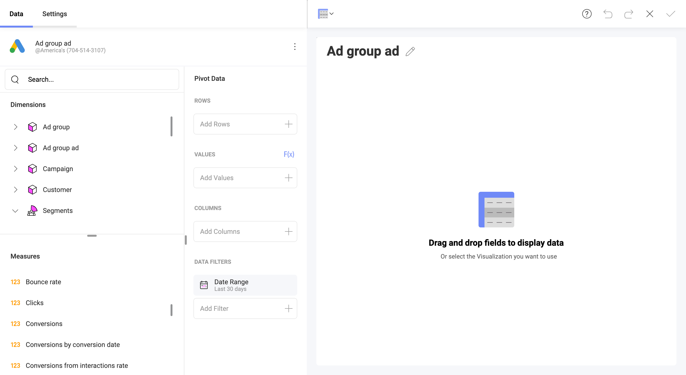

## [First Draft] Google Ads

intro here

### Connecting to Google Ads

1. Select *Google Ads* as your data source and you will see Google's login screen.

2. If multiple Google accounts are listed, select the account that contains the Google Ads data you want to access and enter your login credentials, if you are not already signed in. 

3. In the authorization prompt select *Allow*.

4. Choose a *Google Ads* account

    If your Google account is connected to several Google Ads accounts, select the one you want to use in the following dialog.

    

### Setting Up Your Data

The dialog showing "Popular Resources" and "All Resources" list will most probably drop off.

### Working in the Visualizations Editor 

When you create a dashboard with information coming from Google Analytics, you will see fields organized differently (see screenshot below).

You may notice that there is no "Fields" heading on the left. Instead, there are two sections in their own query field:

1. **DIMENSIONS AND SEGMENTS**: 

    a. **Dimensions** are depicted by a cube icon with a pink side. Dimensions are attributes of your data. For example, the dimension *Base Campaign* indicates... 

    b. **Segments** - Segments are depicted by a group icon (see *Devices* in the screenshot below ) The Segment filters are predefined???. You can choose more than one segment.     
    https://support.google.com/google-ads/answer/2454072?hl=en#zippy=%2Cdevice

2. **METRICS** (depicted by *123* icon): Measures consist of numeric data. For example, the measure AdX Clicks is the number of times AdX ads were clicked on the site.

If you need to learn more, check this Google Ads article: Dimensions and metrics.

#### The Date Range Data Filter

In the *DATA FILTERS* section (see bottom right in the *Data* pane), you have a pre-set date range filter - *Last 30 days*. This means data will be retrieved for the last 30-day period, including today.

To change the default date range, click on the Calendar icon and choose *from* and *to* dates (as shown below). You can also select one of the preset date ranges by clicking the arrow in the upper right corner:

> This is the Google Analytics Calendar. Replace with a screenshot showing the Google Ads calendar when available.

> [!NOTE] **Data retrieved for *Today*.** If you choose *Today* from the preset date ranges, keep in mind the result may vary throughout the day as data is being updated continuously. *Today* starts at 12:00:00 a.m. and will retrieve all data up until the current time. 

### Limitations in Dashboard Filters

>Ask Luis about this

Currently, you cannot create a [dashboard filter](~/en/filters/dashboard-filters.md) with *Google Ads* data.

### Performance Considerations

Depending on how much data you are trying to retrieve, loading data from Google Ads in the Visualizations Editor can be a really time-consuming task. Certain actions affect waiting time so read below to find out how you can make the loading process faster. 

#### Selecting a Date Range

When selecting a date range, keep in mind that the bigger the range, the longer the time it takes to load your data. So, at first restrict your range, evaluate the loading time and then expand it. 

If you are trying to load a dataset that is too large, you may receive an error for exceeding the rows/columns limits. If you can't restrict your range enough to fit your purposes, then [contact support](https://www.infragistics.com/my-account/submit-support-request/reveal) in order to increase the limit. 

> Ask Luis about segments + test when ready
#### Adding Segments

In Reveal, you can combine multiple segments in the Visualizations Editor. As segments are used for more detailed statistics, the more segments you add, the more rows of data you retrieve. This may affect loading time as well. 