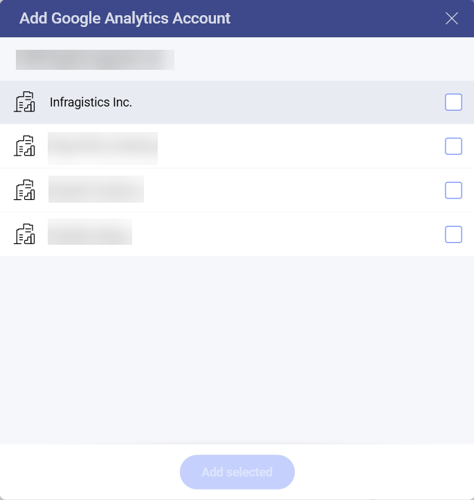
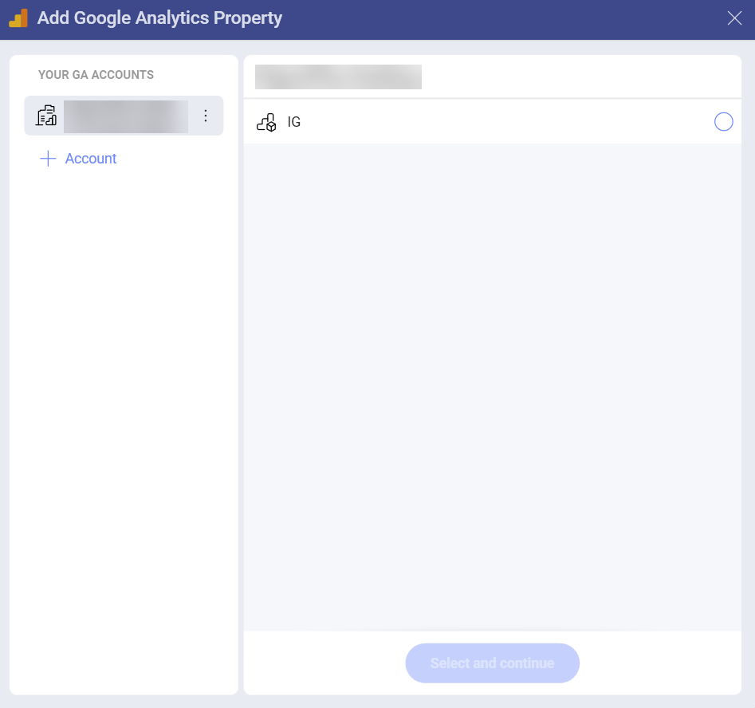
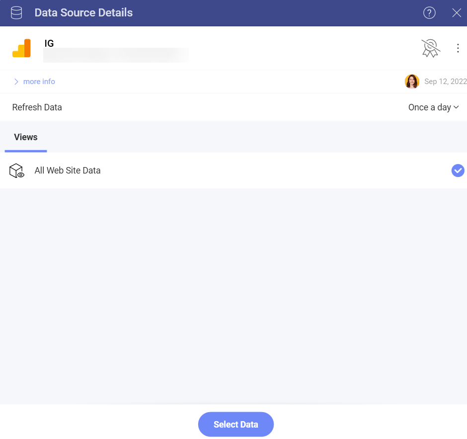
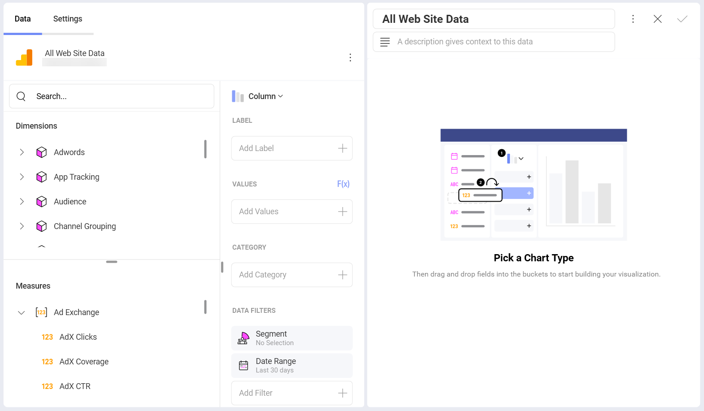
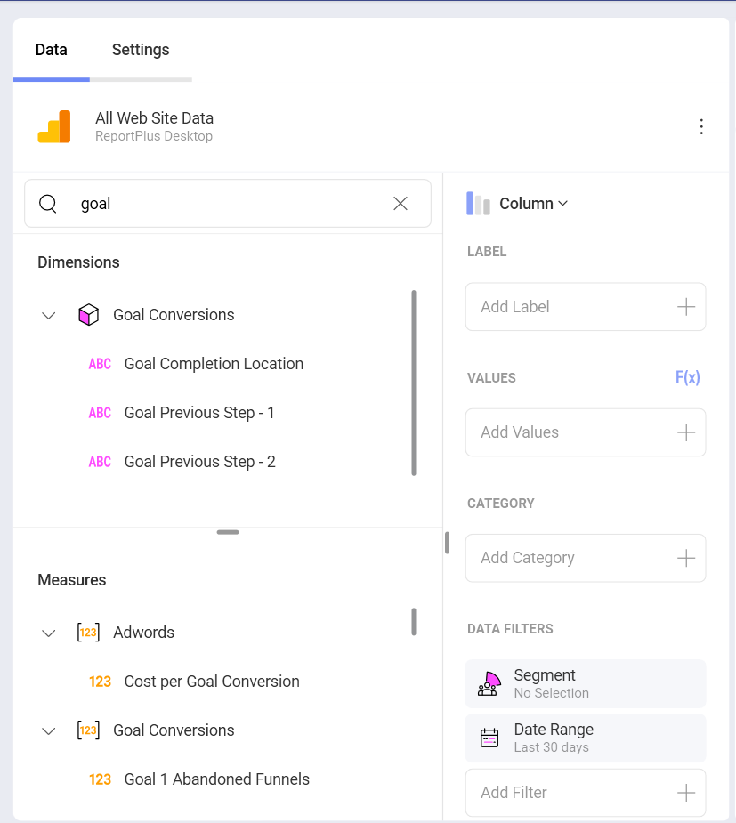

# Google Analytics

Google Analytics is one of the most used web analytics services in the
web, it tracks and reports website traffic. In addition, Google also
provides an SDK to gather usage data from iOS and Android apps.

## Connecting to Google Analytics

1.  **Log in**

    1.  Select Google Analytics as your data source and you will see
        Google's login screen.

    2.  Enter your login credentials and click/tap *Sign In*. You will then
        see an authorization prompt. You can click/tap on *Allow*.

2.  **Choose an account**

    If you have several Google Analytics accounts, select the one you
    want to use.

    

    Once logged in, you can also use the same account later to create
    another visualization unless you delete the data source.

3.  **Choose a Property**

    Select the Google Analytics property that you want to use.

    

    In Google Analytics, **properties** can be websites, mobile apps,
    blogs, among others.

4.  **Choose a database cube**

    Select the data cube that you want to use.

    

    You can also configure the *Refresh Data* setting to to the
    following values:

      - Always

      - Once an hour

      - Once a day

      - Once a week
       
After your credentials are verified, Reveal will take you to the *Visualizations Editor*.

## Working in the Visualizations Editor

When you create a dashboard with information coming from Google Analytics, you will see fields organized differently (see screenshot below).

You may notice that there is no "Fields" heading on the left. Instead, there are two sections in their own query field:

1.  **Dimensions** (depicted by a cube icon with a pink side): Dimensions are attributes of your data. For example, the dimension *Gender* (under the *Audience* cube) indicates the gender of your web site's audience.

2.  **Measures** (depicted by *123* icon): Measures consist of numeric data. For example, the measure *AdX Clicks* is the number of times AdX ads were clicked on the site.

If you need to learn more, check this Google Analytics article: [Dimensions and metrics](https://support.google.com/analytics/answer/1033861?hl=en). 

>[!NOTE] 
> Some dimensions and measures cannot be used together. For a list of valid dimensions-measures combinations, refer to the [Dimensions & Metrics Explorer](https://ga-dev-tools.appspot.com/dimensions-metrics-explorer/) on the Google Developer website.

### Data Filters

There are two *Data Filters* when using the GA data source in Reveal. 

* **Segment** filter. The *Segment filters* are predefined. *System* Segments are defined by Google, and *Custom* Segments are defined by the user on the Google Analytics website. You can choose only one segment to filter your data. 
* **Date Range**. Select a specific date range in the calendar to filter your data. You can also choose one of the preset date ranges by clicking the arrow in the upper right corner: 

  

  >[!NOTE] Default date range is *Last 30 days*. This means data will be retrieved for the last 30-day period, including today. 

### Using Goals from Google Analytics

You can use *Goals* defined in Google Analytics in the *Visualization
Editor*. Your *Goals* are listed as part of the metrics in both
**Dimensions** and **Measures** data types.

As you can see in the example above, the titles of your Google Analytics
*Goals* in Reveal include one or more of the following:

  - a **numeric ID**, from 1 to 20.

  - a **label** at the beginning - this is the name of the goal you
    configured for the specific goal, e.g. *Completed Download* for
    *Goal 19*.

  - a goal **type** at the end - e.g. *Completions*, *Abandoned Funnels*, etc.

For more information about Goals, please refer to this Google Analytics
[help page](https://support.google.com/analytics/answer/1012040?hl=en).
