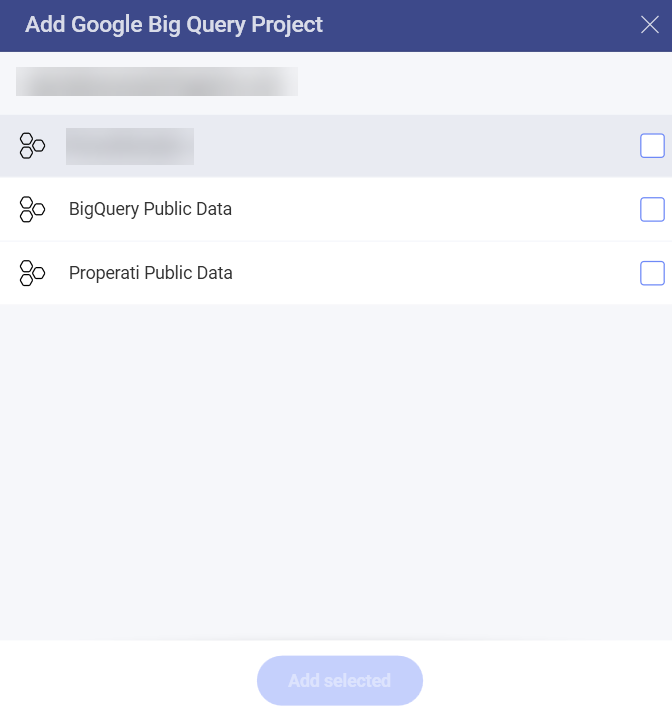
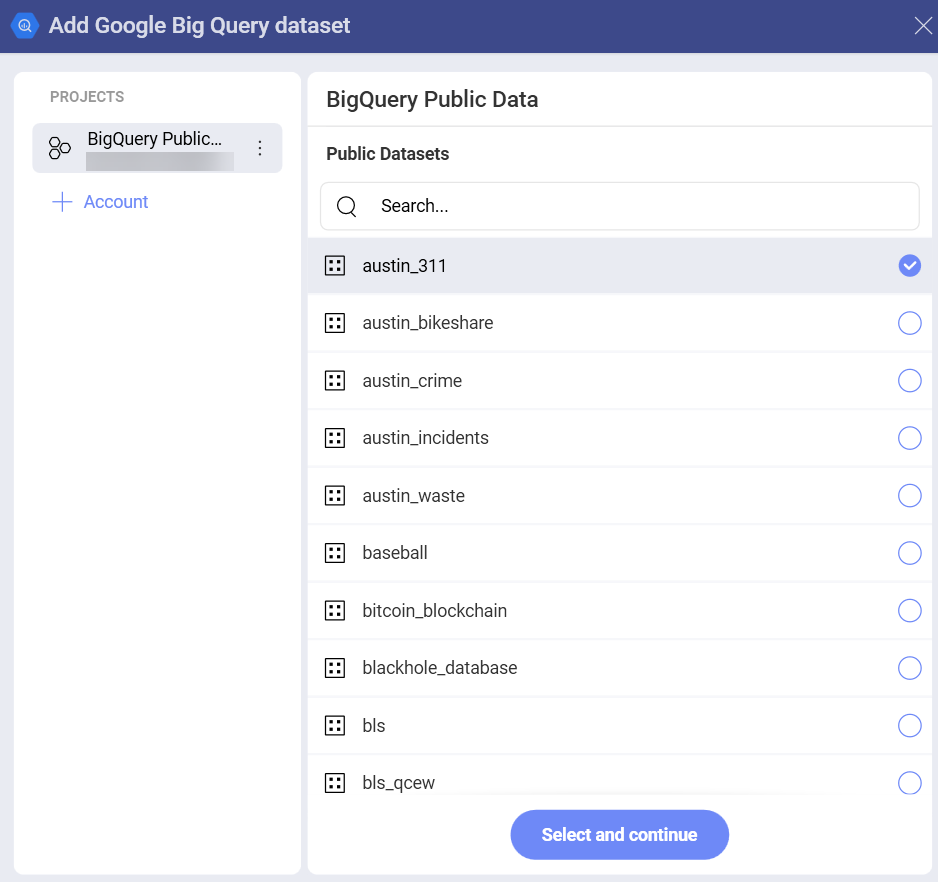
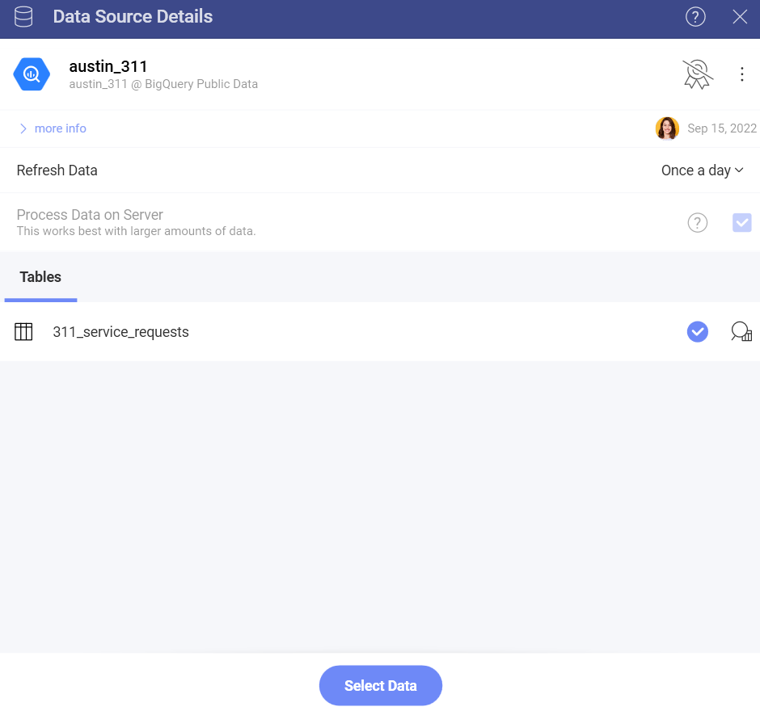
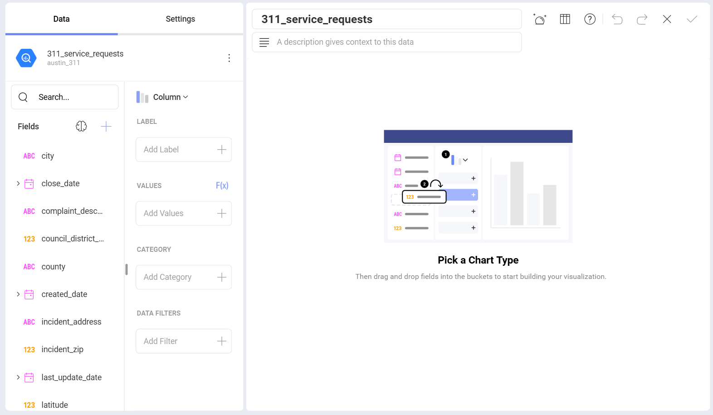

# Google BigQuery

The Google BigQuery data source provides a significant speed increase
when processing big data within Reveal. This allows you to use datasets
with millions of records for your visualizations with no slow down.

## Connecting to Google BigQuery

Upon selecting Google BigQuery, you will be prompted to connect to your
**Google account**.

After you add a Google account, you will have access to your BigQuery
datasets. To start using them for your visualizations:

1.  **Select a project** in the *New Data Source* dialog that opens:

    

    >[!NOTE]    
    **Demo Public BigQuery Data Projects in Reveal**.
    The two public data projects in the screenshot above are demo
    projects configured by the Reveal's team. They allow users with no
    BigQuery datasets to play with this data source in the Visualization
    editor and see how swiftly big data is being processed.

2.  **Select a dataset** by marking the empty circle next to it:

    

3.  **Select a table** from the dataset. Use the *eye icon* on the right
    to preview the data.

    

You are now directed to the *Visualization editor* where you can start
building your visualizations with the data retrieved from Google
BigQuery.

 

## Limitations in the Visualization Editor

When working with big data in Reveal, there are a couple of limitations
in the Visualization Editor due to the specific approach used to handle
data sources storing millions of records.

### Limitations in Functions Available for Calculated Fields

Currently, only a limited number of **functions** are available for
*Calculated Fields* using data from BigQuery:

- [Date](~/en/data-visualizations/fields/calculated-fields/date.md) - date; time.

- [Logic](~/en/data-visualizations/fields/calculated-fields/logic.md) - false; true; if; not.

- [Math](~/en/data-visualizations/fields/calculated-fields/math.md) - abs; exp; log; log10; mod; rand; sign; sqrt; trunc.

- [Strings](~/en/data-visualizations/fields/calculated-fields/string.md) - find; len; trim; lower; mid; upper.

### Limitations in Data Blending

Currently, Data Blending ([combining data sources in one visualization](~/en/datasources/data-blending.md)) is **not available** when using data from the Google BigQuery data source.
