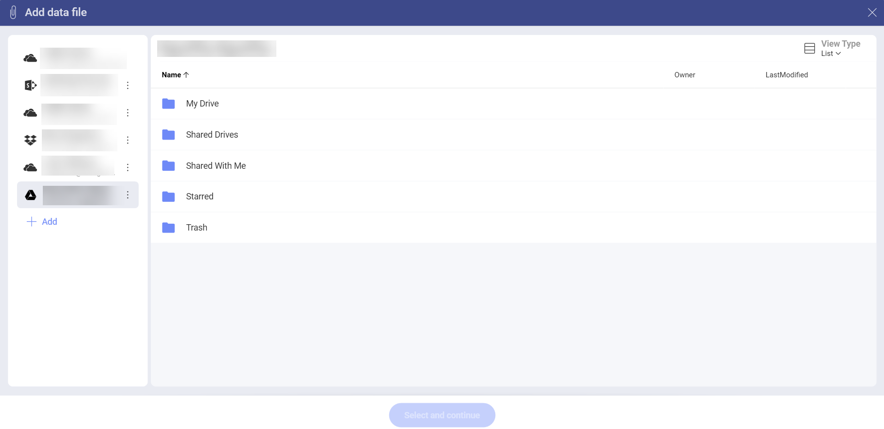
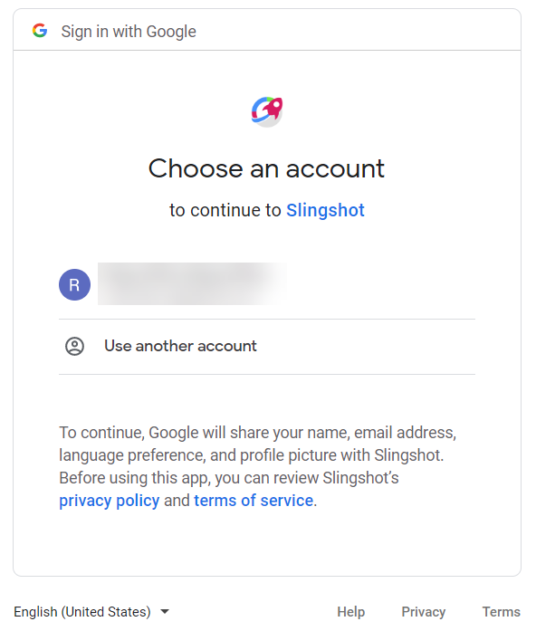
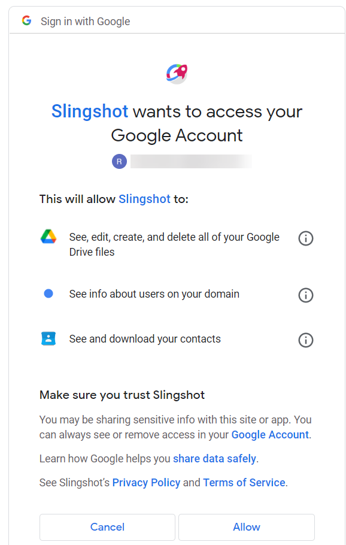

# Google Drive

If you are signed in with your Google account, you will have your Google
Drive automatically added to your data sources:

To use your Google Drive data, follow the steps below.

1.  Upon selecting your Google Drive (or a folder inside it), you will be prompt to choose an account and connect it to the app. Enter your **login credentials** or choose an an account and select *Next*.

    
    
2. An **authorization prompt** will pop up. You can select **Allow** to finish the process.

   

You can now use your Google Drive data to build your visualizations and
will not be asked for these permissions again.

## Supported Files

When working within Reveal, you will be able to use a wide variety of
files:

  - **Spreadsheets & tabular data**: Excel (.xls, .xlsx), CSV, TSV, which you can use
    dynamically within Reveal.

  - **Other files** (including images or document files such as PDFs,
    texts, etc.), which will be displayed in a preview mode only.
